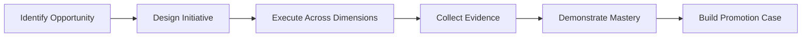
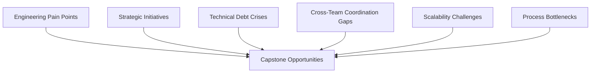
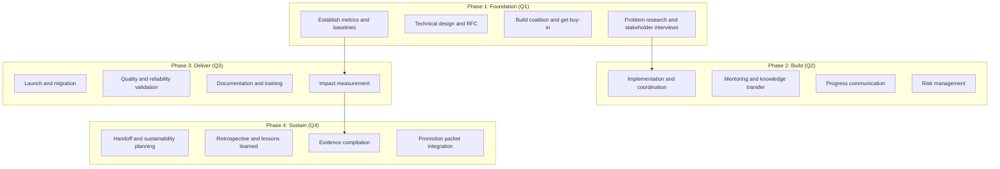

# Capstone Project

> **Core skill:** Senior engineers plan and execute a comprehensive initiative that demonstrates mastery across all capability areas, providing compelling evidence for promotion.

## Why a Capstone Project Matters

A capstone project is a deliberate, high-impact initiative designed to demonstrate that you are already operating at the next level. It is not just another project: it is a strategic choice to take on work that spans all dimensions of senior-level performance.



**Key insight:** The best capstone projects are not invented for promotion. They are real business problems that you choose to lead in a way that demonstrates breadth and depth.

## Capstone Project Criteria

A strong capstone project demonstrates mastery across all eight capability areas:

| Capability Area | What to Demonstrate | Evidence Type |
|----------------|-------------------|---------------|
| **Technical Ownership** | End-to-end ownership of complex systems | System design, implementation, production operation |
| **Problem Framing** | Identifying and scoping ambiguous problems | Problem statements, requirements, stakeholder alignment |
| **Architecture and Design** | Sound architectural decisions with trade-offs | Design docs, ADRs, architecture reviews |
| **Delivery and Execution** | Predictable delivery of complex initiatives | Project plans, metrics, milestone tracking |
| **Quality and Reliability** | Production-ready, observable, resilient systems | Testing strategy, SLOs, incident response |
| **Communication and Influence** | Clear communication across audiences | RFCs, presentations, documentation |
| **Mentoring and Leadership** | Growing others and building capability | Mentoring records, knowledge sharing, team growth |
| **Engineering Economics** | Economic awareness in decision-making | Cost-benefit analysis, ROI, build vs buy |

### The 10-Point Capstone Checklist

Your project should meet at least 8 of these 10 criteria:

- [ ] **Technical complexity:** Solves a genuinely hard problem
- [ ] **Organizational impact:** Affects multiple teams or the entire organization
- [ ] **Strategic alignment:** Advances business or technical strategy
- [ ] **Leadership:** You drove the initiative, not just participated
- [ ] **Influence:** You influenced others without direct authority
- [ ] **Mentoring:** Includes knowledge transfer and team capability building
- [ ] **Economic awareness:** Shows understanding of costs, trade-offs, and ROI
- [ ] **Quality focus:** Delivers reliable, maintainable, well-tested solutions
- [ ] **Communication:** Includes clear documentation and stakeholder communication
- [ ] **Sustainability:** Creates lasting impact beyond your direct involvement

## Planning Your Capstone

### Step 1: Identify the Opportunity

Look for problems that:
- **Span multiple teams:** Require coordination across organizational boundaries
- **Are strategically important:** Aligned with company or engineering priorities
- **Have technical depth:** Require genuine expertise and judgment
- **Have been neglected:** Problems others have avoided or deprioritized
- **Have measurable outcomes:** Success can be quantified

**Sources of capstone opportunities:**



### Step 2: Assess Feasibility

Before committing, evaluate:

| Factor | Question | Red Flag |
|--------|----------|----------|
| **Scope** | Can I complete this in 2-4 quarters? | Requires years of work |
| **Support** | Will my manager and leadership support this? | No executive sponsor |
| **Skills** | Do I have the technical skills to lead this? | Requires expertise I lack |
| **Dependencies** | Can I manage the cross-team dependencies? | Depends on teams that are not aligned |
| **Visibility** | Will the impact be visible to promotion committees? | Only my team will notice |
| **Measurability** | Can I quantify the outcomes? | Success is subjective |

### Step 3: Design the Initiative

Create a project plan that addresses all capability areas:

```markdown
## Capstone Project Plan: [Project Name]

### Problem Statement
[What problem are you solving and why does it matter?]

### Scope and Boundaries
[What is included? What is explicitly excluded?]

### Success Criteria
[How will you know you have succeeded? Quantified metrics.]

### Technical Approach
[High-level architecture and key technical decisions]

### Stakeholders
[Who is affected? Who needs to be aligned?]

### Timeline
[Key milestones across 2-4 quarters]

### Risks and Mitigations
[What could go wrong? How will you handle it?]

### Capability Area Coverage
[How does this project demonstrate each capability area?]
```

### Step 4: Align with Your Manager

Before executing, ensure:
- Your manager supports the initiative and your leadership role
- The project aligns with team and organizational priorities
- You have the time and resources to execute
- Your manager will advocate for you during promotion review

## Executing Your Capstone

### Execution Framework



### Phase 1: Foundation (Quarter 1)

**Technical Ownership:**
- Research the problem deeply
- Interview stakeholders and affected teams
- Understand existing solutions and their limitations

**Problem Framing:**
- Write a clear problem statement
- Define requirements and constraints
- Identify success criteria with metrics

**Architecture and Design:**
- Create design document or RFC
- Evaluate alternatives with trade-off analysis
- Get architecture review and feedback

**Communication:**
- Present the initiative to leadership
- Build coalition across affected teams
- Align on scope, timeline, and success criteria

### Phase 2: Build (Quarter 2)

**Delivery and Execution:**
- Break work into milestones
- Manage dependencies across teams
- Track progress against plan

**Mentoring and Leadership:**
- Delegate meaningful work to team members
- Mentor junior engineers on the project
- Create knowledge-sharing sessions

**Quality and Reliability:**
- Establish testing strategy
- Set up monitoring and observability
- Plan for failure modes

**Engineering Economics:**
- Track costs against budget
- Make build vs buy decisions with analysis
- Document trade-offs and their rationale

### Phase 3: Deliver (Quarter 3)

**Delivery and Execution:**
- Execute launch plan
- Manage migration and rollout
- Handle unexpected issues gracefully

**Quality and Reliability:**
- Validate against SLOs
- Conduct load testing and chaos experiments
- Establish incident response procedures

**Communication:**
- Communicate progress to stakeholders
- Document operational procedures
- Train affected teams

**Technical Ownership:**
- Own production operation
- Respond to incidents
- Iterate based on feedback

### Phase 4: Sustain (Quarter 4)

**Technical Ownership:**
- Ensure sustainability beyond your involvement
- Transfer ownership to appropriate team
- Create long-term maintenance plan

**Mentoring and Leadership:**
- Document lessons learned
- Share retrospective with organization
- Mentor successors

**Impact Measurement:**
- Measure outcomes against success criteria
- Quantify business and technical impact
- Collect feedback from stakeholders

**Evidence Compilation:**
- Organize artifacts for promotion packet
- Quantify all impact metrics
- Collect peer feedback

## Evidence Collection During Execution

### Artifacts to Create and Preserve

| Phase | Artifact | Purpose |
|-------|----------|---------|
| Foundation | Problem statement | Shows problem framing skill |
| Foundation | RFC or design doc | Shows architecture judgment |
| Foundation | Stakeholder alignment doc | Shows communication and influence |
| Build | Project plan and milestones | Shows delivery management |
| Build | Mentoring records | Shows team development |
| Build | Trade-off decisions | Shows economic awareness |
| Deliver | Launch plan and results | Shows execution capability |
| Deliver | SLO definitions and results | Shows quality focus |
| Deliver | Training materials | Shows knowledge sharing |
| Sustain | Impact report | Shows quantified outcomes |
| Sustain | Retrospective | Shows learning and growth |
| Sustain | Sustainability plan | Shows long-term thinking |

### Metrics to Track

**Technical metrics:**
- Latency, throughput, error rates (before and after)
- Uptime and availability
- Deployment frequency and lead time
- Test coverage and bug escape rate

**Business metrics:**
- Revenue impact or cost savings
- Customer satisfaction improvements
- Productivity gains (time saved)
- Risk reduction

**Organizational metrics:**
- Teams affected and aligned
- Engineers mentored and promoted
- Knowledge artifacts created and used
- Process improvements adopted

### Feedback to Collect

**During execution:**
- Weekly check-ins with stakeholders
- Monthly progress updates to leadership
- Peer feedback on collaboration and leadership

**After delivery:**
- Stakeholder satisfaction survey
- Mentee feedback on growth
- Team retrospective on process
- Leadership recognition and comments

## Example Capstone Projects

### Example 1: API Platform Modernization

**Problem:** 15 teams using inconsistent API patterns, causing integration pain and slow onboarding.

**Approach:**
- Researched existing patterns across all teams
- Designed unified API platform with backward compatibility
- Wrote RFC, got buy-in from 10 of 15 teams initially
- Led implementation with 4-engineer team
- Mentored 2 mid-level engineers to become platform champions
- Created migration guide and training program
- Presented progress at quarterly engineering all-hands

**Impact:**
- Reduced API onboarding time from 2 weeks to 2 days
- Eliminated 40% of integration bugs
- Saved $600K/year in engineering time
- Platform adopted by all 15 teams within 6 months
- 2 mentees promoted within 12 months

**Capability coverage:** All 8 areas demonstrated

### Example 2: Incident Response Transformation

**Problem:** MTTR averaging 4 hours, frequent escalations, no structured incident process.

**Approach:**
- Analyzed 6 months of incident data to identify patterns
- Designed incident response framework (roles, processes, tooling)
- Built observability stack (metrics, logs, traces)
- Established SLOs and error budgets for 20 services
- Trained 30 engineers on incident management
- Created incident review process and blameless postmortems
- Presented strategy to VP Engineering

**Impact:**
- Reduced MTTR from 4 hours to 45 minutes (81% improvement)
- Reduced incident frequency by 60%
- Saved $800K/year in engineering time and customer impact
- Established Incident Response Guild (still active 2 years later)
- Zero escalations to VP level in 6 months post-launch

**Capability coverage:** All 8 areas demonstrated

### Example 3: Developer Productivity Platform

**Problem:** Engineers spending 40% of time on tooling, environment setup, and deployment friction.

**Approach:**
- Surveyed 80 engineers to quantify pain points
- Built business case showing $1.2M annual productivity loss
- Designed internal developer platform (CI/CD, testing, deployment)
- Led team of 5 engineers through 9-month build
- Coordinated migration across 8 product teams
- Created extensive documentation and training program
- Established feedback loops and continuous improvement process

**Impact:**
- Reduced developer onboarding from 2 weeks to 2 days
- Reduced deployment time from 2 hours to 15 minutes
- 30% faster feature delivery across all teams
- Platform reliability 99.9%
- $1.2M annual productivity gain realized
- Platform team now self-sustaining (handed off to dedicated team)

**Capability coverage:** All 8 areas demonstrated

## Capstone Project Pitfalls

### 1. Choosing a Project That Is Too Small

**Problem:** The project only demonstrates team-level impact.
**Solution:** Ensure the project spans multiple teams or the organization.

### 2. Doing All the Work Yourself

**Problem:** You demonstrate technical skill but not leadership or mentoring.
**Solution:** Delegate meaningful work, mentor others, build team capability.

### 3. Neglecting Documentation

**Problem:** You do great work but have no artifacts for the promotion packet.
**Solution:** Create design docs, RFCs, presentations, and guides throughout the project.

### 4. Ignoring Stakeholders

**Problem:** You build the right thing but fail to align people.
**Solution:** Communicate proactively, build coalitions, manage expectations.

### 5. Not Quantifying Impact

**Problem:** You deliver but cannot prove the value.
**Solution:** Establish baselines before starting, measure throughout, report outcomes.

### 6. Burning Out

**Problem:** You try to do everything yourself and exhaust yourself.
**Solution:** Plan sustainably, delegate, take breaks, maintain quality of life.

### 7. Forgetting Sustainability

**Problem:** The project collapses when you step away.
**Solution:** Build for handoff from the start. Create documentation, train successors, establish ownership.

## Capstone Project Template

```markdown
# Capstone Project: [Name]

## Problem Statement
[What problem are you solving? Why does it matter to the business?]

## Scope
- **Included:** [What is in scope]
- **Excluded:** [What is explicitly out of scope]

## Success Criteria
| Metric | Baseline | Target | Measurement Method |
|--------|----------|--------|-------------------|
| [Metric 1] | [Current] | [Goal] | [How to measure] |
| [Metric 2] | [Current] | [Goal] | [How to measure] |

## Stakeholders
| Stakeholder | Interest | Influence | Engagement Plan |
|------------|----------|-----------|----------------|
| [Name/Team] | [What they care about] | [High/Med/Low] | [How to engage] |

## Technical Approach
[High-level architecture and key decisions]

## Timeline
| Quarter | Milestone | Key Deliverables |
|---------|-----------|-----------------|
| Q1 | Foundation | Problem research, RFC, coalition |
| Q2 | Build | Implementation, mentoring |
| Q3 | Deliver | Launch, migration, training |
| Q4 | Sustain | Handoff, measurement, evidence |

## Risks
| Risk | Probability | Impact | Mitigation |
|------|------------|--------|-----------|
| [Risk 1] | [H/M/L] | [H/M/L] | [Plan] |

## Capability Coverage
| Area | How Demonstrated | Evidence |
|------|-----------------|----------|
| Technical Ownership | [How] | [Artifact] |
| Problem Framing | [How] | [Artifact] |
| Architecture | [How] | [Artifact] |
| Delivery | [How] | [Artifact] |
| Quality | [How] | [Artifact] |
| Communication | [How] | [Artifact] |
| Mentoring | [How] | [Artifact] |
| Economics | [How] | [Artifact] |
```

## Summary

A capstone project is a deliberate, high-impact initiative that demonstrates mastery across all capability areas. It requires:

1. **Strategic selection:** Choose a problem that spans teams, has depth, and aligns with strategy
2. **Comprehensive planning:** Address all capability areas in your project plan
3. **Disciplined execution:** Lead through all phases while collecting evidence
4. **Evidence collection:** Create artifacts, track metrics, and gather feedback throughout
5. **Sustainability focus:** Build for handoff and lasting impact
6. **Integration:** Weave capstone evidence into your promotion packet

**Key Takeaway:** A capstone project is not an extra project you do on top of your regular work. It is your regular work, approached with the intentionality to demonstrate breadth and depth. Choose a real problem, lead it comprehensively, and document everything.

---

## Related Topics

- [[01_Promotion_Packets]]: Structuring your promotion case
- [[02_Evidence_Collection]]: Systematic documentation of impact
- [[03_Impact_Quantification]]: Measuring and articulating value
- [[04_Self_Assessment]]: Evaluating your readiness
- [[05_Career_Ladders]]: Understanding level expectations
