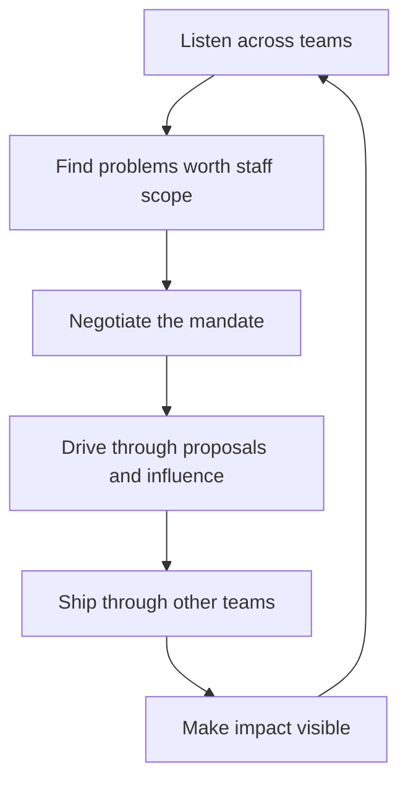

# The Staff Role and Scope

> **Core capability:** The staff engineer shapes technical outcomes across multiple teams without managing anyone — by choosing the right scope, operating through proposals and influence, and avoiding the role's characteristic traps.

## Why This Matters

Staff is the first level where the job stops being "more senior engineering" and becomes a different job. The defining change is scale of influence: problems too broad, ambiguous, or cross-cutting for one team, solved through proposals, reviews, strategy, and mentoring rather than personal implementation.

The role fails most often not from lack of skill but from lack of definition. Staff engineers without a clear mandate drift into three failure modes: **glue work martyrdom** (doing everyone's unowned chores), **invisible impact** (influential work nobody can see), or **hero projects** (one big bet that drowns out everything else). This area defines the mandate, the archetypes, and the operating model before the skills.

## Topics in This Capability Area

| Topic | Core Skill | When It Matters |
|-------|------------|-----------------|
| [[01_The_Four_Staff_Archetypes]] | Choosing between Tech Lead, Architect, Solver, and Right Hand shapes | Role start; mandate negotiation |
| [[02_Staff_vs_Senior_Scope]] | Understanding what changes and what stops at staff level | Transition; scope disputes |
| [[03_Finding_Staff_Scope_Work]] | Discovering and scoping problems worth staff attention | Continuously; after finishing an arc |
| [[04_The_Staff_Operating_Model]] | Structuring time: writing, reviews, office hours, cadence | Always; calendar bankruptcy prevention |
| [[05_Staff_Without_Authority]] | Making decisions stick with borrowed authority | Every cross-team initiative |
| [[06_Staff_Engineer_Career_Traps]] | Avoiding glue work martyrdom, invisibility, scope drift | Always; promotion cycles |
| [[07_First_90_Days_as_Staff]] | Finding leverage points and establishing the mandate | New role; new org |

## The Staff Operating Loop

The loop never closes: staff work is a portfolio of arcs, not a series of finished projects.

## What Changes from Senior to Staff

| Activity | Senior engineer | Staff engineer |
|----------|-----------------|----------------|
| Scope | One team's system area | Multiple teams, a domain, or the org |
| Mechanism | Personal delivery + team influence | Proposals, strategy, reviews, mentoring |
| Implementation | Writes the important code | Ships through others; writes spikes when needed |
| Decisions | Consequential for the team | Consequential across teams |
| Visibility | Known by their team | Known across the org; impact must be legible |

## Practical Applications

### Staff Role Checklist

- [ ] Your archetype (lead, architect, solver, right hand) is chosen, not accidental
- [ ] Your mandate is written and agreed with leadership
- [ ] Your current arcs (2-4) are scoped with end states
- [ ] Calendar reflects the operating model: writing blocks, review capacity, office hours
- [ ] Impact is visible outside the teams you helped
- [ ] You can name your traps and your counter-measures
- [ ] Succession exists for anything only you hold

## Common Pitfalls

| Pitfall | Why It Is a Problem | Better Approach |
|---------|---------------------|-----------------|
| **Glue work martyrdom** | Unowned chores fill the calendar; no arc completes | Triage glue work; delegate, automate, or decline |
| **Invisible influence** | Real impact nobody can see stalls promotion | Narrate impact; make arcs legible |
| **Scope drift** | Back to team-level work within six months | Re-negotiate scope quarterly |
| **Authority confusion** | Acting like a manager without the role | Influence through proposals, never directives |

## Success Indicators

- Teams you don't work with adopt your proposals
- Your calendar shows protected writing and thinking time
- Leadership can state your mandate in one sentence
- At least one arc completed per half-year with measurable outcomes
- You are consulted early, not complained to late

## Related Capabilities

- [[04_Influence_and_Alignment/00_overview|Influence and Alignment]]: the mechanism staff work runs on
- [[03_Technical_Strategy/00_overview|Technical Strategy]]: the highest-leverage staff output
- [[career-path/02_Senior_Software_Engineer/01_Technical_Ownership/00_overview|Technical Ownership (Senior)]]: the foundation being scaled
- [[career-path/05_Tech_Lead/01_The_Tech_Lead_Role_and_Operating_Model/00_overview|The Tech Lead Role and Operating Model]]: the neighboring team-level role

## Summary

The staff role is defined by scope and mechanism, not seniority plus. Choose an archetype, negotiate a written mandate, structure the operating model around writing and influence, ship through others, and keep impact visible. The role's traps are all self-inflicted — and all avoidable with a deliberate operating model.
