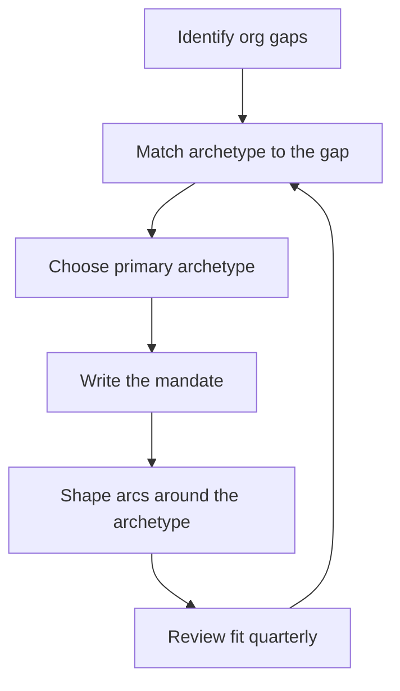

# The Four Staff Archetypes

> **Core skill:** Choosing between the four staff archetypes — Tech Lead, Architect, Solver, and Right Hand — and writing the mandate that matches the organization's need, not just personal preference.

## Why This Matters

The staff role is too broad to be defined by a job description. Two staff engineers at the same company can spend their days doing completely different work — one steering a platform team through a rewrite, another untangling a data corruption issue that has blocked three teams. Will Larson's *Staff Engineer* names the four recurring shapes this work takes: **Tech Lead** (guides a team), **Architect** (owns domain design), **Solver** (dives into hard problems), and **Right Hand** (extends an executive). The archetype is the default operating mode that makes the rest of the operating model coherent: scope, calendar, and success measures all follow from it.

The archetype must be chosen by **organizational need**, not preference alone. An org with five teams building overlapping services needs an Architect; an org with a new CTO trying to understand its own systems needs a Right Hand. Choosing the archetype you enjoy while the org needs another produces impact in the wrong direction — technically interesting, strategically invisible. The discipline is to read the org's gaps honestly, match the archetype to the gap, and write the mandate down so the choice survives quarterly reviews and leadership changes.

## The Four Archetypes

| Archetype | Primary mode | Fits when |
|-----------|--------------|-----------|
| **Tech Lead** | Guides a team or group of teams; owns technical direction and delivery | Teams need leadership and the org wants delivery anchored in technical judgment |
| **Architect** | Owns design of a domain or a system of systems; connects team-level decisions | The org has divergent systems and no one holds the cross-team design view |
| **Solver** | Takes deep dives into hard problems wherever they live | Chronic incidents, gnarly bugs, or stalled technical problems block multiple teams |
| **Right Hand** | Extends an executive; multiplies their technical reach | Leadership needs trusted technical perspective, review, or leverage beyond their own depth |

The archetypes are not ranks. An Architect is not "more senior" than a Solver — they serve different org needs. What makes an archetype staff-level is the **scope of the problem**, not the shape of the work.

## Matching Archetype to Org Need

| Org situation | Likely archetype | Why |
|---------------|------------------|-----|
| Growing org, new teams forming, uneven delivery | Tech Lead | Someone must hold technical direction where teams are too new to hold it themselves |
| Services multiplying, patterns diverging, integration pain | Architect | Someone must own the seams between systems before divergence becomes structural |
| Recurring incidents, hard debugging, deep performance work | Solver | The org's most expensive problems are problems of depth, not breadth |
| New executive, leadership transition, strategy gap | Right Hand | Someone must give the leader technical reach and honest perspective |

The same org can need different archetypes at different times. Match by gap, then confirm the match with leadership before committing to the mandate.

## Mixing Archetypes Across Arcs

A staff career is a portfolio of arcs, and the archetype can shift per arc:

| Arc | Archetype | Why it fits |
|-----|-----------|-------------|
| Standard portfolio | Your primary archetype | The org's steady-state need defines the default |
| Crisis arc: outage investigation, hard bug | Solver | Depth work is urgent and bounded |
| New initiative needing a technical owner | Tech Lead | Until a permanent lead emerges, someone must guide |
| Executive strategy review | Right Hand | A bounded, high-stakes support engagement |

Mixing is normal; **drifting** is not. Each arc should name its archetype deliberately. If you cannot say what archetype an arc needs, the arc is probably unshaped.

## Archetypes Change Over Time

As the org matures, the gaps move. A Tech Lead who was right at three hundred people may be wrong at three thousand, when the org's need shifts to Architect work across a sprawled platform. A Solver who thrived in the incident-heavy years may find the problems disappear as reliability improves. Archetype drift happens on both sides: the org changes its need, or you change what you want to do. Revisit the archetype at least annually with leadership — the question is not "what do I want to be," but "what does the org need now, and is that a fit I can sustain."

## The Written Mandate per Archetype

| Mandate element | What it names |
|-----------------|---------------|
| Archetype | Which of the four shapes this role takes |
| Scope | The teams, domains, or leader this role serves |
| Outcomes | The results expected in the next half-year |
| Arcs | The 2-4 initiatives the role will run |
| Measures | How success will be recognized |

A mandate that names the archetype prevents the most common staff failure: doing excellent work in the wrong shape.



## Practical Applications

```markdown
# Staff Mandate — [name] — [date]

## Archetype
- [ ] Primary archetype: [Tech Lead / Architect / Solver / Right Hand]
- [ ] Why this archetype now: [the org gap it answers]

## Scope
- [ ] Teams or domains in scope: [names]
- [ ] Explicitly out of scope: [names]

## Outcomes
- [ ] Outcome 1 with measure: [what success looks like]
- [ ] Outcome 2 with measure: [what success looks like]

## Arcs
- [ ] Arc 1: [name, archetype, end state]
- [ ] Arc 2: [name, archetype, end state]

## Review
- [ ] Next archetype review: [date]
```

Checklist:

- [ ] The archetype is named and agreed with leadership
- [ ] The org gap it answers is written down
- [ ] Each current arc names its own archetype
- [ ] The annual review includes the archetype question

## Common Pitfalls

| Pitfall | Why It Is a Problem | Better Approach |
|---------|---------------------|-----------------|
| **Archetype by preference alone** | Enjoyable work the org does not need reads as invisible impact | Read the org's gaps first; negotiate the fit |
| **Archetype by job title** | The title says Staff; the org need says something else | Match to the gap, then confirm with leadership |
| **One archetype forever** | Org needs shift; a fixed shape goes stale | Revisit the archetype annually and per arc |
| **Mandate without archetype** | The mandate describes work, not shape; scope disputes recur | Name the archetype explicitly in the mandate |
| **Mixing too thinly** | Every arc a different shape; no identity or depth | One primary archetype, occasional deliberate switches |
| **Refusing a needed archetype** | The org's real gap goes unfilled while you do what you like | Take the needed shape, or negotiate who fills it |

## Success Indicators

- Leadership can state your archetype in one sentence
- Your arcs match the archetype and the org gap
- The mandate survives leadership changes with a re-negotiation, not a restart
- You can articulate why this archetype now, and when it will change
- Your impact is visible in the shape the org needed, not the shape you preferred

## Related Topics

- [[02_Staff_vs_Senior_Scope]]: what the scope jump means regardless of archetype
- [[03_Finding_Staff_Scope_Work]]: finding the gaps the archetype must answer
- [[07_First_90_Days_as_Staff]]: choosing the archetype early in the role
- [[03_Technical_Strategy/00_overview|Technical Strategy]]: the highest-leverage output for most archetypes

## Summary

The four staff archetypes — Tech Lead, Architect, Solver, and Right Hand — are the recurring shapes of staff work. The archetype must be chosen by organizational need, named in a written mandate, and revisited as the org matures; arcs can mix archetypes deliberately, but the default shape must be deliberate too. Staff work fails most often when it is excellent in the wrong shape — the archetype is the guard against that failure.
