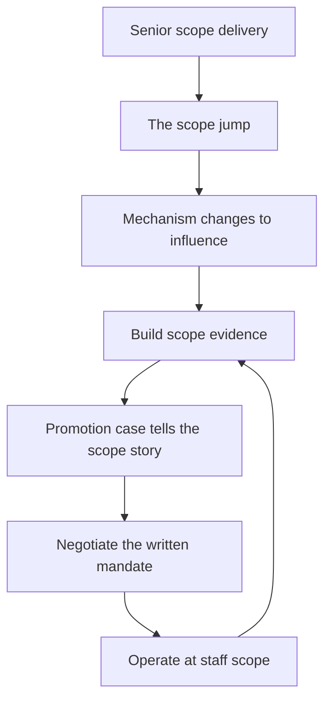

# Staff vs Senior Scope

> **Core skill:** Understanding exactly what changes between senior and staff — breadth, mechanism, and implementation — and what must not change: still an individual contributor, still technical, still shipping.

## Why This Matters

The senior-to-staff transition is the first promotion where the job changes shape rather than size. A senior engineer who is simply "given bigger projects" will fail at staff, because the mechanism of delivery changes: staff engineers ship through other teams, not through their own commit history. Misunderstanding the jump produces two familiar failures — the staff engineer who keeps doing senior work and quietly stagnates, and the promoted senior who tries to manage without the title and alienates every team.

The scope jump is also where promotion conversations go wrong. Committees promote on evidence of scope, and candidates often present evidence of excellence. Excellence at senior scope is not evidence of staff scope. Understanding the dimensions of the jump — breadth, mechanism, implementation, decisions — tells you what to collect as evidence and what to negotiate as scope.

## The Scope Jump

| Dimension | Senior engineer | Staff engineer |
|-----------|-----------------|----------------|
| Breadth | One team's system area | Multiple teams, a domain, or the org |
| Mechanism | Personal delivery plus team influence | Proposals, strategy, reviews, and mentoring |
| Implementation | Writes the important code | Ships through others; writes spikes when needed |
| Decisions | Consequential for the team | Consequential across teams |
| Accountability | Owns delivery of their area | Owns outcomes of initiatives they do not staff |

Every row of the table is a discontinuity, not a scaling. The staff engineer's lever moves from keyboard to proposal; the success measure moves from shipped code to adopted direction.

## What Does NOT Change

| Still true at staff | What it means in practice |
|---------------------|---------------------------|
| Still an individual contributor | No direct reports, no hiring authority, no performance reviews |
| Still technical | Judgment, design, and review depth are the currency |
| Still ships | Staff work that never lands is decoration; arcs end in shipped outcomes |
| Still accountable for quality | Your name is on the initiatives you lead, even when you wrote none of the code |

The "still an IC" line is the hardest to hold. Teams will treat you like a manager; leadership will sometimes ask you to behave like one. The staff role holds influence without authority, and the discipline of staying an IC is what keeps the role distinct.

## Common Misreads

| Misread | Why it hurts | The correction |
|---------|--------------|----------------|
| **Staff as senior-plus** | More of the same work at the same mechanism; the org gets no new capability | Change mechanism: proposals, influence, and reviews |
| **Staff as junior manager** | You inherit people problems without the title or the tools | Stay an IC; route personnel matters to managers |
| **Staff as the best coder** | Depth worship; cross-team impact never happens | Impact is breadth and adoption, not personal output |
| **Staff as a reward** | Promotion without a scope change; the mandate is empty | Negotiate scope before or with the title |

## The Promotion Gap from Both Sides

The gap between "senior working at staff scope" and "staff title" is felt differently by each side:

| Side | What they see | What they need |
|------|---------------|----------------|
| Candidate | High-quality delivery, busy calendar, no visibility of cross-team work | Help scoping, naming, and narrating cross-team impact |
| Committee | Promotion case with team-scoped evidence and no written mandate | Evidence of breadth, adoption, and decisions across teams |

The resolution is the same from both sides: **scope evidence**. A promotion case that shows proposals adopted by teams you do not own, decisions that held across boundaries, and arcs that shipped through others is a staff case. A case that shows excellent PRs is a senior case, no matter how many.

## Building Scope Evidence for Promotion

- [ ] Every arc has a written problem statement and end state
- [ ] Proposals are published and linked from the promotion doc
- [ ] Adoption is measurable: teams cite your records in their own decisions
- [ ] Reviews you ran across teams are named with outcomes
- [ ] The mandate and leadership agreement are attached
- [ ] Impact is narrated in terms of org outcomes, not hours or lines



## Practical Applications

```markdown
# Promotion Evidence — [name] — [cycle]

## Scope statement
- [ ] Breadth: [teams/domain/org] | Mechanism: [proposals/influence] | Decisions: [list]

## Arcs
- [ ] Arc 1: [name, teams affected, outcome, adoption evidence]
- [ ] Arc 2: [name, teams affected, outcome, adoption evidence]

## Decision records
- [ ] Records you authored that teams cite: [links]
- [ ] Records you influenced: [links]

## Reviews
- [ ] Cross-team reviews with outcomes: [list]

## Mandate
- [ ] Written mandate agreed with leadership: [link]
```

Checklist:

- [ ] Every claim of scope has an artifact behind it
- [ ] Adoption and decisions are named, not just activity
- [ ] The case reads as "different job," not "more senior"
- [ ] Leadership can repeat the scope statement back

## Common Pitfalls

| Pitfall | Why It Is a Problem | Better Approach |
|---------|---------------------|-----------------|
| **Evidence of excellence** | Great senior work proves senior scope only | Collect adoption and decision evidence |
| **Scope by title** | The title arrives without the scope; the job stays the same | Negotiate mandate and scope explicitly |
| **Manager cosplay** | Directing people without authority erodes trust | Influence through proposals; refer people to managers |
| **Code withdrawal** | Personal delivery collapses while influence ramps slowly | Keep small, deliberate technical involvement |
| **Measuring yourself like a senior** | Lines, PRs, and on-call hours mislead at staff scope | Measure adoption, decisions, and arc outcomes |
| **Waiting for the title** | Scope never grows because it was never requested | Start operating at staff scope; the title follows |

## Success Indicators

- You can state your scope in one sentence: breadth, mechanism, decisions
- Proposals you write are adopted by teams you do not own
- Your calendar shows more influence work than delivery work
- Leadership and the promotion committee describe your scope correctly
- You remain recognizably technical — review, design, and judgment — while shipping through others

## Related Topics

- [[01_The_Four_Staff_Archetypes]]: the shape the scope jump takes
- [[06_Staff_Engineer_Career_Traps]]: the failures that follow a scope misread
- [[career-path/02_Senior_Software_Engineer/06_Communication_and_Influence/03_Influence_Without_Authority|Influence Without Authority (Senior)]]: the mechanism being scaled
- [[04_Influence_and_Alignment/00_overview|Influence and Alignment]]: how staff influence actually works

## Summary

The staff jump changes breadth, mechanism, implementation, and decisions — while leaving the engineer an IC, technical, and shipping. Misreads of the jump — senior-plus, junior manager, best coder, reward — produce invisible impact or authority confusion. Promotion cases must tell a scope story with evidence of adoption and decisions, and the mandate must be negotiated with the title, not after it.
