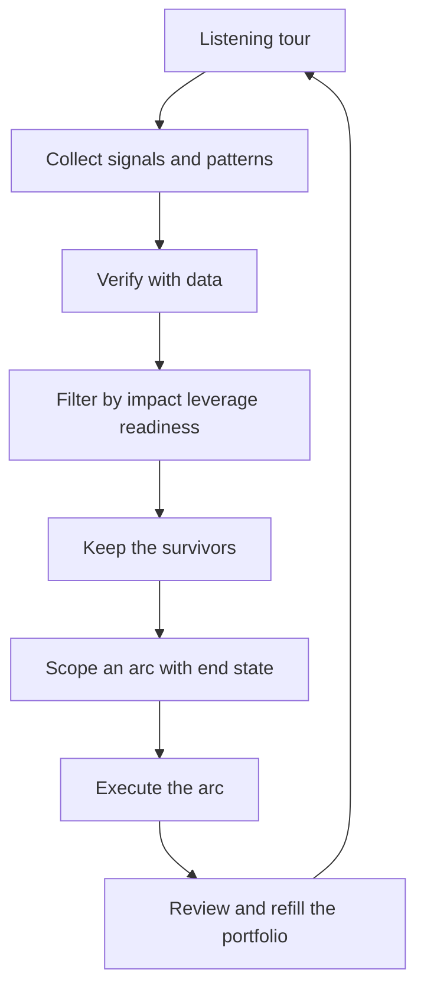

# Finding Staff Scope Work

> **Core skill:** Discovering problems that are genuinely staff-sized — between teams, above teams, or repeated across teams — and scoping them into arcs with end states.

## Why This Matters

Staff work is not assigned in a queue. The problems worth a staff engineer's time are the ones no team owns: the seam between two services, the incident that recurs across four squads, the migration nobody will staff, the pattern every new team reinvents. These problems do not file themselves, and they will not be handed to you. Finding them is the first job skill of the staff role, and it has to be deliberate — a listening habit, a filtering method, and the discipline to say no to the wrong scope.

The failure mode is doing everyone else's work. A staff engineer who is available will absorb team-scope tasks all day: tricky bugs, design questions, unowned chores. That work is real and valuable — and it is exactly the work the staff role must route elsewhere, because it fills the calendar and ships nothing at org scale. Finding staff work is therefore two skills in one: detecting the right problems, and refusing the tempting ones.

## Where Staff Problems Live

| Location | Signal | Example |
|----------|--------|---------|
| Seams between teams | Ownership arguments, integration bugs, dropped handoffs | Two services with no agreed contract owner |
| Repeated incidents | The same postmortem written three times | Memory pressure killing different services monthly |
| Stalled migrations | A migration a year old with no end in sight | The framework upgrade every team "is working on" |
| Divergent patterns | Each team builds its own variant | Three caching layers, five config formats |
| Leadership blind spots | Leaders surprised by technical reality | A cost spike nobody saw coming until budget season |

Each location has a distinct signal. Learn to hear them in standups you attend as a guest, in postmortems, in one-on-ones, and in the gap between what roadmaps promise and what integrations deliver.

## The Listening Tour Method

A listening tour is a bounded, structured set of conversations — the staff equivalent of reconnaissance:

| Step | What happens |
|------|--------------|
| 1. Scope the tour | Pick the teams, leaders, and systems worth hearing; 6-12 conversations |
| 2. Ask open questions | "What slows you down?" "What do you own that you should not?" "What breaks?" |
| 3. Listen for patterns | Collect signals across conversations, not within one |
| 4. Verify | Check the pattern with data: incident counts, migration ages, duplicate services |
| 5. Feed back | Close the loop with the people you interviewed; they become early allies |

The tour is not a survey and not a therapy session. Its output is a shortlist of candidate problems with evidence, ready for filtering.

## Problem Filtering: Impact x Leverage x Readiness

| Filter | Question | Reject if |
|--------|----------|-----------|
| Impact | Does solving this change outcomes for multiple teams or the org? | Only one team benefits |
| Leverage | Does your involvement multiply others, or substitute for them? | You would be doing team work solo |
| Readiness | Are stakeholders ready to change? Is there a mandate window? | No owner, no budget, no appetite |

Score each candidate on the three filters. A problem that fails any filter is not staff work today — it may become staff work when readiness matures, so keep it on a watch list rather than dropping it.

## Scoping an Arc

An arc is a staff initiative with a defined end:

| Element | What it contains |
|---------|------------------|
| Problem statement | The pain, who feels it, and the evidence |
| Success criteria | Measurable end state: adoption, incidents, time saved |
| Duration | A bounded window — typically one to two quarters |
| Owner | You are the named driver, even if others execute |
| Exit | What happens when the arc closes: handoff, standard, or decision |

An arc without success criteria is a hobby; an arc without a duration is a committee.



## Saying No to Tempting Work

| Temptation | Why it tempts | The decline |
|------------|---------------|-------------|
| A gnarly team bug | It is interesting and you can fix it | Point to the owner; offer review |
| A design doc with no author | You would write it beautifully | Name an author; offer feedback |
| An unowned cross-team task | Someone must do it | Staff it properly or decline visibly |
| A new project kickoff | Early involvement is valuable | Attend once; do not join the team |
| Leadership asks for the impossible | It feels important | Negotiate scope before accepting |

The decline is not a refusal of help — it is a statement of scope. Say what you are working on, why it matters more, and who can take the tempting task. Teams respect a staff engineer who protects their own mandate; they lose respect for one who absorbs everything.

## Practical Applications

```markdown
# Candidate Problem Log — [quarter]

| Problem | Location | Impact | Leverage | Readiness | Verdict |
|---------|----------|--------|----------|-----------|---------|
| [name] | [seam/incident/migration/pattern/blind spot] | [teams affected] | [multiply/substitute] | [owner, appetite] | [arc / watch / decline] |
```

Checklist:

- [ ] One listening tour per quarter, with a written synthesis
- [ ] Candidate problems logged with evidence
- [ ] Every current arc has success criteria and a duration
- [ ] Tempting team-scope work is declined visibly and helpfully
- [ ] The portfolio has 2-4 arcs, not 9

## Common Pitfalls

| Pitfall | Why It Is a Problem | Better Approach |
|---------|---------------------|-----------------|
| **Problem shopping** | Interesting problems with no org impact consume the year | Filter by impact first, interest last |
| **The savior complex** | Solving everyone's team problems one by one | Route team-scope work; keep org-scope only |
| **Data-free intuition** | Patterns that feel real but do not exist | Verify every signal with data before scoping |
| **Arc sprawl** | Nine half-arcs, zero completions | Cap the portfolio; finish before adding |
| **No exit plan** | Arcs that never close become standing committees | Write the exit into every arc |
| **Declining without help** | Saying no without a path leaves teams stranded | Decline with a named alternative |

## Success Indicators

- The arc portfolio reflects verified org pain, not personal interest
- Problems from all five locations appear in your log
- Teams bring you problems early because you route them well
- Most arcs reach their success criteria and close
- You can name the tempting work you declined this quarter

## Related Topics

- [[02_Staff_vs_Senior_Scope]]: why scope discipline matters at staff level
- [[04_The_Staff_Operating_Model]]: how arcs fit into the staff calendar
- [[07_First_90_Days_as_Staff]]: the listening tour that opens the role
- [[03_Technical_Strategy/00_overview|Technical Strategy]]: the arc portfolio becomes strategy

## Summary

Staff scope work lives between teams and above teams: seams, repeated incidents, stalled migrations, divergent patterns, and leadership blind spots. A structured listening tour surfaces candidates; an impact-by-leverage-by-readiness filter selects them; a scoped arc with success criteria and an exit ships them. The discipline includes declining the tempting team-scope work that would quietly consume the role.
