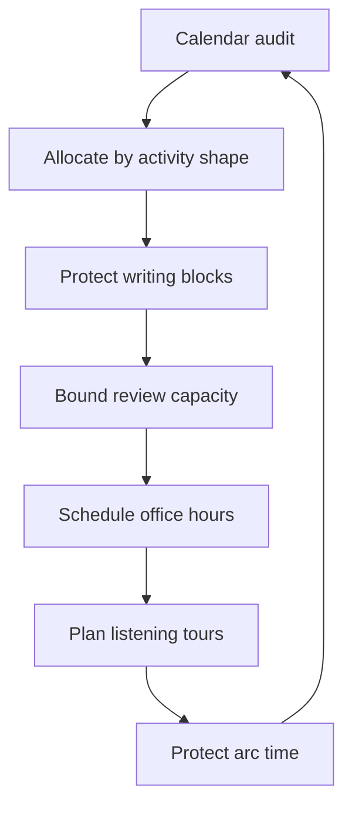

# The Staff Operating Model

> **Core skill:** Structuring the staff calendar — writing blocks, bounded reviews, office hours, listening tours, and arc time — so influence work actually happens instead of being crowded out by meetings.

## Why This Matters

The staff role runs on time that the org will not protect for you. Everyone wants a piece of the staff engineer: the review, the alignment meeting, the design consult, the "quick question" that becomes an hour. The org's default allocation of your time is the meeting trap — invited everywhere because you are useful everywhere, and useful nowhere as a result. The operating model is the counterweight: a deliberate calendar structure that protects the activities that only produce value in uninterrupted blocks.

The core insight is that staff work has a different time shape than team work. Writing a proposal is not interruptible. Reviewing a design properly requires a quiet hour, not ten minutes between meetings. If the calendar is built from one-hour slots, the staff engineer produces meeting minutes and nothing else. The operating model allocates time by activity shape first, and lets meetings fill the residue.

## The Staff Calendar

| Block | Share of the week | Purpose |
|-------|-------------------|---------|
| Writing blocks | 20-30% | Proposals, strategies, decision records — deep work that needs protection |
| Review capacity | 10-15% | Bounded, strategic review slots; triage the queue |
| Office hours | 5-10% | Open consulting: walk-ins, quick design questions |
| Listening tours | Quarterly, 1-2 weeks | Structured reconnaissance across teams and leaders |
| Arc time | The majority | Execution: meetings that move arcs, coordination, shepherding |

The percentages are a starting point, not a law. The shape matters more: **writing is protected**, **reviews are bounded**, **everything else is managed through the margin**.

## The Calendar Audit

A quarterly audit answers one question: does the calendar match the operating model?

- [ ] Writing blocks are on the calendar, not just intended
- [ ] Review time is bounded; the queue does not drive the calendar
- [ ] Office hours exist as real slots with a visible signup
- [ ] Listening tour time is scheduled for this quarter
- [ ] Recurring meetings have a stated reason to exist
- [ ] The majority of the week is arc time, not attendance

## The Meeting Trap

| Meeting type | Default invitation | The move |
|--------------|--------------------|----------|
| Status meetings | "Useful to have you" | Decline unless an arc needs you; read the notes |
| Decision meetings | "You should be in the room" | Attend if you influence the decision; otherwise the record |
| Design reviews | "Your input matters" | Attend within review capacity; delegate the rest |
| Leadership syncs | "We want your perspective" | Attend; this is mandate work |
| New initiative kickoffs | "Early alignment" | Send a written position instead of presence |

The rule: **attend meetings that move arcs or the mandate; read the notes on everything else.** Every recurring invitation gets a periodic review — if you cannot state why you are in a meeting, leave it.

## Delegation of Self

The hard question is not what you can delegate — it is what only you can do:

| Only you can do | Feels like only you, but can move |
|-----------------|-----------------------------------|
| Author the mandate-level proposal | Review someone else's draft of your idea |
| Hold the executive relationship | Staff the working sessions, attend rarely |
| Make the call on the contested decision | Run the process, record the outcome |
| Represent the org in the critical forum | Represent the initiative in routine forums |

Delegation of self is not abdication. It is the recognition that the org needs your judgment on the few decisions only you can make, and your attention on the few relationships only you hold — and that everything else, done by others, scales you.

## Energy Management Across Contexts

Staff work alternates between deep solitary writing and high-context social work, and the switching itself is the cost. Practical patterns:

| Pattern | Why it works |
|---------|--------------|
| Batch similar contexts | All the meetings in the afternoon; writing in the morning |
| Writing before the day opens | Proposals advance before the first interruption |
| Review slots with hard bounds | Deep review work is finite, visible, and protected |
| One no-meeting day per week | Arc work and writing get a guaranteed runway |
| Walk-between-meetings buffer | Context switching has a physical reset |



## Practical Applications

```markdown
# Weekly Operating Template — [week]

## Protected
- [ ] Writing block 1: [proposal/strategy] — [day, time]
- [ ] Writing block 2: [record/retrospective] — [day, time]
- [ ] Review slots: [bounded hours, named reviews]

## Open
- [ ] Office hours: [day, time, signup link]
- [ ] Arc meetings: [the ones that move work]

## Declined this week
- [ ] [meeting or request] — reason: [arc time / not my scope / notes suffice]
```

Checklist:

- [ ] Writing blocks appear on the calendar every week
- [ ] The review queue is triaged, not absorbed
- [ ] Office hours have a visible signup
- [ ] The audit runs quarterly with written findings
- [ ] You can name what only you can do this week

## Common Pitfalls

| Pitfall | Why It Is a Problem | Better Approach |
|---------|---------------------|-----------------|
| **The meeting trap** | Attendance fills the calendar; no arc ships | Attend for arcs and mandate; read notes otherwise |
| **Review queue as calendar** | Unbounded review demand crowds out writing | Fixed review capacity; triage honestly |
| **Protecting time on paper only** | Blocks exist but meetings colonize them | Decline into the block; move it, do not trade it |
| **Heroic over-delivery** | Doing others' work because it is faster | Delegate visibly; let others grow |
| **No energy model** | Constant context switching burns out the role | Batch contexts; protect a no-meeting day |
| **Audit without change** | The audit documents the problem and repeats it | One structural change per audit, enforced |

## Success Indicators

- Writing blocks survive the quarter with only deliberate exceptions
- The review queue is healthy: bounded, triaged, and mostly on time
- You can name your arcs and their time share
- Office hours are used and valued by teams
- The calendar audit produces changes, not just findings

## Related Topics

- [[03_Finding_Staff_Scope_Work]]: the arc portfolio the calendar must protect
- [[05_Staff_Without_Authority]]: where the mandate's time pressure comes from
- [[06_Staff_Engineer_Career_Traps]]: what an unmanaged calendar becomes
- [[career-path/05_Tech_Lead/04_Team_Delivery_and_Execution_Leadership/05_Coordinating_Across_Teams|Coordinating Across Teams (Tech Lead)]]: the team-level precursor to this model

## Summary

The staff operating model is a deliberate calendar: protected writing blocks, bounded review capacity, visible office hours, quarterly listening tours, and arc time as the majority. Without the model, meetings and requests colonize the week and influence work never happens; with it, the staff engineer produces proposals, decisions, and shipped arcs — and can audit the calendar quarterly to keep it true.
