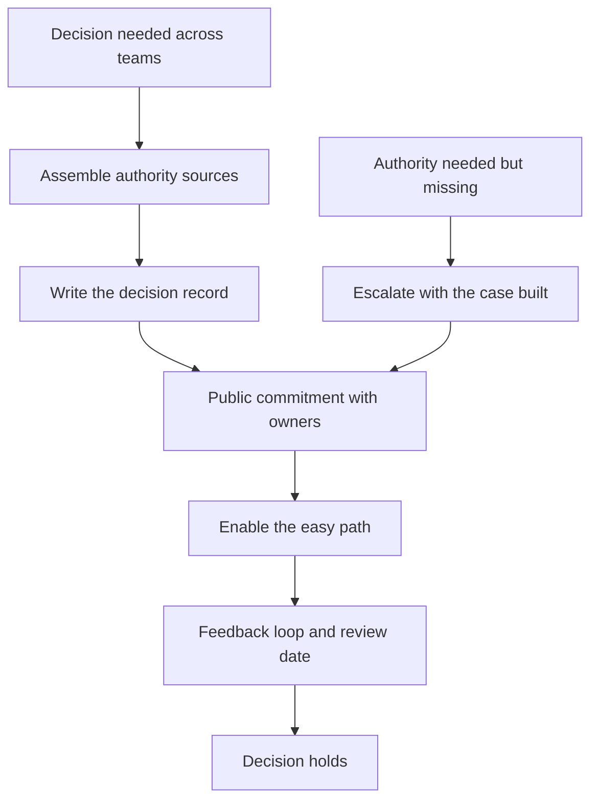

# Staff Without Authority

> **Core skill:** Making decisions stick across teams you do not manage — through borrowed, earned, and structural authority — and knowing exactly when real authority is needed and how to get it involved.

## Why This Matters

The staff engineer's hardest daily reality: you are accountable for outcomes you cannot command. Teams do not report to you; their backlogs are not yours; their incentives point elsewhere. Yet the org expects your proposals to land and your decisions to hold. The gap between expectation and authority is the whole game of the staff role — and it is winnable, because authority in an engineering org is mostly not what people think it is.

Authority at staff level is a portfolio of three sources: **borrowed** (leadership sponsorship), **earned** (a track record of good calls), and **structural** (the standing processes you own, like standards boards or review gates). The staff engineer assembles the portfolio deliberately. Decisions stick not because someone said so, but because they were recorded, publicly committed to, and enabled — three properties that are all within your control.

## Authority Variants

| Variant | Source | How it works |
|---------|--------|--------------|
| Borrowed | Leadership sponsorship | The CTO's backing opens doors; your proposals carry their weight |
| Earned | Track record | Past good calls make teams trust the next one |
| Structural | Standing processes | Boards, standards, review gates you own give decisions a home |

Borrowed authority depreciates fast — use it to get earned authority started, never as the daily currency. Earned authority compounds slowly and survives leadership changes. Structural authority is the quietest and most durable: a decision that flows through a process you own does not need you in the room.

## Making Decisions Stick

| Mechanism | What it does | Why it matters |
|-----------|--------------|----------------|
| Decision record | Writes the decision, the options, and the reasoning | The decision survives the room and the quarter |
| Public commitment | Named owners, dates, and expected outcomes | Accountability is visible; drift is visible too |
| Enablement | Tooling, templates, and examples that make compliance easy | The right path becomes the easy path |
| Feedback loop | A review date and a dissent channel | The decision can be corrected without being reopened |

A decision that is recorded, committed, and enabled is a decision that is implemented. A decision that is announced in a meeting and forgotten is not a decision — it is a wish.

## When Authority Is Genuinely Needed

Some decisions cannot be made by influence alone:

| Situation | Why staff authority fails | The move |
|-----------|---------------------------|----------|
| Personnel changes | You cannot hire, fire, or reassign | Bring the manager or exec in as the authority |
| Budget allocation | You cannot move money | Make the case with numbers; let the owner decide |
| Cross-org mandates | One team cannot be forced to comply | Escalate to the level that holds both teams |
| Policy enforcement | Repeated non-compliance needs teeth | Use the structural process, not personal pressure |

The move is not to complain about the missing authority — it is to **get the authority involved**. Frame it as "this decision needs your weight," name exactly what you need, and hand the decision-maker the material they need to make it well. Leadership usually grants authority when the alternative is a stalled initiative they own.

## The Anti-Pattern: Complaining About Lack of Authority

| Complaint | The reality | The reframe |
|-----------|-------------|-------------|
| "Nobody listens to me" | Influence was assumed, not built | Map stakeholders; pre-align one by one |
| "I have no authority" | Authority was never assembled | Borrow, earn, and structure it deliberately |
| "They should just do it" | Commitment was never negotiated | Public commitment: owners, dates, outcomes |
| "Decisions never stick" | Decisions were announced, not enabled | Record, commit, enable, and follow up |

The complaining staff engineer is a signal to leadership that the role is not working. The staff engineer who treats authority as an assembly problem — pieces to be gathered and maintained — rarely needs to complain.

## Influence Budget Accounting

Influence is finite. Every ask spends it; every delivered win earns it back:

| Ledger | Entries |
|--------|---------|
| Spend | Each proposal you push, each ask of a busy team, each escalation |
| Earn | Each decision that proved right, each enablement that saved effort |
| Audit | Quarterly: what did the org do because of you, and what did it cost them? |



## Practical Applications

```markdown
# Decision Record — [title] — [date]

## Decision
- [ ] What was decided: [one sentence]

## Authority
- [ ] Sources: [borrowed / earned / structural] — [who sponsors]
- [ ] If authority was missing: [who was brought in, and how]

## Commitment
- [ ] Owners: [names] | Dates: [dates] | Expected outcomes: [measures]

## Enablement
- [ ] Tooling, templates, or examples shipped: [what]

## Review
- [ ] Review date: [date] | Dissent channel: [where]
```

Checklist:

- [ ] Authority sources are named per decision
- [ ] Every consequential decision has a record
- [ ] Owners and dates are public
- [ ] The easy path is built, not assumed
- [ ] The influence ledger is audited quarterly

## Common Pitfalls

| Pitfall | Why It Is a Problem | Better Approach |
|---------|---------------------|-----------------|
| **Authority by announcement** | Decisions without record and commitment evaporate | Record, commit, enable |
| **Borrowed-authority dependency** | Every decision needs the exec in the room | Convert sponsorship into earned and structural authority |
| **Complaint loop** | Leaders hear noise, not cases | Escalate with the case built, once |
| **Influence overspend** | Every ask granted means the next ask is discounted | Earn between spends; choose asks carefully |
| **Structural authority misuse** | Using your process to win arguments, not improve decisions | The process must serve the org, not your position |
| **Authority denial** | Pretending you have none avoids accountability | You are accountable for outcomes; assemble what you need |

## Success Indicators

- Decisions you record are still in effect a quarter later
- Teams cite your records in their own planning
- Escalations to leadership are rare and well-prepared
- The influence ledger is positive: the org acts because of you
- You can name your authority sources for each active decision

## Related Topics

- [[02_Cross_Team_Technical_Leadership/00_overview|Cross-Team Technical Leadership]]: the arena where staff authority is exercised
- [[04_Influence_and_Alignment/00_overview|Influence and Alignment]]: the mechanism behind borrowed and earned authority
- [[career-path/02_Senior_Software_Engineer/06_Communication_and_Influence/03_Influence_Without_Authority|Influence Without Authority (Senior)]]: the team-level foundation
- [[02_Staff_vs_Senior_Scope]]: why the role stays influence-based, not management-based

## Summary

Staff authority is assembled, not granted: borrowed from leadership sponsorship, earned through a track record, and structural through the processes you own. Decisions stick when they are recorded, publicly committed, and enabled — and when genuine authority is missing for personnel or budget calls, the move is to bring the right authority in with the case already built. Complaints about authority are the anti-pattern; an influence ledger, audited quarterly, is the practice.
