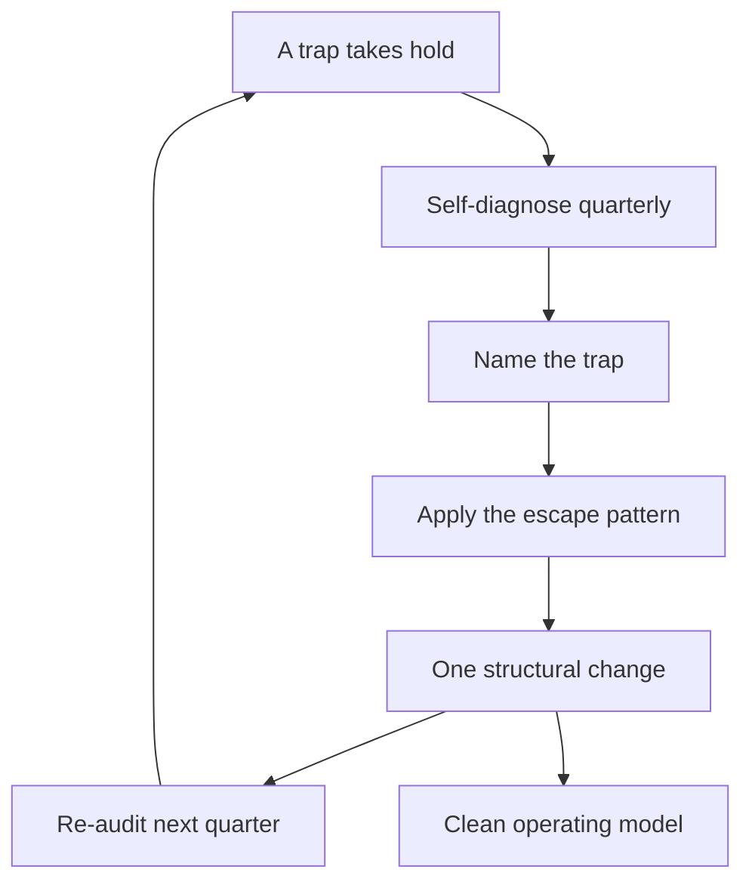

# Staff Engineer Career Traps

> **Core skill:** Recognizing the six traps that end staff careers — glue work martyrdom, invisibility, hero projects, scope drift, knowledge hoarding, and committee capture — and escaping them with a self-diagnosis routine.

## Why This Matters

Staff careers rarely end in a single failure. They end in a slow quarter-by-quarter erosion: the calendar fills with other people's priorities, the impact becomes invisible, the one big bet fails, the scope quietly shrinks back to team work, the knowledge concentrates in one head, the meetings replace the arcs. Each trap is survivable for a quarter; two quarters in two traps is a stalled promotion; three is a demotion conversation. The traps are the reason the staff role needs an operating model at all.

The good news: most traps are self-inflicted and therefore escapable. They are not personality flaws — they are structural responses to an underspecified role. The staff engineer who cannot name their trap and its escape pattern is living in it. This note is the catalog: the trap, the symptom, the escape.

## The Trap Catalog

| Trap | Symptom | Root cause |
|------|---------|------------|
| **Glue work martyrdom** | Calendar full of unowned chores; no arc completes | No triage discipline; saying yes to everyone |
| **Invisibility** | Real impact nobody can attribute to you | Impact narrated nowhere; no visibility systems |
| **Hero projects** | One giant bet consumes every resource | Scope was never bounded; all eggs in one arc |
| **Scope drift** | Back to team-level work within months | No written mandate; no quarterly re-negotiation |
| **Knowledge hoarding** | You are the bottleneck; teams wait for you | Delegation feels slower; no succession built |
| **Committee capture** | All meetings, no arcs; calendars prove it | Attendance without triage; no protected time |

## Self-Diagnosis

Two instruments catch the traps early:

**Calendar audit** (quarterly): categorize every hour of the last four weeks. Writing and arc time below a third of the week is a trap signal — likely glue work, committees, or scope drift.

**Impact inventory** (quarterly): list what changed in the org because of you, with evidence. If the list is short or the evidence is anecdotal, that is invisibility or hero-project risk.

| Instrument | Trap it detects | Frequency |
|------------|-----------------|-----------|
| Calendar audit | Glue work, committee capture, scope drift | Quarterly |
| Impact inventory | Invisibility, hero projects, hoarding | Quarterly |

## Escape Patterns per Trap

| Trap | Escape pattern |
|------|----------------|
| Glue work martyrdom | Triage the calendar; delegate, automate, or decline each unowned chore; protect arc time |
| Invisibility | Publish the impact doc; narrate outcomes to leadership monthly; make adoption legible |
| Hero projects | Bound the bet: one arc, success criteria, a kill criterion, and a portfolio around it |
| Scope drift | Re-negotiate the mandate quarterly; decline team-scope work visibly |
| Knowledge hoarding | Pair on your knowledge; write the decision records; build a successor for every bottleneck |
| Committee capture | Exit meetings without an arc reason; route requests to records and office hours |

Every escape is a calendar and a document change, not a personality change. The trap persists because the behavior is unexamined; the escape is the examination plus one structural change.

## Org-Caused vs Self-Caused

| Trap | Usually org-caused when | Usually self-caused when |
|------|-------------------------|--------------------------|
| Glue work | No one owns cross-team chores by design | You accept everything offered |
| Invisibility | No promotion process, no narrative culture | You never narrate your own impact |
| Hero projects | Leadership demands one big bet | You choose the bet over the portfolio |
| Scope drift | The org has no staff role definition | You never negotiated the mandate |
| Knowledge hoarding | Critical knowledge is undocumented by culture | You prefer being the bottleneck |
| Committee capture | The org runs on meetings | You attend without triage |

The distinction matters because the response differs: org-caused traps need a negotiation or an escalation; self-caused traps need a calendar change. Most traps are a mix — the diagnosis is which part is yours.



## Practical Applications

```markdown
# Quarterly Trap Check — [quarter]

## Calendar audit
- [ ] Writing and arc time: [share of week]
- [ ] Meetings without an arc reason: [count]

## Impact inventory
- [ ] What changed because of me: [list with evidence]
- [ ] Who can see it: [named audiences]

## Trap diagnosis
- [ ] Trap 1: [name] | Evidence: [what you saw]
- [ ] Trap 2: [name] | Evidence: [what you saw]

## Escapes
- [ ] Structural change 1: [the one change for this quarter]
- [ ] Structural change 2: [the one change for this quarter]
```

Checklist:

- [ ] The audit happens on a fixed date, not when things feel bad
- [ ] Each trap named has a concrete escape
- [ ] Escape number one is calendared, not intended
- [ ] The org-caused share is escalated or negotiated, not absorbed

## Common Pitfalls

| Pitfall | Why It Is a Problem | Better Approach |
|---------|---------------------|-----------------|
| **Trap shame** | Naming the trap feels like failure, so it goes unnamed | Traps are structural; name them clinically |
| **Fixing symptoms** | Quitting one meeting without a triage rule | Change the rule, not the instance |
| **Audit without action** | The check runs, the calendar does not change | One structural change per quarter, enforced |
| **Blaming the org entirely** | Self-caused share stays invisible | Split the diagnosis; fix your half |
| **Escaping into another trap** | Scope drift fixed by a hero project | Escape toward the operating model, not away |
| **Solo recovery** | No one to see the trap from outside | A peer staff engineer as a quarterly mirror |

## Success Indicators

- You can name your current trap and its escape at any time
- The quarterly audit produces structural changes
- Calendar audit shows arc and writing time at a healthy share
- The impact inventory is long and evidenced
- A peer reviews your diagnosis with you

## Related Topics

- [[04_The_Staff_Operating_Model]]: the calendar that prevents most traps
- [[01_The_Four_Staff_Archetypes]]: the mandate that prevents scope drift
- [[07_Organizational_Learning_and_Mentoring/00_overview|Organizational Learning and Mentoring]]: the cure for knowledge hoarding
- [[career-path/02_Senior_Software_Engineer/06_Communication_and_Influence/00_overview|Communication and Influence (Senior)]]: the skills that prevent invisibility

## Summary

Six traps end staff careers slowly: glue work martyrdom, invisibility, hero projects, scope drift, knowledge hoarding, and committee capture. Each has a symptom, a root cause, and an escape pattern — and each is caught by a quarterly self-diagnosis of calendar and impact. Most traps are partly self-caused and therefore escapable; the escape is always one structural change, calendared and enforced, not a personality overhaul.
