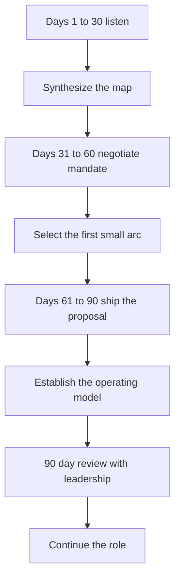

# First 90 Days as Staff

> **Core skill:** Using the first 90 days — listening first, negotiating the mandate second, shipping one visible win third — to establish the staff role on the right footing.

## Why This Matters

The first 90 days set the role's trajectory for years. What you do in month one defines what teams expect from you; what you negotiate in month two defines what leadership expects; what you ship in month three defines whether either expectation holds. The most common first-year failure is the reverse order: proposing in week two (before understanding the org), accepting a vague mandate (before understanding the leverage), and disappearing into the codebase (before building the influence).

The role is a new contract with the org, and the first quarter is the negotiation window. The org is most open to defining the role in your favor during the honeymoon — the mandate agreed in month two will not be re-opened in month six. The 90-day plan is therefore: listen, then negotiate, then deliver a small proof that the model works.

## Days 1-30: Listen

| Activity | Purpose |
|----------|---------|
| Listening tour with teams | Learn what slows them down; map the seams |
| Listening tour with leaders | Learn what the org needs; map expectations |
| Systems read | Learn the architecture as it really is, not as documented |
| No premature proposals | Earn the right to propose by understanding first |

The listening tour in the first month has one rule: **no proposals**. Every instinct to fix what you discover must wait. You are building the map, the relationships, and the credibility that make the month-two proposal land. Write a synthesis at the end: the pain points, the seams, and the candidate problems — the raw material for the mandate.

## Days 31-60: Negotiate and Build

| Activity | Purpose |
|----------|---------|
| Mandate negotiation | A written mandate agreed with leadership, naming scope and outcomes |
| First small arc selection | A bounded win you can actually ship in the next 60 days |
| Relationship capital | One-on-ones with the engineers and managers who matter most |
| Archetype choice | Which of the four archetypes this role takes |

The mandate is the deliverable of this phase: written, agreed, and named — archetype, scope, outcomes, arcs. The first arc should be deliberately small: the org is watching whether the model works, not whether it is ambitious. Pick the highest-confidence win among the candidate problems from the listening tour.

## Days 61-90: Deliver and Establish

| Activity | Purpose |
|----------|---------|
| First proposal shipped | The proposal for the first arc, adopted and started |
| Operating model established | Writing blocks, review capacity, office hours on the calendar |
| Visibility systems | The impact doc that makes your work legible |
| First win landed or visibly close | Proof the role produces outcomes |

The 90-day mark is when the org decides whether the staff role is working. One shipped proposal plus a visible operating model is enough — the goal is proof of mechanism, not transformation of the org.

## Inherited vs Greenfield Org

| Dimension | Inherited role | Greenfield role |
|-----------|----------------|-----------------|
| Mandate | Likely vague; negotiate hard | Likely open; propose the shape |
| Expectations | Reputation and history precede you | You define what staff means here |
| Listeners | Know the org; verify your map | Know nothing; build the map fast |
| Traps | Scope drift into prior patterns | Invisibility; no one knows what you do |
| Risk | Mandate never gets written | Mandate never gets bounded |

Both paths need the same 90-day structure; they differ in where the work is hardest. Inherited roles fight scope drift; greenfield roles fight vagueness.

## The Temptation to Prove Yourself Coding

| Why it tempts | Why it is wrong | What to do instead |
|----------------|------------------|--------------------|
| It is familiar and fast | It proves senior skills, not staff skills | Ship a proposal; let others execute |
| The codebase needs it | It fills your calendar and empties your mandate | Recommend it to a team; review the design |
| Impostor syndrome | The org sees a coder, not a leader | The mandate and the first win define you |

A first quarter spent coding is a first quarter that re-negotiated the role downward. The visible proof the org needs is a proposal adopted and an initiative moving — not a commit history.



## Practical Applications

```markdown
# 90-Day Plan — [role] — [start date]

## Days 1-30: Listen
- [ ] Listening tour: [teams, leaders, systems]
- [ ] Synthesis written: [pain, seams, candidates]

## Days 31-60: Negotiate
- [ ] Mandate agreed and written: [scope, outcomes, archetype]
- [ ] First arc chosen: [name, success criteria, duration]

## Days 61-90: Deliver
- [ ] Proposal shipped and adopted: [title, adoption evidence]
- [ ] Operating model calendared: [blocks, reviews, office hours]
- [ ] Impact doc published: [location]

## 90-Day Review
- [ ] Agenda: mandate check, first win review, next-arc discussion
- [ ] Questions for leadership: [what worked, what to adjust]
```

Checklist:

- [ ] No proposal shipped before day 30
- [ ] Mandate is written, not verbal
- [ ] First arc has a success criterion and a date
- [ ] The operating model is on the calendar by day 75
- [ ] The 90-day review is scheduled in advance

## Common Pitfalls

| Pitfall | Why It Is a Problem | Better Approach |
|---------|---------------------|-----------------|
| **Proposing too early** | Proposals without the map miss the org's real pain | Listen for 30 days; earn the right |
| **Vague mandate accepted** | Scope disputes for the next two years | Negotiate the written mandate in month two |
| **First arc too big** | The proof-of-mechanism drags into a year | Choose the smallest credible win |
| **Coding to prove yourself** | The role silently re-negotiates downward | Ship through others; stay visible |
| **Skipping the review** | No checkpoint; drift goes unnoticed | Book the 90-day review on day one |
| **Greenfield vagueness** | The role means everything and nothing | Bound the mandate even without history |

## Success Indicators

- Leadership can state your mandate by day 60
- The first proposal is adopted by day 90
- The operating model is visible on your calendar
- Teams describe you as a resource, not a threat or a savior
- The 90-day review produces a second-quarter plan, not a re-negotiation

## Related Topics

- [[01_The_Four_Staff_Archetypes]]: the archetype choice the mandate needs
- [[03_Finding_Staff_Scope_Work]]: the listening tour method in depth
- [[04_The_Staff_Operating_Model]]: the calendar to establish by day 75
- [[05_Staff_Without_Authority]]: the influence mechanics the first win depends on

## Summary

The first 90 days follow one arc: listen for 30 days without proposing, negotiate the written mandate and a small first arc by day 60, and ship the proposal and establish the operating model by day 90. The temptations — proposing early, proving yourself coding, accepting vagueness — all re-negotiate the role downward. The 90-day review with leadership closes the quarter with a second-quarter plan instead of a re-negotiation.
