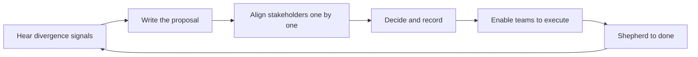

# Cross-Team Technical Leadership

> **Core capability:** The staff engineer aligns multiple teams around coherent technical direction — leading architecture across boundaries, driving migrations and standards, and reviewing systems they don't own.

## Why This Matters

Every team optimizes locally. At org scale, local optimization produces duplicated systems, conflicting patterns, and integration seams nobody owns. Someone must hold the cross-team view without owning any single team's backlog — that is the staff engineer's defining contribution.

This work succeeds through **legitimacy, not authority**: the best proposal, the clearest writing, the most useful review, the migration that actually finishes. Teams follow staff direction when it demonstrably makes their work easier — and route around it when it doesn't.

## Topics in This Capability Area

| Topic | Core Skill | When It Matters |
|-------|------------|-----------------|
| [[01_Cross_Team_Architecture]] | Designing boundaries, interfaces, and shared platforms | System splits; new cross-team services |
| [[02_Driving_Technical_Change]] | Moving orgs from current to target patterns | Standards adoption; new practices |
| [[03_Alignment_Across_Teams]] | Creating agreement without authority | Every multi-team initiative |
| [[04_Migration_Leadership]] | Leading migrations that actually finish | Platform moves; framework upgrades at scale |
| [[05_Standards_and_Reference_Architectures]] | Producing standards teams adopt willingly | Repeated divergence across teams |
| [[06_Reviewing_Beyond_Your_Team]] | Reviewing designs outside your expertise depth | Design reviews; architecture boards |
| [[07_Cross_Team_Communication]] | Translating between teams and audiences | Always; decision records |

## How Cross-Team Work Moves

Proposals align; enablement delivers. Skipping the enablement step is why so much staff work dies after the decision.

## What Changes from Tech Lead to Staff

| Activity | Tech Lead | Staff Engineer |
|----------|-----------|----------------|
| Architecture | One team's system direction | Boundaries between many teams' systems |
| Standards | Team conventions | Org-wide standards and reference architectures |
| Migrations | Executes team's migration | Leads multi-team migration end to end |
| Reviews | Reviews own team's designs | Reviews across teams, including unfamiliar domains |
| Communication | Team and stakeholders | Org-scale: writing that travels without you |

## Practical Applications

### Cross-Team Leadership Checklist

- [ ] Cross-team decisions produce written, findable records
- [ ] Every active migration has sequenced phases and a definition of done
- [ ] Standards ship with enablement: templates, tooling, examples
- [ ] Reviews you run improve designs without becoming bottlenecks
- [ ] Divergence signals (duplicate systems, conflicting patterns) are collected systematically
- [ ] Teams adopt your direction because it helps them, visible in their metrics

## Common Pitfalls

| Pitfall | Why It Is a Problem | Better Approach |
|---------|---------------------|-----------------|
| **Ivory tower direction** | Designs disconnected from delivery reality | Validate with teams; pilot before standardizing |
| **Decision theater** | Decisions made but nothing changes | Budget enablement and shepherding, not just alignment |
| **Big-bang migrations** | Multi-year efforts that die mid-way | Strangler approach; value at each phase |
| **Standard without adopter** | Standards ignored because adoption cost is invisible | Ship adoption tooling with every standard |

## Success Indicators

- Duplicate systems and conflicting patterns decline measurably
- Migrations finish — with momentum maintained past the hard middle
- Teams cite standards and records in their own decisions
- Review queues stay healthy; you review strategically, not exhaustively
- Cross-team interfaces change through negotiation, not surprise

## Related Capabilities

- [[01_The_Staff_Role_and_Scope/00_overview|The Staff Role and Scope]]: the mandate this executes
- [[05_Systems_Thinking_and_Organizational_Design/00_overview|Systems Thinking and Organizational Design]]: why divergence happens and how structure shapes it
- [[03_Technical_Strategy/00_overview|Technical Strategy]]: where cross-team direction comes from
- [[career-path/05_Tech_Lead/03_Technical_Direction_and_Architecture/00_overview|Technical Direction and Architecture (Tech Lead)]]: the team-level counterpart
- [[career-path/06_Software_Architect/00_overview|Software Architect]]: the role where architecture becomes the whole job

## Summary

Cross-team technical leadership means making the org's systems coherent: architecture across boundaries, change that lands, migrations that finish, standards that teams adopt because they help, and reviews that improve designs at scale. The currency is legitimacy — earned through proposals that make teams' work demonstrably easier.
