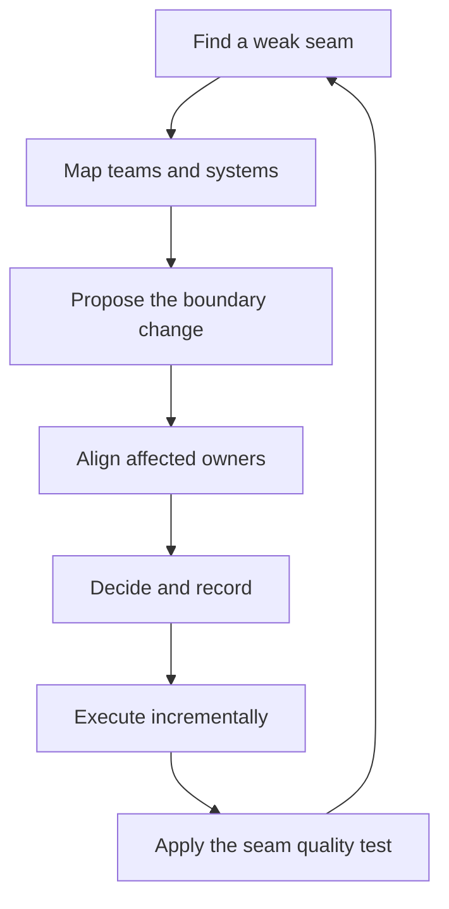

# Cross-Team Architecture

> **Core skill:** Designing the boundaries between teams' systems — service boundaries, interface contracts, and shared platforms — so teams can move independently without the org fracturing.

## Why This Matters

Every team optimizes locally; architecture is what the local optimizations add up to. Without a cross-team view, the sum is duplicated services, integration seams nobody owns, and change that requires a six-team coordination dance. The staff engineer holds the cross-team architecture view — not by designing every system, but by designing the **boundaries** between systems and the **contracts** across them.

The deep principle is Conway's law working in reverse: the system structure and the team structure will converge, so design the system structure to produce the team structure you want. Teams that can ship independently need service boundaries that match their ownership; interfaces that change through negotiation, not surprise; and a shared platform that absorbs the boring commonality. The seam quality test — can each team move independently? — is the single question that separates good cross-team architecture from elegant diagrams.

## Service Boundaries vs Team Boundaries

| Boundary type | Defined by | Owned by | Fails when |
|---------------|------------|----------|------------|
| Service boundary | System behavior and data ownership | The owning team | The service is too big to change alone |
| Team boundary | Headcount and mission | The org structure | The team owns pieces of many services |

The two must align: a service split across two teams has no owner; a team that owns a dozen services has no focus. Design boundaries so that **one team can change its service without coordinating with others** — the org chart and the service map should agree, and where they disagree, that seam is the highest-leverage architecture work available.

## Interface Contracts Between Teams

| Contract type | What it fixes | Owner | Change policy |
|---------------|---------------|-------|---------------|
| API contract | Request-response semantics and versions | The provider team | Versioned; breaking changes negotiated |
| Event contract | Message schemas and delivery guarantees | The producer, with consumers consulted | Schema evolution rules; never silent breaks |
| Data ownership | Which team owns which data, and who reads it | The owning team | Read access negotiated; writes owned |

Contracts are the architecture that teams actually live by. A contract without a change policy is a trap: the first breaking change is a cross-team incident, and the second is a political battle. The policy — versioning, deprecation windows, negotiated breaks — is what makes change safe.

## Shared Platform Design: Centralize vs Leave Local

| Centralize | Leave local |
|-------------|-------------|
| Identity, auth, and access | Team-specific business logic |
| Observability: tracing, metrics, logs | Dashboard content and alert thresholds |
| Security baselines and compliance | Implementation choices within the baseline |
| Deployment primitives | Deployment cadence and ownership |
| Data infrastructure commonality | Schema design and data modeling |

The test is the same as for standards: centralize what is **cheaper and safer to share**, leave local what **differing teams need freedom on**. Centralizing too much creates a platform bottleneck; centralizing too little creates fifteen variants of the same wheel. The platform's job is to make the boring path fast so teams spend their freedom on what matters.

## The Seam Quality Test

A boundary is good when teams can move independently. The test:

- [ ] Team A can change its service without Team B knowing
- [ ] Contracts change through the documented policy, not through surprise
- [ ] Data has one owner; readers negotiate access
- [ ] The platform absorbs commonality without a ticket queue
- [ ] A new team can join the system with no cross-team design meeting

## Boundary Change Process

| Step | What happens |
|------|--------------|
| 1. Name the change | The boundary problem: what moves, what breaks, who is affected |
| 2. Map the seam | Every team and system touching the boundary |
| 3. Propose the new shape | Written proposal with options and a recommendation |
| 4. Align the owners | One-on-ones with each affected owner before any meeting |
| 5. Decide and record | The decision record with dissent noted |
| 6. Execute incrementally | Strangler-style change; each step independently valuable |

Boundary changes are the highest-stakes architecture work because they cross ownership lines. The process exists to make the change negotiated rather than imposed — and the record exists so the reasoning outlives the room.

## Architecture Reviews Across Teams

The review is where the cross-team architecture view is maintained:

| Review type | Scope | Cadence |
|-------------|-------|---------|
| Design reviews | New services and significant changes | As designed |
| Architecture board | Cross-team, high-stakes decisions | Monthly |
| Boundary audits | Existing seams against the quality test | Quarterly |

The staff engineer runs these reviews as a guest, not a judge — the owning team decides, and the review exists to surface what the owning team cannot see from inside its own boundary.



## Practical Applications

```markdown
# Boundary Proposal — [boundary] — [date]

## The seam today
- [ ] Who owns what: [teams and systems]
- [ ] What breaks: [integration pain, coordination cost]

## The proposed shape
- [ ] Service boundary: [new ownership]
- [ ] Contracts: [API / event / data changes with policy]

## Centralization
- [ ] Shared platform changes: [what moves to the platform]
- [ ] Left local: [what teams keep freedom on]

## Seam quality after
- [ ] Team A moves without Team B: [how]
- [ ] Contract change policy: [where it is written]

## Decision
- [ ] Recorded: [link] | Dissent: [noted where]
```

Checklist:

- [ ] Boundaries match ownership; no service is split across teams
- [ ] Every cross-team contract has a change policy
- [ ] Platform scope is explicit; the ticket queue is not the platform
- [ ] The seam quality test passes for the changed boundary
- [ ] Reviews run as guest, not judge

## Common Pitfalls

| Pitfall | Why It Is a Problem | Better Approach |
|---------|---------------------|-----------------|
| **Diagram architecture** | Beautiful boundaries that nobody owns | Boundary work lives in ownership and contracts |
| **Service/team mismatch** | Split ownership produces coordination hell | Align boundaries to teams; fix seams first |
| **Contract without policy** | The first breaking change is an incident | Version, deprecate, negotiate breaks |
| **Platform grab** | Centralizing everything makes the platform the bottleneck | Centralize the boring; leave the freedom |
| **Boundary by surprise** | Changes announced, not negotiated | The written, aligned, recorded process |
| **Audit without action** | Seams catalogued, never fixed | One boundary improvement per quarter |

## Success Indicators

- Teams change their services without cross-team coordination
- Contract changes follow the documented policy
- New teams join the system without a design summit
- The platform absorbs commonality; teams keep freedom
- Boundary audits find fewer and fewer weak seams

## Related Topics

- [[02_Driving_Technical_Change]]: how boundary changes actually land
- [[05_Standards_and_Reference_Architectures]]: codifying the boundary patterns
- [[03_Technical_Strategy/00_overview|Technical Strategy]]: where cross-team architecture direction comes from
- [[career-path/05_Tech_Lead/03_Technical_Direction_and_Architecture/00_overview|Technical Direction and Architecture (Tech Lead)]]: the team-level counterpart

## Summary

Cross-team architecture is the design of boundaries: service boundaries that match team ownership, interface contracts with change policies, and shared platforms that absorb commonality without becoming bottlenecks. The seam quality test — can teams move independently — is the measure of every boundary, and the boundary change process makes change negotiated rather than imposed. Architecture reviews across teams maintain the view without owning the decisions.
