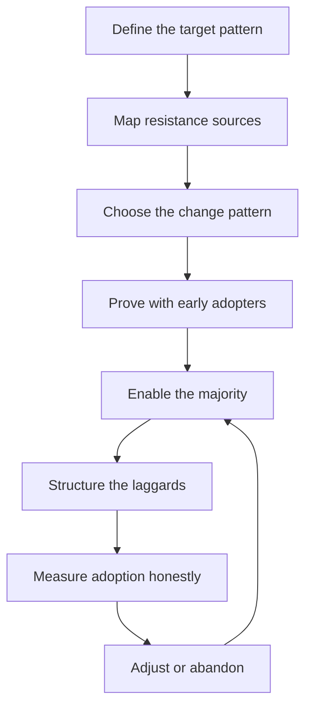

# Driving Technical Change

> **Core skill:** Moving organizations from current to target technical patterns — understanding resistance, choosing the right change pattern, and measuring adoption honestly.

## Why This Matters

Technical change fails more often on the human side than the technical side. The new service mesh is sound; the migration to it stalls because teams do not trust it. The standard is good; nobody adopts it because adopting costs more than diverging. The staff engineer's change work is therefore less about the target state and more about the **path** — understanding why orgs resist, choosing a change pattern that fits the situation, and measuring whether the change is actually landing.

The failure mode to avoid is the announcement: a decision, a town hall, a slide deck, and then silence. Adoption is not a communication problem; it is an economics problem. Teams adopt what is cheaper for them — in effort, risk, and career terms. The change leader's job is to make the new pattern genuinely cheaper, visibly proven, and locally owned.

## Why Orgs Resist

| Resistance source | What it looks like | What it responds to |
|-------------------|--------------------|---------------------|
| Status quo bias | "It works today" | A demonstrated problem with today |
| Incentive misalignment | The change helps the org, not the team | Adoption measured and rewarded |
| Sunk cost | "We built this" | Honest accounting of what the sunk system costs going forward |
| Risk asymmetry | Failure is visible, success is distributed | Pilots with bounded blast radius |
| Identity | "We are a [X] shop" | The change framed as capability, not conversion |

Resistance is information, not obstruction. Each source responds to a different argument, and the change leader who treats all resistance as the same wall will lose the argument they never actually made.

## Change Patterns

| Pattern | How it works | Fits when | Risks |
|---------|--------------|-----------|-------|
| **Pilot team** | One willing team adopts first; results prove the way | Change is risky or unproven; one team can represent many | The pilot never generalizes |
| **Paved path** | The new way is made dramatically easier; teams drift to it | Change is a default improvement, not a conversion | The path is underfunded and teams stay on the old road |
| **Mandate-backed** | Leadership requires adoption by a date | Change is urgent, org-wide, and not adoptable by economics alone | Compliance without belief; silent divergence |
| **Crisis-driven** | The incident or outage justifies the change | The status quo just failed visibly | The window closes; the lesson fades |

The patterns combine: a pilot proves the paved path, and a mandate covers the laggards. The mistake is choosing a pattern for comfort — mandate because it is fast, pilot because it is safe — instead of fit.

## The Adoption Curve

| Segment | Share | What they need |
|---------|-------|----------------|
| Early adopters | ~15% | A good idea and permission to try it |
| Majority | ~60% | Proof, enablement, and a local win |
| Laggards | ~25% | A deadline, a default, or a working example to copy |

The curve explains most adoption failures: pitching the majority with the arguments that moved the early adopters. The early adopters need vision; the majority needs **proof and ease**; the laggards need **structure**. The change plan must sequence for all three — celebrate the early adopters, enable the majority, and schedule the laggards' deadline.

## Change Fatigue Management

| Symptom | Cause | Response |
|---------|-------|----------|
| "Another initiative" | Change volume exceeds capacity | Sequence; finish before starting |
| Cynicism | Past changes died in the middle | Finish visibly; publish completions |
| Ritual compliance | Adoption theater without behavior change | Measure behavior, not attendance |
| Initiative pileup | Multiple changes competing for the same teams | A change portfolio with owners and order |

The change leader is also the change accountant: the org has a limited appetite, and every initiative spends it. If you cannot say what change finished last quarter, you do not get to start one this quarter.

## Measuring Adoption Honestly

| Measure | What it actually shows |
|---------|------------------------|
| Telemetry | Behavior: what teams actually run |
| Templates used | Enablement take-up |
| Exceptions requested | Divergence, visible and bounded |
| Support tickets | Pain in the new path |
| Team self-reports | Sentiment — useful, never sufficient |

Honest measurement distinguishes the change from the story about the change. The dashboard is the discipline: if the numbers do not move, the change has not happened regardless of the announcements.

## When to Abandon a Change Effort

| Signal | Question to ask |
|--------|-----------------|
| Adoption flat after enablement | Is the path actually easier, or only claimed to be? |
| The original problem moved | Did the problem solve itself another way? |
| The cost of continuing exceeds the remaining value | What is the honest remaining net present value? |
| A better alternative emerged | Does the new option dominate? |

Abandoning is a decision, recorded like any other — with the reasoning, so the next person does not restart a dead effort out of nostalgia. A killed change with a tombstone note is a contribution; a zombie change that consumes teams for another year is a tax.



## Practical Applications

```markdown
# Change Plan — [change] — [date]

## Target
- [ ] The pattern: [what the org should do]
- [ ] The problem it solves: [evidence]

## Resistance
- [ ] Sources mapped: [status quo / incentives / sunk cost / risk / identity]

## Pattern
- [ ] Chosen pattern: [pilot / paved path / mandate / crisis] | Why: [fit]

## Adoption
- [ ] Early adopters named: [who]
- [ ] Enablement shipped: [templates, tooling, examples]
- [ ] Laggard structure: [deadline or default]

## Measurement
- [ ] Telemetry or behavior metric: [what moves]
- [ ] Review dates: [when we check]
- [ ] Abandon criteria: [what would end it]
```

Checklist:

- [ ] Resistance sources are mapped, not assumed
- [ ] The pattern fits the situation, not the comfort
- [ ] Enablement exists before the majority is asked
- [ ] Adoption is measured by behavior, not attendance
- [ ] Finish and abandon are both planned outcomes

## Common Pitfalls

| Pitfall | Why It Is a Problem | Better Approach |
|---------|---------------------|-----------------|
| **The announcement** | Decisions without enablement produce no adoption | Ship the path, then announce |
| **Pilot that never generalizes** | One team's win becomes the whole story | Plan generalization from day one |
| **Mandate without economics** | Compliance with resentment and silent divergence | Make the new way cheaper, then mandate |
| **Majority pitched like early adopters** | Vision does not move the majority; proof does | Sequence arguments by segment |
| **Attendance metrics** | Theater passes for adoption | Measure behavior and telemetry |
| **Zombie changes** | Efforts that should be killed consume teams | Recorded abandon criteria, honored |

## Success Indicators

- Adoption telemetry moves; behavior changes measurably
- Teams cite the change as their own decision, not an imposition
- Change fatigue is managed: the portfolio has an order
- Failures are killed with records, not nostalgia
- The org's default pattern shifted, and the shift survives

## Related Topics

- [[03_Alignment_Across_Teams]]: the stakeholder work that precedes adoption
- [[04_Migration_Leadership]]: the change pattern with the longest arc
- [[05_Standards_and_Reference_Architectures]]: codifying the adopted pattern
- [[career-path/05_Tech_Lead/03_Technical_Direction_and_Architecture/07_Technical_Roadmapping|Technical Roadmapping (Tech Lead)]]: sequencing change at team level

## Summary

Driving technical change is economics, not announcement: map the resistance sources, choose the pattern that fits — pilot, paved path, mandate, or crisis — and sequence the adoption curve from early adopters through majority to laggards. Measure adoption by behavior, manage the org's finite change appetite, and abandon with a record when the numbers say the effort is done. The change that survives is the one that became cheaper than the status quo.
