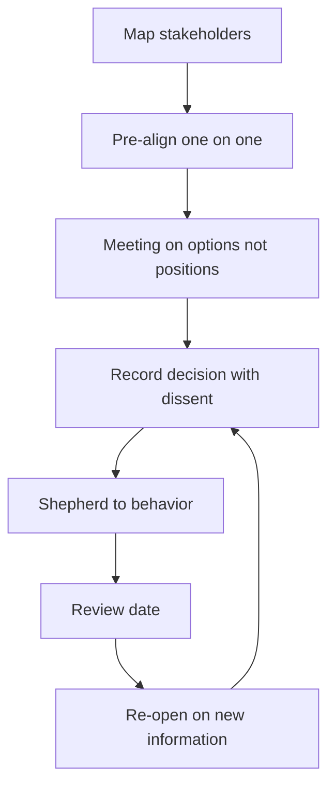

# Alignment Across Teams

> **Core skill:** Creating agreement across teams without authority — mapping stakeholders, pre-aligning one-on-one, running meetings on options rather than positions, and recording agreements with dissent.

## Why This Matters

Cross-team work runs on agreement, and agreement is not a meeting outcome — it is the product of a sequence of conversations, most of them one-on-one, most of them before the meeting. The staff engineer who calls a cross-team meeting to "get alignment" has the process backwards: the meeting is where already-aligned stakeholders ratify, not where alignment happens. Getting this backwards is why so many multi-team initiatives die: the meeting produced a decision that nobody felt they made.

Alignment without authority has a specific shape. First, map who actually decides, influences, and executes. Second, hold pre-alignment conversations where objections surface privately, when they are cheap. Third, run the alignment meeting on options, not positions, so the discussion is about trade-offs rather than egos. Fourth, document the agreement with dissent recorded. And fifth — the step everyone skips — shepherd the agreement after the meeting until it becomes behavior.

## Stakeholder Mapping

| Role | Who | What they need |
|------|-----|----------------|
| Decider | The person whose call the decision is | A clear recommendation, options, and risks |
| Influencers | People whose opinion shapes the decider | Their concerns addressed before the room |
| Executors | Teams that will implement | Feasibility, ownership, and a path |
| Veto-holders | People who can block | Early inclusion, not surprise |

Map before you write the proposal. A stakeholder missed until the meeting is a stakeholder who becomes a veto; a stakeholder pre-aligned is a sponsor.

## Pre-Alignment Conversations

| Conversation | Purpose |
|--------------|---------|
| With the decider | Learn what would make this decision easy or hard |
| With each influencer | Surface objections privately, where they are cheap |
| With each executor | Test feasibility and ownership appetite |
| With likely dissenters | Understand the objection; fix what is fixable |

The pre-alignment conversation has one question per person: "What would make you able to support this?" The answers are the meeting agenda — the objections you could not fix in advance are the only ones the meeting should debate.

## Running the Alignment Meeting

| Principle | What it looks like |
|-----------|--------------------|
| Options, not positions | The deck presents 2-3 options with trade-offs, not one proposal to defend |
| Decide by evidence | Disagreement on facts resolves with data, not volume |
| Timeboxed | The meeting ends with a decision or a named path to one |
| Decider named | Everyone knows whose call it is if consensus fails |

The meeting's job is to close the gaps that pre-alignment could not. If the meeting is a debate about whether the proposal is good, the pre-alignment failed; if it is a trade-off discussion among options with a named decider, it will end on time with a decision.

## Documenting Agreement with Dissent

| Element | What it contains |
|---------|------------------|
| The decision | One sentence: what was decided |
| The options | What was considered, and why the winner won |
| The dissent | Named objections that remain, and their status |
| The owners | Who does what, by when |
| The review | When the decision gets revisited |

A decision record with dissent is stronger than a unanimous one: the dissent is the instruction manual for the review date.

## Post-Agreement Shepherding

| Step | What it looks like |
|------|--------------------|
| Owners confirm | Named owners and dates are acknowledged |
| Enablement ships | Tooling and examples make the agreement easy to follow |
| Progress is visible | The dashboard or doc updates; the agreement does not go dark |
| Deviations surface | Divergence reports to the record, not to gossip |
| Review happens | The review date arrives and is honored |

Agreement decays by default. The shepherd's job is to make the decay visible and correct it — or, at the review date, to re-open the decision properly.

## Re-Opening Decisions the Right Way

| Right way | Wrong way |
|-----------|-----------|
| New information: facts changed | New persistence: the same objection, louder |
| A written case to the owners | An end-run to leadership |
| A review date reached | A surprise at a random meeting |
| Options re-examined with evidence | The original decision re-litigated |

Decisions should be re-openable — but only on new information, at the review date, through the owners. The re-opening rule is what makes decisions safe to make in the first place.



## Practical Applications

```markdown
# Alignment Plan — [decision] — [date]

## Stakeholders
- [ ] Decider: [name] | Influencers: [names]
- [ ] Executors: [teams] | Veto-holders: [names]

## Pre-alignment
- [ ] Conversations held: [names and dates]
- [ ] Objections surfaced: [what, and status]

## Meeting
- [ ] Options presented: [2-3 with trade-offs]
- [ ] Decider named: [who]
- [ ] Decision: [what was decided]

## Record
- [ ] Decision record written with dissent: [link]
- [ ] Owners and dates: [who does what]

## Shepherding
- [ ] Enablement shipped: [what]
- [ ] Progress visible: [where]
- [ ] Review date: [when]
```

Checklist:

- [ ] Every stakeholder is mapped before the proposal
- [ ] Objections are surfaced in pre-alignment, not the meeting
- [ ] The meeting presents options, not a position
- [ ] Dissent is recorded with the decision
- [ ] Shepherding continues until behavior changes

## Common Pitfalls

| Pitfall | Why It Is a Problem | Better Approach |
|---------|---------------------|-----------------|
| **Meeting alignment** | Consensus theater; nobody felt they decided | Pre-align one-on-one; ratify in the room |
| **Missed stakeholder** | The veto arrives after the decision | Map and include before the proposal |
| **Position warfare** | People defend proposals, not trade-offs | Present options and let evidence decide |
| **Unanimity worship** | Dissent goes underground and resurfaces | Record dissent; it strengthens the review |
| **Agreement decay** | The decision evaporates without shepherding | Owners, enablement, and visible progress |
| **Re-opening by persistence** | The loudest objection re-litigates forever | New information, review date, owners |

## Success Indicators

- Decisions from your alignment process hold past the quarter
- Stakeholders describe the decision as theirs, not imposed
- Meetings end on time with decisions, not debates
- Dissent in records is specific and acted on at review
- Teams pre-align with you before their own cross-team decisions

## Related Topics

- [[02_Driving_Technical_Change]]: alignment is the front half of change
- [[07_Cross_Team_Communication]]: the records and writing that make alignment durable
- [[01_The_Staff_Role_and_Scope/00_overview|The Staff Role and Scope]]: the mandate this alignment executes
- [[career-path/02_Senior_Software_Engineer/06_Communication_and_Influence/03_Influence_Without_Authority|Influence Without Authority (Senior)]]: the team-level foundation

## Summary

Alignment across teams is built in private and ratified in public: map the stakeholders, hold pre-alignment conversations that surface objections cheaply, run the meeting on options with a named decider, record the decision with its dissent, and shepherd until the agreement becomes behavior. Re-open decisions only on new information, at the review date, through the owners — the rule that makes decisions safe to make.
