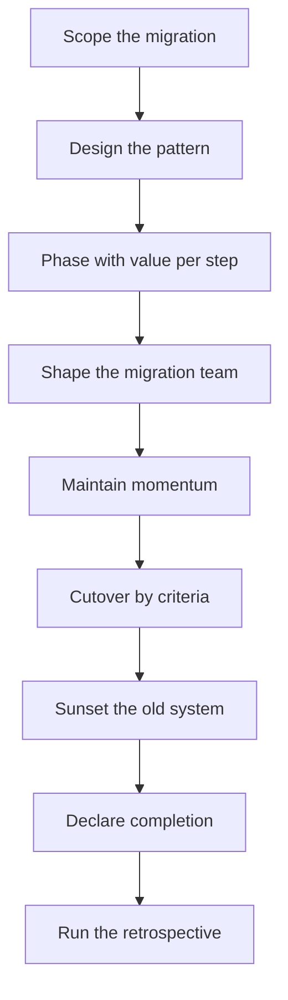

# Migration Leadership

> **Core skill:** Leading migrations that actually finish — designing for the boring middle, phasing with value at every step, and driving cutover, sunset, and completion declaration.

## Why This Matters

Most migrations do not fail at the start. They fail in the middle — after the enthusiasm, before the end — because the boring middle has no natural owner, no visible progress, and no daily pressure. The framework upgrade begins with energy, slows to a trickle, and dies at 40% with a tombstone README that says "in progress." The org pays the migration tax forever: two systems to maintain, two mental models, two sets of bugs.

The staff engineer's migration leadership is different from the team's migration execution. The team asks "how do we move this service?"; the staff engineer asks "how does the whole org cross this river, in what order, with what proof of progress, ending with what declaration?" The migration is the longest, most visible change pattern, and it is where the staff engineer earns or spends the org's trust in bulk.

## Why Migrations Stall

| Stall cause | Symptom | Prevention |
|-------------|---------|------------|
| **Boring middle** | Energy peaks at kickoff and cutover; the middle has no events | Phase with a value milestone per phase |
| **No owner** | "Everyone is working on it" means nobody is | One named driver with a written plan |
| **Invisible progress** | The migration is 40% done and nobody can see it | A progress dashboard updated weekly |
| **No end state** | The definition of done was never written | Cutover criteria written before starting |
| **Fear of cutover** | The finish line keeps moving because switching is scary | Cutover rehearsed and gated by criteria |

## Migration Design Patterns

| Pattern | How it works | Fits when | Risk |
|---------|--------------|-----------|------|
| **Strangler fig** | The new system grows alongside the old; traffic shifts gradually | Long-lived systems with organic growth | The two systems run in parallel for years |
| **Parallel run** | Both systems run; output is compared | High-risk financial or correctness moves | Double-run cost and comparison noise |
| **Expand-contract** | Expand the contract first, then migrate consumers, then contract | API and data model changes | A long expansion phase with no visible win |

The patterns are not exclusive: a strangler fig often contains expand-contract steps. What matters is that every pattern produces a **sequence of small, safe, valuable steps** instead of one big-bang switchover.

## Phasing with Value at Each Step

| Phase | Value delivered | Proof |
|-------|-----------------|-------|
| 1. Foundation | The new path exists | A working vertical slice |
| 2. First consumers | The new path is proven in production | N teams on the new path |
| 3. Bulk migration | The org's default shifts | Majority of traffic migrated |
| 4. Finishing | The old system is gone | Cutover complete, old system sunset |

A migration with a value milestone per phase is a sequence of small wins; a migration with one big milestone is a bet. Phase boundaries are where momentum is rebuilt — every phase ending with a visible, celebrated, measurable outcome.

## The Migration Team Shape

| Shape | How it works | Fits when |
|-------|--------------|-----------|
| **Dedicated** | A small full-time team drives the migration | Short, high-stakes, urgent migrations |
| **Distributed** | Every team migrates its own slice with shared tooling | Long migrations; teams own their path |
| **Hybrid** | A core driver team plus per-team owners | The common case: central tooling, local execution |

The hybrid is usually right: a tiny central team owns the platform, the tooling, and the dashboard, while each team owns its own cutover. The failure mode of distributed-only is the tragedy of the commons — nobody moves the platform forward; the failure mode of dedicated-only is the finished platform nobody migrated to.

## Momentum Maintenance

| Instrument | What it does |
|------------|--------------|
| Progress dashboard | Percentage by team, updated weekly; the migration is visible |
| Milestone comms | A one-page update per phase: what moved, what is next |
| Blocked-list triage | Every blocked team has a named unblocker, same week |
| Completion stories | Each team's cutover is celebrated and linked |
| Cadence | The same meeting, same time, same week — until done |

Momentum is maintained by visible progress and bounded blockage. The dashboard is the discipline: when it stops updating, the migration has already stalled.

## Finishing: Cutover, Sunset, Declaration

| Step | What it requires |
|------|------------------|
| Cutover criteria | Written before starting: correctness, performance, rollback |
| Cutover | Executed with a rehearsal, a window, and a named commander |
| Old-system sunset | A date; the old system is turned off, not "kept for safety" |
| Completion declaration | A written record: what was migrated, what the old system was, what the outcome is |
| Retrospective | What made it work, what would be done differently |

The completion declaration matters more than it looks: it is what the org remembers, and it is what prevents the zombie migration — the 40% migration that stays "in progress" forever. A migration without a declaration is not finished; it is paused.



## Practical Applications

```markdown
# Migration Plan — [migration] — [date]

## End state
- [ ] Target: [the new system] | Cutover criteria: [correctness, performance, rollback]

## Pattern
- [ ] Pattern: [strangler / parallel / expand-contract] | Why: [fit]

## Phases
- [ ] Phase 1: [value, proof] | Phase 2: [value, proof]
- [ ] Phase 3: [value, proof] | Phase 4: [value, proof]

## Team
- [ ] Core driver: [names] | Per-team owners: [who]

## Momentum
- [ ] Dashboard: [link, update cadence]
- [ ] Blocked-list triage: [who unblocks, how fast]

## Finish
- [ ] Sunset date: [when] | Declaration: [where it is written]
```

Checklist:

- [ ] Cutover criteria written before starting
- [ ] Every phase delivers visible value
- [ ] The dashboard updates weekly, mechanically
- [ ] Blocked teams get named unblockers same week
- [ ] The completion declaration exists before cutover

## Common Pitfalls

| Pitfall | Why It Is a Problem | Better Approach |
|---------|---------------------|-----------------|
| **Big-bang switchover** | One failure event; no partial credit | Strangler or phased steps, each safe |
| **The 40% migration** | Invisible progress, no owner, dies in the middle | Dashboard, named driver, phase milestones |
| **No cutover criteria** | The finish line moves because fear decides | Criteria written before starting |
| **Zombie old system** | Both systems run forever; the tax never ends | A sunset date, enforced |
| **Distributed-only drift** | Everyone's job, nobody's job | Hybrid: central tooling, local ownership |
| **No declaration** | The org cannot tell finished from paused | Completion record with outcomes |

## Success Indicators

- Migrations you lead reach declared completion
- Cutovers happen by criteria, not by courage
- The old system is actually turned off
- Teams describe the migration as organized, not heroic
- The retrospective produces reusable migration playbooks

## Related Topics

- [[02_Driving_Technical_Change]]: the change pattern migrations execute
- [[01_Cross_Team_Architecture]]: the boundary work migrations move toward
- [[career-path/05_Tech_Lead/04_Team_Delivery_and_Execution_Leadership/05_Coordinating_Across_Teams|Coordinating Across Teams (Tech Lead)]]: coordination at the team scale
- [[career-path/02_Senior_Software_Engineer/04_Delivery_and_Execution/02_Dependency_Management|Dependency Management (Senior)]]: managing the dependency web migrations cut through

## Summary

Migrations finish when they are designed for the boring middle: a pattern of small safe steps, a phase with visible value at each boundary, a hybrid team with a named driver, and a weekly dashboard that makes progress and blockage impossible to hide. Cutover runs on pre-written criteria, the old system gets a real sunset, and the completion declaration tells the org the migration is done — not paused at 40%.
