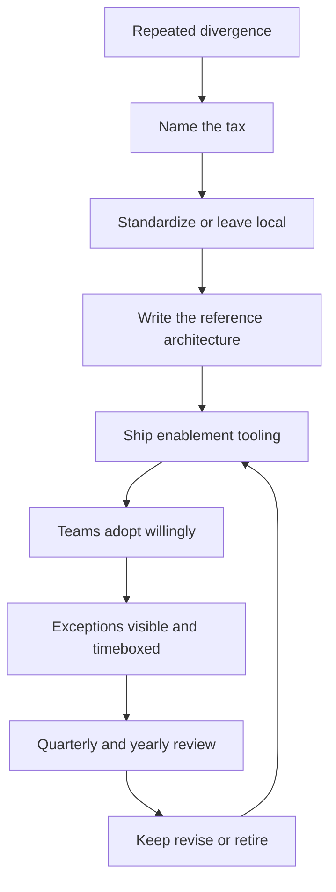

# Standards and Reference Architectures

> **Core skill:** Producing standards and reference architectures that teams adopt willingly — standardizing the right things, making adoption cheaper than divergence, and shipping enablement with every standard.

## Why This Matters

Every org pays a divergence tax: three caching layers, five configuration formats, seven ways to do retries. The tax is invisible in any single team and enormous in aggregate — integration pain, onboarding cost, security holes in the variants nobody audits. Standards are the staff engineer's instrument for taxing the tax, but only if they are built the right way: standards that teams adopt willingly, not standards that are policed into compliance.

The economics decide everything: a standard is adopted when **the cost of adopting is less than the cost of diverging**, measured in effort, risk, and career terms. The standard that ignores this math becomes a document that everyone nods at and nobody follows. The reference architecture is the standard's operating manual — the patterns, the approved options, the when-to-use guidance that makes the standard executable — and enablement tooling is what makes the math work.

## What to Standardize vs Leave Local

| Standardize | Leave local |
|-------------|-------------|
| Interfaces: APIs, events, data ownership | Internal implementation within a service |
| Observability: tracing, metrics, logging conventions | Dashboard content and alert thresholds |
| Security baselines and compliance | Choices above the baseline |
| Deployment primitives and environments | Deployment cadence and ownership |
| Naming for domains and concepts | Local naming within a module |

The test: does the inconsistency cost more than the standard? If integration breaks, security baselines diverge, or reviewers argue every month, standardize. If the choice is invisible outside one team, leave it local. The reference architecture exists to draw this line explicitly.

## The Reference Architecture Document

| Section | What it contains |
|---------|------------------|
| Context | The problems the architecture answers; when it applies |
| Patterns | The approved patterns, with the trade-offs of each |
| Approved options | The short menu of allowed choices, with selection guidance |
| When-to-use guidance | The decision rules: when to use which option |
| Anti-patterns | What not to do, and why it tempts |

A reference architecture is a **decision aid**, not a spec: it compresses the org's accumulated judgment so a team can make the right call in an afternoon instead of re-litigating the org's history. The measure of the document is how many teams follow it without asking.

## Standards Adoption Economics

| Cost | Divergence cost | Adoption is chosen when |
|------|-----------------|-------------------------|
| Effort: migration, change, relearning | Effort: integration pain, reinvention, rework | Adoption effort < divergence effort |
| Risk: change risk, breakage | Risk: unpatched variants, unknown seams | Adoption risk < divergence risk |
| Career: learning new skills | Career: being blocked, being blamed | Adoption is visible and valued |

The lever is not persuasion; it is **cost reduction**. Every standard should ship with the things that lower adoption cost: examples, tooling, a working path. A standard that requires a team to do more work than staying divergent is a standard that will fail, and the failure is the standard's, not the team's.

## Enablement Tooling

| Tool | What it lowers |
|------|----------------|
| Templates and scaffolds | Starting cost; new work begins inside the standard |
| Golden paths | Decision cost; the blessed route is the documented route |
| Code generation | Repetition cost; the pattern is executed, not copied |
| Example services | Uncertainty cost; teams see the standard working |
| Migration tooling | Switching cost; the standard has a path from the old way |

A standard without enablement is a hope. The staff engineer's rule: **no standard ships without its tooling**, and the tooling is what makes adoption an economic win.

## The Exception Process

| Element | Rule |
|---------|------|
| Visibility | Exceptions are written where everyone can see them |
| Reasoning | The exception states why the standard does not fit |
| Owner | One person owns it |
| Timebox | The exception has an expiry or a review condition |

Exceptions are the standard's feedback channel: recurring exceptions are evidence the standard is wrong, and the process converts that evidence into a revision. The exception process is what keeps the standard honest.

## Standards Review and Retirement

| Cadence | What happens |
|---------|--------------|
| Quarterly | The exception log and open challenges are reviewed |
| Yearly | Each standard is judged: does it still pay its tax? |
| On trigger | A repeated exception or a new pattern forces an early review |

Retirement is part of the lifecycle: a standard that outlives its reason is next generation's debt. Retired standards get a tombstone note — what it was, why it died — so the next person does not reinvent it or fear it.



## Practical Applications

```markdown
# Standard — [name] — [status: active]

## The tax
- [ ] What divergence costs: [integration, risk, onboarding]

## Scope
- [ ] Standardized: [interfaces, observability, security, naming]
- [ ] Left local: [what teams keep freedom on]

## Reference architecture
- [ ] Patterns: [approved, with trade-offs]
- [ ] Options menu: [choices and selection guidance]
- [ ] When-to-use: [decision rules]

## Enablement
- [ ] Tooling shipped: [templates, golden path, examples]
- [ ] Migration path from the old way: [what]

## Exceptions
- [ ] Current exceptions: [owners and expiry]
- [ ] Request process: [where]

## Review
- [ ] Next review: [date] | Retirement criteria: [when]
```

Checklist:

- [ ] The divergence tax is named with evidence
- [ ] Adoption cost is lower than divergence cost
- [ ] Enablement ships with the standard
- [ ] Exceptions are visible, owned, and timeboxed
- [ ] Review and retirement are calendared

## Common Pitfalls

| Pitfall | Why It Is a Problem | Better Approach |
|---------|---------------------|-----------------|
| **Standard by decree** | Compliance without belief; silent divergence | Adoption economics and enablement |
| **Over-standardizing** | Every choice regulated; teams stop thinking | Standardize only where the tax is real |
| **Spec without guidance** | Teams cannot map their situation to the standard | Reference architecture with when-to-use rules |
| **Document-only standard** | No tooling; adoption costs stay high | Ship templates, paths, and examples |
| **Underground exceptions** | Deviations hidden because the process is hostile | Visible, owned, timeboxed exceptions |
| **Graveyard standards** | Old rules outlive their reasons | Yearly review with retirement and tombstones |

## Success Indicators

- New teams adopt the standard without a design meeting
- The exception log is short and its items expire
- Divergence declines measurably: fewer variants, fewer seams
- Teams cite the reference architecture in their own decisions
- Standards change deliberately, a few times a year

## Related Topics

- [[01_Cross_Team_Architecture]]: the boundaries the standards codify
- [[02_Driving_Technical_Change]]: the adoption mechanics standards depend on
- [[career-path/05_Tech_Lead/03_Technical_Direction_and_Architecture/04_Technical_Standards_and_Conventions|Technical Standards and Conventions (Tech Lead)]]: the team-level counterpart
- [[career-path/06_Software_Architect/00_overview|Software Architect]]: the role where architecture is the whole job

## Summary

Standards and reference architectures succeed on economics: standardize only where divergence costs more than adoption, write the reference architecture as a decision aid with patterns and when-to-use guidance, and ship enablement tooling with every standard so the right path is the cheap path. Visible, timeboxed exceptions keep standards honest, and a yearly review with retirement and tombstones keeps them alive for exactly as long as they pay their tax.
