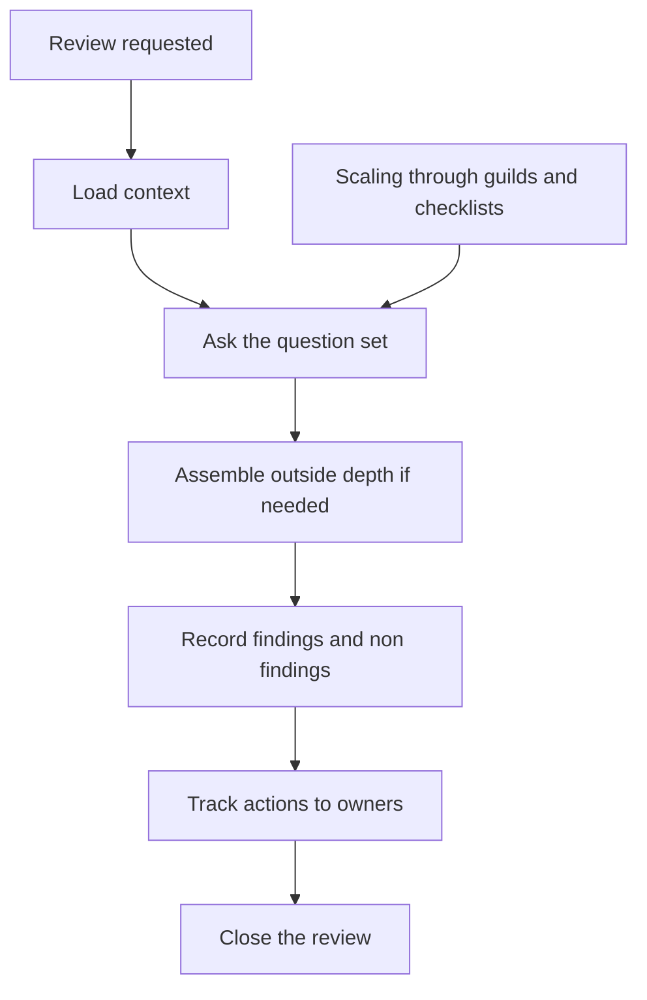

# Reviewing Beyond Your Team

> **Core skill:** Reviewing designs outside your team and outside your expertise depth — preparing properly, asking the questions that matter, recording outcomes, and scaling review through others.

## Why This Matters

The staff engineer is asked to review designs across the org — systems they do not own, domains they have never worked in, stacks they know only by reputation. The temptation is to fake depth: skim the doc, nod, and bless it, or worse, dominate with generic architecture opinions that ignore the domain's real constraints. Both failures damage the reviewer's credibility and the org's decision quality.

The staff review is valuable precisely because it is outside the team: the reviewer brings the cross-org view, the seam awareness, and the question set that the team's own review culture cannot supply. That value is earned through preparation and delivered through questions, not answers. The reviewer who walks in knowing nothing and leaves having asked the right six questions has done more for the design than the reviewer who walked in with a verdict.

## Preparation: Context Loading

| Load | What to find |
|------|--------------|
| The design doc | The proposal, its options, and its open questions |
| Prior decisions | Related records and past reviews; what was decided and why |
| The domain basics | Enough to ask good questions: terminology, constraints, risks |
| The team context | Who is building, what they know, what they are missing |

Preparation for an unfamiliar review is bounded: an hour of reading replaces an hour of the team explaining. The rule — **read before the meeting** — is the difference between a review that improves the design and a meeting that wastes the room.

## Question-Driven Review

| Question | What it surfaces |
|----------|------------------|
| What breaks? | The failure modes the team has not enumerated |
| What does it cost? | Build cost, run cost, maintenance cost, migration cost |
| Who maintains it? | The owner question: who carries this after the design lands |
| What happens at 10x? | Scale behavior: traffic, teams, data, complexity |
| What is the exit? | The sunset path: can this design be replaced? |
| Who disagrees? | The dissent the room has not heard |

The questions are the reviewer's real output. A review that ends with the team saying "we had not thought of that" has delivered more than a review that ends with a verdict. The question set is also the checklist for reviewers without your depth.

## Assembling Outside Reviewers

| When | Who to bring | Why |
|------|--------------|-----|
| Domain depth is missing | An expert in the unfamiliar domain | The review needs depth you cannot fake |
| Security or compliance matters | The security reviewer | The risk is invisible to both teams |
| The decision is org-shaping | An executive or platform owner | The boundary effects need an owner |
| The review is contested | A neutral third party | The dispute needs a guest, not a judge |

The staff reviewer's job is to know when the room needs someone else — and to invite them before the review, not after the problem surfaces. Reviewing beyond your depth includes the judgment of when your depth is not enough.

## Recording Review Outcomes

| Element | What it contains |
|---------|------------------|
| Findings | The issues that matter, with severity |
| Non-findings | What was checked and found sound — the record of what was considered |
| Actions | Owners, dates, and required changes |
| Decision | Approved, approved with changes, or not approved |

The non-findings matter more than they look: they are the evidence that the review actually considered the dimensions, and they are what the next reviewer (or the audit) relies on. Every review you run produces a record, however short.

## Review Etiquette Across Team Boundaries

| Rule | Why |
|------|-----|
| Guest, not judge | The owning team decides; your role is perspective |
| Ask before asserting | Questions land; verdicts provoke |
| Credit the team | The design is theirs, including the improvements |
| No surprises after | If the review is not the first time they hear your concern, the review failed |
| Stay in your lane | Seam and org questions are yours; domain details are theirs |

The etiquette is what makes the review repeatable. A team that experiences a cross-team review as help will bring the next design early; a team that experiences it as judgment will route around you.

## Scaling Review Through Others

| Instrument | What it does |
|-------------|--------------|
| Review guilds | A standing cross-team body with shared standards |
| Question checklists | The question set encoded so anyone can run it |
| Review records | Past outcomes as the training set for new reviewers |
| Pairing | Review with a junior reviewer; they learn, you scale |

The staff engineer cannot review everything — and should not. The org's review capability scales when the question set, the etiquette, and the records outlive individual reviewers.



## Practical Applications

```markdown
# Review Record — [design] — [date]

## Context
- [ ] Design: [link] | Prior decisions: [links]
- [ ] Domain notes: [what the reviewer loaded]

## Findings
- [ ] Finding: [issue, severity, owner]
- [ ] Finding: [issue, severity, owner]

## Non-findings
- [ ] Checked and sound: [dimensions]

## Actions
- [ ] Required change: [owner, date]
- [ ] Open question: [owner, date]

## Decision
- [ ] Approved / Approved with changes / Not approved
```

Checklist:

- [ ] Context loaded before the meeting
- [ ] Questions asked before verdicts offered
- [ ] Outside depth assembled when needed
- [ ] Findings, non-findings, and actions recorded
- [ ] Etiquette held: guest, not judge

## Common Pitfalls

| Pitfall | Why It Is a Problem | Better Approach |
|---------|---------------------|-----------------|
| **Faked depth** | Generic opinions ignore domain reality; credibility burns | Load context; ask questions; admit limits |
| **Verdict review** | The team gets a judgment, not improvement | Question-driven; the team reaches the insight |
| **Unrecorded review** | The same debate recurs; non-findings lost | Record every outcome with actions |
| **Judge energy** | Teams route around you; reviews come late | Guest etiquette; credit the team |
| **Reviewer bottleneck** | Everything waits for you; review capability is you | Guilds, checklists, pairing |
| **Missing the missing depth** | The domain gap surfaces after the review | Assemble outside reviewers in preparation |

## Success Indicators

- Teams bring designs early because reviews help
- Design quality rises measurably between first draft and review
- Review records are findable and cited
- Others run reviews with your question set without you
- You are asked back into unfamiliar domains

## Related Topics

- [[07_Cross_Team_Communication]]: the records that make reviews durable
- [[03_Alignment_Across_Teams]]: reviews as alignment instruments
- [[career-path/05_Tech_Lead/03_Technical_Direction_and_Architecture/03_Design_Review_Leadership|Design Review Leadership (Tech Lead)]]: the team-level foundation
- [[career-path/02_Senior_Software_Engineer/03_Architecture_and_Design_Judgment/04_Architecture_Decision_Records|Architecture Decision Records (Senior)]]: the records reviews feed

## Summary

Reviewing beyond your team is preparation plus questions: load context, apply the question set — what breaks, what costs, who maintains, what happens at 10x — and assemble outside depth when the domain demands it. Record findings and non-findings with actions, hold the guest-not-judge etiquette, and scale the capability through guilds, checklists, and pairing. The review's value is the thinking it causes, not the verdict it delivers.
