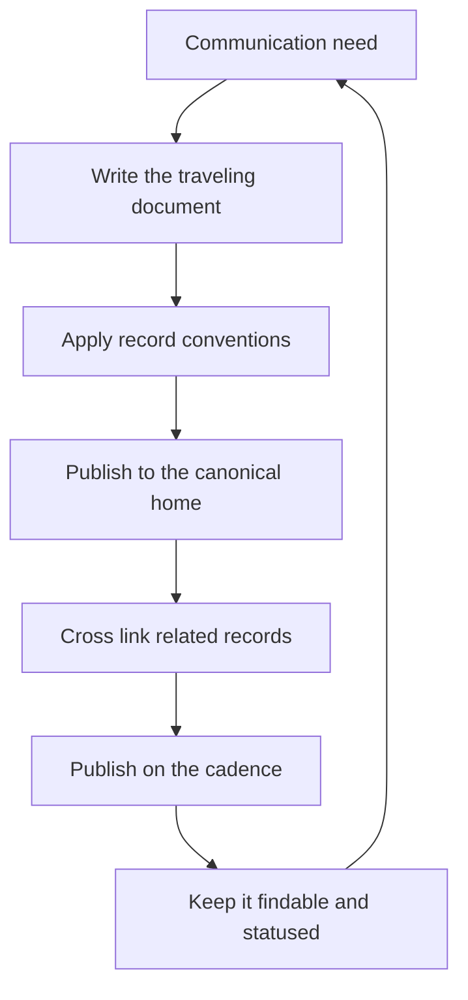

# Cross-Team Communication

> **Core skill:** Communicating at org scale — writing that travels without you, decision records that stay findable, and an async-first cadence that does not depend on meetings.

## Why This Matters

At team scale, communication can be a conversation. At org scale, the conversation is the bottleneck: twenty teams cannot all attend the meeting, and the one person who attended becomes the human cache that everything else depends on. The staff engineer's communication therefore has to be **writing that travels** — documents that inform, persuade, and record without their author present. The staff engineer's real audience is not the room; it is the org, six months from now, searching for why this decision was made.

The discipline has three parts. First, the writing itself: proposals, strategies, postmortems, and standards that work standalone. Second, the conventions: decision records that are findable, linked, and statused, so the org's memory is a corpus, not a set of individuals. Third, the cadence: communication that runs async-first, with a rhythm that does not require anyone's calendar.

## Writing That Travels

| Property | What it looks like |
|----------|--------------------|
| Standalone | Readable without the meeting, the chat thread, or the author |
| Decision-first | The recommendation and the decision in the first screen |
| Context-rich | The problem, the options, the constraints, the reasoning |
| Statused | Its state is explicit: proposal, decision, superseded |
| Actioned | Owners and dates; the reader knows what happens next |

The test: can a new engineer in another timezone pick up the document cold and act? If the answer requires the author, the document has failed.

## Decision Record Conventions

| Convention | Rule |
|------------|------|
| Findable | A known location and a consistent naming pattern |
| Linked | Related records link both ways; proposals link to decisions |
| Statused | Every record shows its state: proposed, decided, superseded |
| Dated | The decision date and the review date are explicit |
| Dissent-visible | Named objections and their disposition |

The conventions turn individual documents into an org memory. The staff engineer's contribution is less any single record and more the convention itself — the pattern that makes every future decision findable.

## The Communication Portfolio

| Document | Purpose | Audience |
|----------|---------|----------|
| Proposals | Change a decision; options with a recommendation | Deciders and influencers |
| Strategies | Set direction; the map for a domain | Leadership and teams |
| Postmortems | Learn from failure; the org's lessons | Everyone |
| Standards | Codify practice; the default path | The teams that build |
| Status updates | Keep initiatives visible; progress and blockage | Everyone tracking the arc |

The portfolio is not busywork — it is the operating system of cross-team work. Each document type has a job, and the staff engineer's week is largely the production and shepherding of these documents.

## Presenting to Mixed Audiences

| Audience | What they need | The move |
|----------|----------------|----------|
| Engineers | Depth, trade-offs, technical honesty | The technical sections: options, constraints, risks |
| Leaders | The decision, the cost, the risk, the ask | The executive summary: recommendation, numbers, owners |
| Both | One document that serves both without lying | The top answers leaders; the body answers engineers |

One document, two reading paths. The classic failure is the engineering-grade document that leadership cannot act on, or the leadership-grade summary that engineers cannot build from. The structure — decision first, evidence after — serves both.

## Async-First Practices

| Practice | What it replaces |
|----------|------------------|
| Written proposals with comment windows | The alignment meeting |
| Decision records with status | The tribal memory |
| Status docs on a cadence | The status meeting |
| Office hours for questions | The ad-hoc interrupt |
| Recorded or written reviews | The review meeting |

Async-first does not mean no meetings — it means meetings are the exception, called when the written exchange stalls, and always with a written record before and after.

## Communication Cadence Without Meetings

| Cadence | What it produces |
|---------|------------------|
| Weekly | A one-page status: progress, blockage, next |
| Per-phase | A milestone note for each arc phase |
| Quarterly | The strategy or area update for leadership |
| On-decision | A record for every consequential call |

The cadence is what makes the corpus trustworthy: the org learns that if it is not in the doc, it is not true. Trust in the cadence is worth more than any single brilliant document.

## Archiving for Findability

| Step | What it does |
|------|--------------|
| Consistent naming | The title carries the subject and the date |
| A single home | One canonical location per document type |
| Status transitions | Superseded records are marked, not deleted |
| Cross-links | Records link to what they replaced and what replaced them |
| A search path | The org knows where to look first |

Archiving is the difference between an org memory and a document graveyard. The org's past decisions are only as useful as the search that finds them.



## Practical Applications

```markdown
# Document Template — [type] — [title] — [status]

## Decision
- [ ] The recommendation in one sentence

## Context
- [ ] The problem, the options, the constraints

## Reasoning
- [ ] Why this option; what was weighed

## Actions
- [ ] Owners and dates: [who does what]

## Status
- [ ] State: [proposal / decided / superseded]
- [ ] Review date: [when] | Links: [related records]
```

Checklist:

- [ ] Every document works standalone, without its author
- [ ] Records are findable, linked, and statused
- [ ] The portfolio covers the arc: proposals, records, status
- [ ] Mixed audiences both get what they need from one document
- [ ] The cadence runs without meetings

## Common Pitfalls

| Pitfall | Why It Is a Problem | Better Approach |
|---------|---------------------|-----------------|
| **Meeting dependence** | The human cache becomes the bottleneck | Write it down; the doc travels |
| **Author-dependent docs** | The document only makes sense in the meeting | Decision-first, context-rich, standalone |
| **Record graveyard** | Decisions unreachable, statuses unknown | Conventions: findable, linked, statused |
| **Summary-only communication** | Leaders decide without the evidence | One doc, two reading paths |
| **Cadence theater** | Updates that say nothing, on schedule | Statuses with progress, blockage, next |
| **Deletion culture** | Old records vanish; history is lost | Mark superseded, never delete |

## Success Indicators

- Decisions are findable by anyone, months later
- Teams cite your records in their own decisions
- The cadence runs without your presence
- Mixed-audience documents get acted on by both audiences
- New engineers reconstruct history from the corpus, not from asking

## Related Topics

- [[03_Alignment_Across_Teams]]: the meetings that records replace
- [[06_Reviewing_Beyond_Your_Team]]: the records that make reviews durable
- [[career-path/02_Senior_Software_Engineer/06_Communication_and_Influence/00_overview|Communication and Influence (Senior)]]: the team-level foundation
- [[career-path/02_Senior_Software_Engineer/03_Architecture_and_Design_Judgment/04_Architecture_Decision_Records|Architecture Decision Records (Senior)]]: the record format at its origin

## Summary

Cross-team communication is writing that travels: decision-first, context-rich, statused documents that work without their author, organized by conventions that keep them findable and linked, and published on a cadence that does not require meetings. The staff engineer's portfolio — proposals, strategies, postmortems, standards, status — is the org's operating system, and the corpus it builds is the org's memory.
