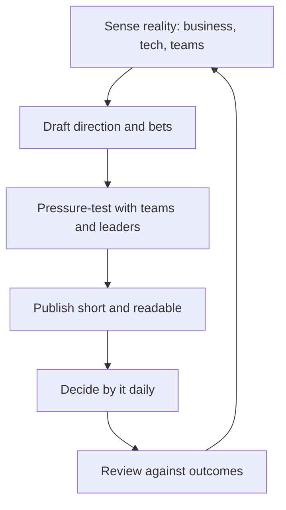

# Technical Strategy

> **Core capability:** The staff engineer connects technical investment to organizational priorities — writing strategy that survives contact with reality, sequencing bets, and saying no to good ideas that don't fit.

## Why This Matters

Strategy is the highest-leverage staff output: one page of direction prevents hundreds of scattered decisions. Without it, engineering becomes a queue of loudest-voice initiatives; with it, teams can decline work without escalation because the rationale is written down.

Good technical strategy is rare because it's genuinely hard: it must be grounded in business reality (not technology wishlists), concrete enough to decide by, and short enough to read. The staff engineer is typically the only role that both sees the technical whole and writes as part of the job.

## Topics in This Capability Area

| Topic | Core Skill | When It Matters |
|-------|------------|-----------------|
| [[01_Writing_Technical_Strategy]] | The strategy document: direction, bets, non-goals | Annual/quarterly planning; new leadership |
| [[02_Technology_Betting]] | Making and sizing irreversible technology bets | Platform choices; language/framework decisions |
| [[03_Capacity_and_Investment_Allocation]] | Dividing capacity between feature, debt, platform | Planning cycles; competing demands |
| [[04_Saying_No_at_Scale]] | Declining work consistently through written strategy | Every request that doesn't fit |
| [[05_Strategy_Review_and_Adaptation]] | Keeping strategy honest as reality changes | Quarterly; after market shifts |
| [[06_Working_With_Product_Strategy]] | Coupling technical strategy to product direction | Product planning cycles |
| [[07_Sunset_and_Exit_Strategy]] | Ending things: systems, tools, commitments | Legacy burdens; maintenance overload |

## The Strategy Loop

A strategy that isn't used to decline work is decoration.

## Senior vs Staff in Strategy

| Activity | Senior engineer | Staff engineer |
|----------|-----------------|----------------|
| Direction | Proposes within their area | Writes the domain/org strategy |
| Bets | Flags risk in team decisions | Sizes and recommends major bets |
| Saying no | Escalates conflicts | Declines by strategy, in writing |
| Review | Contributes evidence | Owns the review and the revision |

## Practical Applications

### Strategy Checklist

- [ ] A current strategy document exists, is under ~5 pages, and names non-goals
- [ ] Every major technical bet has sizing, reversibility, and exit reasoning
- [ ] Capacity allocation (feature/debt/platform) is explicit, not residual
- [ ] "No" answers cite the strategy, not personal preference
- [ ] Strategy was reviewed against outcomes last quarter, and revised or re-affirmed
- [ ] Product and technical strategy reference each other's constraints
- [ ] Sunsets have owners, dates, and migration paths

## Common Pitfalls

| Pitfall | Why It Is a Problem | Better Approach |
|---------|---------------------|-----------------|
| **Technology wishlist** | Strategy as desired tools, not direction | Start from business constraints and outcomes |
| **Strategy theater** | Beautiful doc, unchanged decisions | Test: did anything get declined because of it? |
| **Eternal beta bets** | Irreversible choices never fully committed | Sequence bets with commitment points |
| **No exit clauses** | Nothing ever ends; maintenance eats capacity | Every bet and system gets an exit review |

## Success Indicators

- Teams quote the strategy when declining work themselves
- Investment shifts measurably after strategy publication
- Leadership references it in their own communications
- Bets are reviewed honestly — some abandoned on schedule
- The strategy fits on fewer pages each year it survives

## Related Capabilities

- [[02_Cross_Team_Technical_Leadership/00_overview|Cross-Team Technical Leadership]]: strategy's execution arm
- [[04_Influence_and_Alignment/00_overview|Influence and Alignment]]: how strategy gets adopted
- [[career-path/02_Senior_Software_Engineer/08_Engineering_Economics_and_Trade_Offs/00_overview|Engineering Economics and Trade Offs (Senior)]]: the economic foundations
- [[career-path/06_Software_Architect/00_overview|Software Architect]]: the specialist strategy path

## Summary

Technical strategy is the staff engineer's highest-leverage writing: direction grounded in business reality, sized bets with exit clauses, explicit capacity allocation, and the discipline to decline work by the written page. Its test is behavioral — decisions change because it exists.
