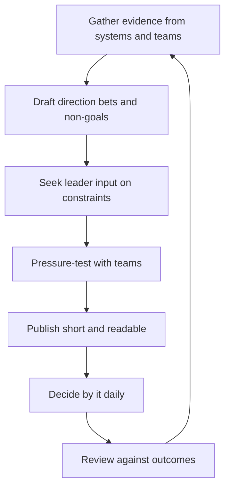

# Writing Technical Strategy

> **Core skill:** The staff engineer writes a strategy document that is honest about the current state, commits to a few sized directional bets, names what the organization will not do, and stays short enough to be read and used in daily decisions.

## Why This Matters

Strategy is decision-making infrastructure. When a technical strategy exists and is trusted, teams can decline work, prioritize work, and defend investments without escalating every conflict to a meeting. When it does not exist, engineering becomes a queue of loudest-voice initiatives, and every "no" is a personal fight instead of a reference to a shared document.

The staff engineer is usually the only person who both sees the technical whole and is expected to write as part of the job. That combination makes strategy writing the highest-leverage artifact the role produces. A good strategy does not merely describe the future; it changes who decides what, and on what evidence, for a year or more.

## Anatomy of the Strategy Document

A technical strategy answers five questions in a fixed order. Each has a section, a purpose, and a strict length budget.

| Section | Purpose | Length Guidance |
|---------|---------|-----------------|
| Current state | Honest description of where the system actually is, with evidence | Under one page |
| Direction | Where the organization is heading and why | Half a page |
| Bets | The 3-5 sized investments that move the direction forward | One page |
| Non-goals | What we will not do, named explicitly | Half a page |
| Implications per team | What changes for each team, concretely | One page |

## The Current State Must Be Honest

The current state section is where a strategy gains or loses credibility. Leaders and engineers will test it against what they already know. If it is flattering but false, every other section is discounted.

| Honest version | Fiction version |
|----------------|-----------------|
| "Migration progress is 40 percent, with the last 20 percent blocked on legacy data" | "We are well on our way to a modern platform" |
| "Two teams run parallel build systems and both are slowing down" | "Our build system is standardized" |
| "Latency regressed 15 percent this quarter after the caching change" | "Performance is stable" |
| "We do not know why incidents doubled in the payments service" | "Reliability remains a priority" |

Write the current state from evidence: dashboards, incident counts, migration progress, team surveys. Ask the uncomfortable question of every sentence: do I have a number for this, or do I have a hope?

## Directional Bets: 3-5, Sized

Direction without bets is a vision statement. Bets are the commitments that make direction real. A strategy should contain three to five, never more. Each bet needs the following fields.

| Field | What It Contains |
|-------|------------------|
| Thesis | The belief that justifies the bet |
| Size | Rough cost in engineer-months and calendar time |
| Reversibility | One-way door or reversible; what the exit looks like |
| Owner | The person accountable for driving it |
| Horizon | When it will be re-evaluated |

More than five bets means the strategy is a wishlist; fewer than three means it is not committing to anything. Bets are covered in depth in Technology Betting.

## Non-Goals: What We Will Not Do

Non-goals are the section that makes strategy usable. A strategy that only says what will be done invites every competing idea to claim compatibility. Naming what will not be done — the migration we will not start, the platform we will not adopt, the scale we are not optimizing for — gives teams the written authority to decline.

Non-goals must be specific enough to test. "We will not chase performance beyond the p99 target of 200ms" is a non-goal; "we care about quality" is decoration.

## Implications per Team

A strategy that does not change any team's work plan is not a strategy. The implications section translates direction into per-team consequences: which team carries which bet, which team stops which activity, which team gets which new dependency. This is the section teams actually read, so it must be concrete, owned, and dated.

## Length Discipline: 3-5 Pages

The document must fit in three to five pages. This is not a stylistic preference; it is the mechanism that forces prioritization. A strategy long enough to cover every exception is a strategy long enough to be ignored. If a section cannot be written within the budget, the thinking is not done yet — the answer is to decide, not to add pages.

## The Drafting Process



| Stage | What Happens | Who Is Involved |
|-------|--------------|-----------------|
| Evidence gathering | Collect data, pain points, and constraints; interview team leads | Everyone who will be affected |
| Draft | Write the first version; keep it short | The staff engineer alone |
| Leader input | Test direction against business constraints and strategy | Directors and above |
| Pressure-test | Present the draft to teams; collect objections in writing | The teams that must execute |
| Publish | Distribute with a clear effective date and owner | The whole engineering organization |
| Review | Revisit against outcomes on the refresh cadence | The staff engineer and leaders |

## Publishing and Socializing

Publication is the start, not the end. A published strategy must be walked through with each team lead, referenced in planning meetings, and quoted in decisions for months. Schedule the socialization explicitly: one session per team, one session with leadership, and a standing agenda item in the next planning cycle. A strategy nobody was walked through is a strategy nobody was asked to follow.

## The Refresh Cadence

A strategy is a living document with a fixed review cycle. A quarterly review keeps it honest; an annual rewrite keeps it fresh. Between reviews, changes of circumstance go through the versioning discipline described in Strategy Review and Adaptation. The cadence exists to force the question: are the bets still right, and are the non-goals still true?

## Strategy Anti-Patterns

| Anti-Pattern | Why It Is a Problem | Better Approach |
|--------------|---------------------|-----------------|
| **Wishlist** | Lists desired tools and outcomes with no direction or trade-offs | Start from business constraints; every entry must cost something |
| **Fiction** | Current state flatters; nobody recognizes the system | Write the current state from data; verify with the teams who live in it |
| **Doorstop** | Thirty pages, read once, never referenced | Enforce the page budget; delete anything not used to decide |
| **Everything is a priority** | No non-goals, so nothing is ever declined | Name non-goals explicitly and test them in review |
| **Perpetual draft** | Never published because it is never perfect | Publish v1 with a review date; imperfection is fixed by review, not delay |

## Practical Applications

### Strategy Document Template

```markdown
# Technical Strategy: [Domain]

## Current State
- What is true today, with numbers: [evidence]
- What is painful: [top three pains, with cost]
- What we do not know yet: [open questions]

## Direction
- Where we are heading: [one paragraph]
- Why now: [the forcing function]

## Bets
| Bet | Thesis | Size | Reversibility | Owner | Horizon |
|-----|--------|------|---------------|-------|---------|
| [Bet 1] | [belief] | [engineer-months] | [reversible or one-way] | [owner] | [date] |

## Non-Goals
- We will not: [specific commitment]

## Implications per Team
| Team | What Changes | Owner | Date |
|------|--------------|-------|------|

## Review
- Next review: [date]
- Success would look like: [measurable outcome]
```

### Drafting Checklist

- [ ] Current state written from evidence, with numbers, and verified by the teams
- [ ] Three to five bets, each with size, reversibility, owner, and horizon
- [ ] Non-goals named specifically enough to decline work by them
- [ ] Implications listed per team, with owners and dates
- [ ] Total length within 3-5 pages
- [ ] Draft pressure-tested with teams; objections answered in writing
- [ ] Leadership signed off on direction and constraints
- [ ] Publication plan exists: who gets walked through, and when
- [ ] Review date set before publication

## Common Pitfalls

| Pitfall | Why It Is a Problem | Better Approach |
|---------|---------------------|-----------------|
| **Writing for the CEO instead of the teams** | Beautiful but useless for daily decisions | Write for the team lead deciding whether to start work |
| **Hiding disagreement inside vague language** | Every reader projects their own meaning | State the trade-offs you rejected, explicitly |
| **No evidence in the current state** | Credibility fails at the first skeptical reader | Attach a number to every claim you can |
| **Publishing without socialization** | Adoption is zero because nobody was walked through | Budget time to present to every affected team |
| **Refusing to update between cycles** | The document drifts from reality and dies | Use the versioning and review discipline |

## Success Indicators

- Teams quote the strategy when declining or prioritizing work themselves
- Planning cycles allocate against the bets, not against the loudest voice
- Skeptical engineers confirm the current state section matches what they see
- Leadership references the strategy in its own communications
- The strategy survived contact with reality and was revised, not abandoned

## Related Topics

- [[02_Technology_Betting]]: the bets the strategy commits to
- [[05_Strategy_Review_and_Adaptation]]: keeping the document honest over time
- [[04_Saying_No_at_Scale]]: the daily use of the written strategy
- [[06_Working_With_Product_Strategy]]: coupling the document to product direction
- [[04_Influence_and_Alignment/00_overview|Influence and Alignment]]: how the strategy gets adopted

## Summary

Writing technical strategy is the staff engineer's highest-leverage act: an honest current state, three to five sized bets, explicit non-goals, and per-team implications, all held to three to five pages. The drafting process — evidence, leader input, team pressure-test — determines adoption more than the prose does, and the refresh cadence keeps the document alive. A strategy that does not change decisions is decoration; one that does is the organization's decision-making infrastructure.
