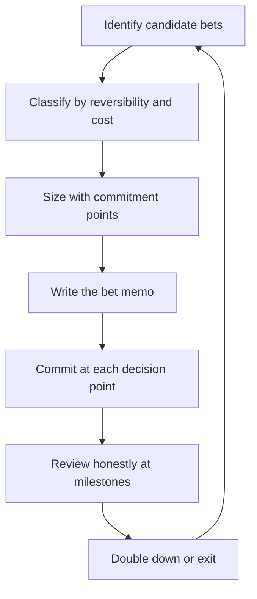

# Technology Betting

> **Core skill:** The staff engineer makes technology bets with explicit sizing, reversibility, and exit criteria, and manages a portfolio that balances a few big commitments with cheap experiments.

## Why This Matters

Every significant technology choice is a bet: a commitment of capacity and direction made under uncertainty. The difference between organizations that bet well and those that bet badly is not intelligence — it is structure. A structured bet names its thesis, its size, its reversibility, and the evidence that would end it. An unstructured bet is just an argument that someone eventually wins.

The staff engineer is the person who makes the bet portfolio visible, sizes commitments honestly, and reviews them without the sunk cost bias that protects bad decisions. This discipline is what keeps a platform strategy from becoming a graveyard of abandoned frameworks.

## The Bet Taxonomy

Classify every bet on three axes before doing anything else. The classification determines how much process the bet deserves.

| Axis | Options | Implication |
|------|---------|-------------|
| Reversibility | Reversible (two-way door) vs irreversible (one-way door) | Irreversible bets need commitment points and exit criteria before the door closes |
| Cost | Cheap vs expensive in engineer-months | Expensive bets need written theses and review milestones |
| Strategic position | Core (differentiating) vs context (commodity) | Core bets deserve in-house depth; context bets deserve the cheapest adequate option |

## Reversible vs Irreversible

One-way doors are choices that are genuinely hard to reverse: a database migration, a rewrite of a core service, an org-wide language change. Two-way doors are choices that can be undone cheaply: a library choice behind an interface, a new tool trialed by one team.

The discipline is to know which door you are walking through before you walk through it. Irreversible bets get commitment points — scheduled moments where the bet is re-evaluated with fresh evidence and the cost of turning back is stated explicitly. Reversible bets get a trial period and a lightweight review.

## Sizing Bets with Commitment Points

| Commitment point | What Happens | Example |
|------------------|--------------|---------|
| Proposal | Thesis and sizing written down | "Kafka for the event pipeline, 6 engineer-months" |
| Pilot | One team validates the core risk | One service migrates first |
| Scale | Broad adoption begins; cost of reversal grows | Half the services onboarded |
| Lock-in | Door closes; exit criteria recorded | New event infrastructure is the only supported path |

Between commitment points, the bet is an experiment, not a decision. The classic mistake is treating a pilot as a done deal, or treating an irreversible adoption as still open to negotiation.

## The Bet Portfolio

A healthy portfolio has a shape: a few big bets, several small bets, and a standing set of experiments.

| Layer | Count | Size | Review Cadence |
|-------|-------|------|----------------|
| Big bets | 2-3 | Years, org-wide | Quarterly, with formal commitment points |
| Small bets | 3-6 | Quarters, single domain | Each planning cycle |
| Experiments | Standing | Weeks, one team | Monthly, or per experiment |

The portfolio view matters because capacity is finite. A portfolio with nine big bets is not ambitious; it is unfunded. Part of the staff role is refusing to add a bet to a portfolio that cannot absorb it.

## When to Bet on Emerging Technology

Emerging technology bets fail in two ways: too early, when the ecosystem is not ready, and too late, when the advantage is gone. Two concepts keep the timing honest.

| Concept | Meaning | Test |
|---------|---------|------|
| Absorptive capacity | The organization's ability to learn and integrate a new technology | Can we name the team, the time, and the training budget for adoption? |
| Escape velocity | The point where the new technology compounds faster than the old one is maintained | Show the curve: when does the new path cost less per quarter than the old path? |

If no team has slack to learn, the bet will fail regardless of the technology's merits. If the new technology cannot reach escape velocity within a stated horizon, it is a hobby, not a bet.

## The Bet Memo

Every bet that is not a trivial experiment gets a memo. The memo is short, written, and public.

```markdown
# Bet Memo: [Name]

- Thesis: [the belief that justifies the bet]
- Size: [engineer-months, calendar time]
- Reversibility: [one-way or two-way door]
- Why now: [the forcing function]
- Commitment points: [pilot, scale, lock-in, with dates]
- Exit criteria: [the evidence that ends the bet]
- Kill criteria: [the evidence that ends the bet early]
- Owner: [name]
- Review date: [date]
```

## Reviewing Bets Honestly



The review is where most organizations fail, because every review is contaminated by the sunk cost fallacy. The questions that keep a review honest:

- If we had not already spent the capacity, would we start this bet today?
- Is the thesis still true, or are we defending the work?
- What did the commitment points predict, and what actually happened?

Sunk cost resistance is a habit: record predictions at each commitment point, then read them back at review. Predictions that were written down are much harder to rationalize away than memories.

## Practical Applications

### Bet Review Checklist

- [ ] Every active bet has a written memo with thesis, size, and exit criteria
- [ ] One-way doors have commitment points on the calendar
- [ ] The portfolio has a named shape: big bets, small bets, experiments
- [ ] Emerging technology bets have an absorptive capacity answer and an escape velocity argument
- [ ] Reviews read written predictions, not memories
- [ ] Kill criteria exist and are honored when triggered
- [ ] The portfolio fits within actual capacity, not aspirational capacity

## Common Pitfalls

| Pitfall | Why It Is a Problem | Better Approach |
|---------|---------------------|-----------------|
| **Betting without a thesis** | Nobody can say what evidence would change the decision | Write the thesis before spending the first engineer-month |
| **Pilot forever** | The trial never ends; teams hedge indefinitely | Set the scale and lock-in commitment points in advance |
| **Nine big bets** | Every bet is underfunded and none succeeds | Cap big bets; make the portfolio fit the capacity |
| **Chasing the shiny** | Emerging tech adopted because it is exciting | Require absorptive capacity and escape velocity arguments |
| **Sunk cost defense** | Bad bets defended by money already spent | Read back written predictions; ask the start-from-zero question |
| **No exit criteria** | Bets drift until the org quietly abandons them | Write exit and kill criteria at proposal time |

## Success Indicators

- Every major bet can be described in one paragraph: thesis, size, reversibility, exit
- Commitment points appear on calendars and are actually held
- At least one bet was killed on criteria, not on embarrassment
- The portfolio has a visible shape that fits capacity
- Engineers can name what the org is betting on and why

## Related Topics

- [[01_Writing_Technical_Strategy]]: where bets live as strategy
- [[03_Capacity_and_Investment_Allocation]]: the capacity bets consume
- [[05_Strategy_Review_and_Adaptation]]: reviewing bets on the strategy cadence
- [[career-path/02_Senior_Software_Engineer/08_Engineering_Economics_and_Trade_Offs/06_Trade_Off_Evaluation|Trade Off Evaluation (Senior)]]: the economic foundations
- [[06_Technical_Risk_and_Judgment/00_overview|Technical Risk and Judgment]]: risk framing for big commitments

## Summary

Technology betting turns opinionated choices into structured commitments: classify by reversibility and cost, size with commitment points, write a memo with exit and kill criteria, and hold the portfolio to a shape that actual capacity can fund. The discipline is not in picking winners — it is in reviewing bets honestly against written predictions and letting failed bets end on schedule.
