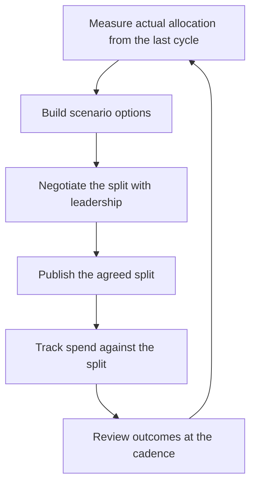

# Capacity and Investment Allocation

> **Core skill:** The staff engineer makes the split of engineering capacity between feature work, technical debt, and platform investment explicit, defensible, and reviewed — instead of letting it happen by accident.

## Why This Matters

Engineering capacity is the organization's scarcest resource, and in most companies it is allocated by default: features get whatever remains after the latest incident, debt gets whatever is left at the end of the quarter, and platform work happens only when someone is loud enough. The result is a slow-motion collapse of the systems the features depend on.

The staff engineer turns this implicit allocation into an explicit decision. An explicit split — "70 percent features, 15 percent debt, 15 percent platform" — can be argued with, tested against outcomes, and defended to leadership. An implicit split cannot be discussed at all, because nobody ever chose it. Making allocation a decision is the precondition for making it a good one.

## Allocation Models

There are three practical models for structuring the split. They are not mutually exclusive; most healthy organizations combine them.

| Model | How It Works | Strengths | Weaknesses |
|-------|--------------|-----------|------------|
| Percentage split | Capacity divided into named buckets (feature, debt, platform) each cycle | Simple to communicate; easy to audit | Percentages drift; nobody owns the boundary |
| Capacity anchors | Fixed minimums per category, e.g. "two days per engineer per week on platform" | Protects a floor of investment | Can become rigid; hard to flex in crises |
| Dedicated cycles | Whole cycles or teams assigned to debt and platform work | Deep work possible; clear focus | Creates two-class systems; work can be gamed around cycles |

The percentage split is the default conversation; anchors are the guardrails that keep the percentages honest; dedicated cycles are the heavy artillery for migrations and platform pushes.

## The Allocation Conversation with Leadership

The allocation conversation with leadership fails when it is a demand ("we need 20 percent for tech debt") and succeeds when it is a decision presented with evidence and scenarios. Prepare three artifacts.

| Artifact | What It Contains |
|----------|------------------|
| Evidence | Current actual split, measured over the last two quarters: where did time really go? |
| Scenarios | Two or three allocation options with their consequences: what each split buys and costs |
| Recommendation | The split you propose, with the reasoning that makes it defensible |

The scenario table is the persuasive core. Leaders cannot argue with an option they can see:

| Allocation | Feature output | Debt trajectory | Platform trajectory | Risk |
|------------|----------------|-----------------|---------------------|------|
| 90/5/5 | Maximal this quarter | Debt grows 20 percent; incidents rise | Platform stalls | Failure in 2-3 quarters |
| 70/15/15 | Slightly slower | Debt flat; incidents stable | Platform progresses | Sustainable |
| 55/20/25 | Noticeably slower | Debt shrinks | Platform accelerates | Misses market window |

The staff engineer's job is to make the trade visible, not to win the argument by volume. If leadership picks a different scenario, the outcome data will eventually arbitrate — if the trade was made explicit.

## Protecting Platform Investment Under Pressure

Every quarter, an incident or a product surprise will create pressure to raid the platform bucket. The defenses are structural, not personal:

- **Name the bucket.** Work that is invisible cannot be defended. Platform investment with a line item survives raids better than platform work hidden inside feature tickets.
- **Price the raid.** When asked to pull platform engineers onto features, state the cost: "That moves the migration date from March to June and adds two months of double-maintenance."
- **Make it a decision, not an accommodation.** Agreeing quietly sets a precedent; agreeing with a stated cost creates a record that leadership must consciously override next time.
- **Keep visible progress.** A platform initiative with a public milestone chart is much harder to interrupt than one with a private backlog.

## Paying Down vs Paying Interest

Debt language is borrowed from finance for a reason: every unit of debt has an interest rate. The allocation question is not whether to pay down debt but whether the interest is worth paying.

| Situation | The Right Move |
|-----------|----------------|
| Debt is small and the rate is low (a hack behind a clean interface) | Pay interest; keep capacity on features |
| Debt is compounding (every feature touches the tangled code) | Pay down; the rate is eating the feature budget anyway |
| Debt blocks a bet (the migration cannot start on the legacy schema) | Pay down on a schedule tied to the bet's commitment points |
| Debt is concentrated in one area about to be replaced | Do not pay down; sunset or replace instead |

The staff engineer's contribution is the interest-rate analysis: which debt is cheap to carry, which is expensive, and which will be replaced anyway. "Pay down all debt" is as wrong as "pay down no debt" — both ignore the rate.

## Allocation Review Cadence and Metrics

Allocation decisions decay. The review cadence keeps them honest.

| Review | Cadence | What Is Checked |
|--------|---------|-----------------|
| Allocation check | Monthly | Actual time spent vs the agreed split; drift and its causes |
| Bucket health | Quarterly | Debt trend, platform milestones, feature throughput per bucket |
| Full reallocation | Annually | Does the split still match the strategy's bets and non-goals? |

The metrics that matter: percentage of time actually spent per bucket (measured, not estimated), incidents per quarter as a debt proxy, platform milestone completion, and feature throughput. If the review finds the split was honored but the outcomes are wrong, the split should change — the review's purpose is the decision, not the defense.



## Practical Applications

### Allocation Proposal Template

```markdown
# Capacity Allocation Proposal: [Cycle]

## Current Reality
- Measured split last two cycles: [feature percent, debt percent, platform percent]
- Where the drift happened: [causes]
- Cost of the drift: [incidents, delays, missed milestones]

## Options
| Option | Feature | Debt | Platform | What We Gain | What We Risk |
|--------|---------|------|----------|--------------|--------------|
| [A] | [percent] | [percent] | [percent] | [gain] | [risk] |
| [B] | [percent] | [percent] | [percent] | [gain] | [risk] |

## Recommendation
- Proposed split: [percentages]
- Reasoning: [why this split matches the strategy]
- Protection mechanism: [anchor, named bucket, milestone visibility]

## Review
- Monthly check date: [date]
- Quarterly outcome review: [date]
```

### Allocation Checklist

- [ ] Actual allocation measured, not estimated, for the last two cycles
- [ ] The split is explicit: feature, debt, and platform are named buckets
- [ ] Scenarios were presented to leadership with consequences, not demands
- [ ] Platform investment has a visible milestone chart
- [ ] Debt carries an interest-rate analysis: which to pay, which to carry, which to replace
- [ ] The monthly check and quarterly review are on the calendar

## Common Pitfalls

| Pitfall | Why It Is a Problem | Better Approach |
|---------|---------------------|-----------------|
| **100 percent feature** | The system decays until an incident forces the work anyway | Allocate a named floor for debt and platform, even if small |
| **Hidden platform work** | Platform effort disguised as feature tickets cannot be defended or measured | Name the bucket; report it honestly |
| **Debt sprints as penance** | One guilt-driven cycle of cleanup with no structural change | Continuous small allocation beats episodic penance |
| **Allocation by loudest voice** | Whoever escalates hardest gets the capacity | Decide by evidence and scenarios at the review |
| **No measured baseline** | The split is fiction; reviews argue about impressions | Measure actual time per bucket before discussing percentages |

## Success Indicators

- The current split can be stated in one sentence and matches the strategy
- Platform and debt work appear on team roadmaps, not just in retrospectives
- Leadership can name the allocation and its trade-offs in their own words
- Monthly checks show actual spend within a few points of the agreed split
- Debt and platform metrics move in the direction the allocation promised

## Related Topics

- [[01_Writing_Technical_Strategy]]: allocation as a strategy section
- [[02_Technology_Betting]]: where allocated capacity gets invested
- [[04_Saying_No_at_Scale]]: declining work when capacity is full
- [[career-path/02_Senior_Software_Engineer/08_Engineering_Economics_and_Trade_Offs/00_overview|Engineering Economics and Trade Offs (Senior)]]: the economic foundations
- [[05_Systems_Thinking_and_Organizational_Design/00_overview|Systems Thinking and Organizational Design]]: org-level capacity dynamics

## Summary

Capacity allocation is the decision most organizations never make, and the staff engineer is the one who forces it: measure the real split, build scenarios with consequences, negotiate an explicit allocation with leadership, and review it on a cadence. The goal is not a perfect ratio; it is a visible, defensible, reviewed trade between features, debt, and platform — one that survives the pressure of every quarter.
