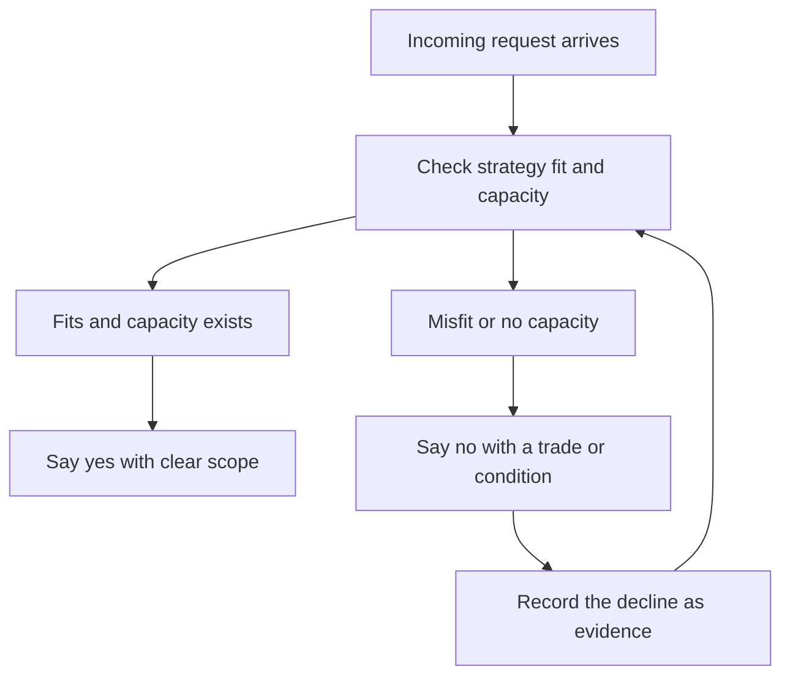

# Saying No at Scale

> **Core skill:** The staff engineer declines work consistently and constructively across the whole organization — through written strategy, priced trade-offs, and conditional yeses — so that "no" protects capacity without burning relationships.

## Why This Matters

At staff level, requests arrive faster than capacity, from every direction: product wants features, teams want platforms, leadership wants initiatives, and each one is reasonable on its own. Saying yes to all of them is not generosity; it is a decision to underfund everything. The only sustainable response is a system for saying no that is consistent, written, and free of personal conflict.

The staff engineer's no carries unusual weight because it is delivered without authority. It must therefore be based on something impersonal — the strategy, the capacity model, the priced trade — and it must leave the requester with a path. A no without a path is a wall; a no with a path is a prioritization.

## The No Toolkit

Different requests deserve different kinds of no. Match the refusal to the situation.

| No type | When to use it | What you say, in essence |
|---------|----------------|--------------------------|
| Strategic no | The request contradicts the written strategy | "This is a named non-goal in the strategy; we are deliberately not doing this" |
| Prioritization no | The request is fine but unfunded | "It is a good idea; here is what we would stop to fund it" |
| Capability no | The organization cannot execute it yet | "Not yet — this needs X first, and here is the sequence" |
| Non-decision no | The request should not be decided at all | "This does not meet the bar for review; it dies in triage" |

## The Strategic No

The strategic no is the cheapest and strongest refusal, because it is not yours. When the strategy names a non-goal, the answer writes itself: "The strategy commits us to not doing this until next review." There is nothing personal to argue with, and the requester's recourse is the review process, not a renegotiation with you.

This is why the strategy must name non-goals specifically. A strategy with vague priorities forces every refusal to be a personal judgment call, and personal judgment calls burn relationships one at a time.

## The Prioritization No: Offer the Trade

When the request is good but unfunded, the refusal must carry the price of its own acceptance. The formula: name the request's cost, name what it displaces, and let the requester make the choice with full information.

| Weak no | Strong no |
|---------|-----------|
| "We don't have capacity" | "This is 3 engineer-months. The platform migration is 5. We can do one this quarter; which one?" |
| "Not now" | "Not now — unless you can move the compliance deadline, which is the only thing queued ahead of it" |

The trade-off no converts the conversation from a request into a decision, and it records the trade in the requester's own words. If they choose their request over the displaced work, the decision is theirs, and the next no is easier.

## The Capability No: Not Yet, Needs X

Some requests are legitimate but premature: the org cannot absorb the work, the dependency is not ready, the team does not exist. The capability no says not yet, names the missing condition, and sequences the path. It is a no with a roadmap attached — which is why it is the refusal that most often turns into a funded proposal later.

## The Non-Decision No

A large share of requests do not deserve a decision at all: they are unquantified, unowned, or based on a stale problem. The non-decision no lets them die in triage rather than consuming a decision cycle. The discipline is to say so plainly — "this does not meet the bar for a proposal" — instead of scheduling a meeting that produces nothing.

## Nos to Leadership: Options, Not Refusal

Saying no to leadership is a different craft, because leaders control the priorities you are protecting. The move is to convert the no into options with consequences, exactly as in the allocation conversation: here is what you are asking, here is what it displaces, here are three ways to get both. Leadership rarely objects to a no; it objects to discovering the trade was hidden.

| Bad pattern | Good pattern |
|-------------|--------------|
| "We can't do that" | "We can, and here is the cost: the migration slips a quarter. Alternatively, we defer the reporting feature. Which do you prefer?" |

Never refuse a leader with a bare no and no options. A leader with options feels in control; a leader facing a wall escalates around you.

## Nos to Peers: Relationship-Preserving

Peer requests are the ones where refusal feels personal, because peers are also collaborators. The preservation mechanics: acknowledge the merit, separate the idea from the funding, offer the path (next cycle, the trade, the proposal bar), and follow through on whatever small help you did promise. The goal is that the peer walks away saying "good no" — they lost the allocation and kept the relationship.

## Nos to Yourself: Dropping Your Own Darlings

The hardest no is the one you owe your own portfolio. Staff engineers accumulate darlings: the rewrite they championed, the framework they introduced, the migration they own emotionally. A no to yourself means killing or deprioritizing your own work when the evidence says it should yield. It is the most visible demonstration that your no is principled, and it buys the credibility that makes every other no land.

## Tracking Nos: The Declined List

The declined list is the strategy's audit trail. Every significant no gets one line: the request, the requester, the no type, the date, and the reason. Two uses make it worth keeping:

| Use | How it works |
|-----|--------------|
| Pattern detection | If the same request recurs quarterly, the strategy or the request needs to change |
| Strategy evidence | A review can ask: what did we decline, and was that the right call? Declines are decisions, and decisions deserve review |

## The Yes That Means No: Conditionals

The conditional yes is the negotiation move: "yes, if X." It accepts the request on terms that make it safe — scope, sequencing, or dependency conditions.

```markdown
# Conditional Yes Template

- Request: [what was asked]
- Yes to: [the part that is safe to accept]
- Conditions:
  - [ ] [condition 1, e.g. scope limited to one team]
  - [ ] [condition 2, e.g. follow-up capacity allocated next cycle]
  - [ ] [condition 3, e.g. dependency delivered by a date]
- If conditions fail: [the no that takes effect, pre-agreed]
```

A conditional yes is only honest if the conditions are real and the fallback is stated in advance. A yes with conditions that never bind is just a yes.



## Practical Applications

### Saying No Checklist

- [ ] The strategy names non-goals specific enough to decline by
- [ ] Every significant no cites a reason: strategy, capacity, capability, or bar
- [ ] Prioritization nos price the displaced work and offer the choice
- [ ] Leadership nos come with options, never bare refusals
- [ ] Peer nos acknowledge merit and offer a path
- [ ] Your own darlings are held to the same standard as everyone else's
- [ ] The declined list is kept and reviewed each cycle

## Common Pitfalls

| Pitfall | Why It Is a Problem | Better Approach |
|---------|---------------------|-----------------|
| **Yes by exhaustion** | Saying yes to end the meeting; the work lands anyway | Pause; the request can survive one night of written pricing |
| **Personal no** | Refusals that read as dislike; relationships burn | Cite the strategy or the trade, never the requester |
| **Bare no to leadership** | Leaders escalate around you; the trade happens without you | Always attach options and consequences |
| **No without a path** | The requester recycles the same ask with new framing | Leave a concrete next step: cycle, bar, or condition |
| **Conditional yes that never binds** | Conditions ignored; the org absorbs the full cost | State the fallback no in advance and enforce it |
| **Defending darlings** | Your own work exempt from the standard you apply to others | Apply the same evidence test to your portfolio |

## Success Indicators

- Requests arrive pre-filtered because teams know the strategy
- Rejected requesters can repeat the reason back and agree with it
- Leaders describe your no as "options and consequences," not refusal
- The declined list shows patterns that changed strategy or process
- No relationship damage is visible: the same people bring the next request

## Related Topics

- [[01_Writing_Technical_Strategy]]: the strategy is the no's authority
- [[03_Capacity_and_Investment_Allocation]]: the capacity the no protects
- [[02_Cross_Team_Technical_Leadership/00_overview|Cross-Team Technical Leadership]]: declining across team boundaries
- [[04_Influence_and_Alignment/00_overview|Influence and Alignment]]: keeping relationships while refusing
- [[career-path/02_Senior_Software_Engineer/06_Communication_and_Influence/03_Influence_Without_Authority|Influence Without Authority (Senior)]]: the foundation this scales

## Summary

Saying no at scale is a system, not a posture: strategic nos cite the written strategy, prioritization nos price the displaced work, capability nos sequence the path, and conditional yeses make acceptance safe. The declined list turns refusals into evidence, and the willingness to apply the same standard to your own darlings is what makes every other no credible. A no with a reason and a path is prioritization; a no without them is a wall.
