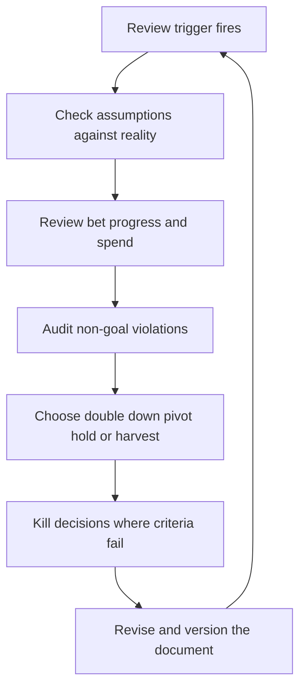

# Strategy Review and Adaptation

> **Core skill:** The staff engineer keeps strategy honest by reviewing it against reality on a schedule, making kill decisions without sunk cost attachment, and adapting bets deliberately instead of drifting.

## Why This Matters

Every strategy is written against assumptions, and assumptions decay. Markets shift, leadership changes, teams reorganize, and metrics reveal that the world is different from the one the strategy described. A strategy that is never reviewed becomes a myth — quoted as authority long after its premises have died.

The staff engineer owns the review because the strategy is their artifact and their credibility is on the line. Review is not an administrative chore; it is where the strategy earns or loses its power to direct decisions. A strategy that demonstrably adapts gets followed; one that visibly fossilizes gets quietly ignored.

## Strategy vs Plan

The review must be clear about what it is reviewing. Strategy and plan are different artifacts with different failure modes.

| Dimension | Strategy | Plan |
|-----------|----------|------|
| Answers | Where are we going, and why? | What do we do next, and when? |
| Horizon | Years | Quarters |
| Changes | When assumptions break | Every cycle, routinely |
| Failure mode | Fossilizes into a myth | Churns into busywork |

A review that treats the plan as strategy spends its time on dates and misses the assumptions. A review that treats strategy as plan refuses to change direction because the plan says otherwise. The quarterly review checks both, in that order: assumptions first, then the plan that follows from them.

## Review Triggers

The calendar review is the minimum. Mature organizations also review on events, because reality does not wait for the quarter.

| Trigger | Type | Response |
|---------|------|----------|
| Quarterly review date | Calendar | Full assumptions check, bet progress, non-goal audit |
| Market or competitive shift | Event | Targeted review of affected bets and non-goals |
| Leadership change | Event | Re-validate direction with the new leader; update or reaffirm |
| Metric divergence | Event | Investigate why outcomes diverged from the strategy's predictions |
| Major technical surprise | Event | Assess whether the surprise invalidates a bet's thesis |

The discipline of event triggers is to act on them: an event that is noticed and ignored teaches the organization that the strategy is decorative.

## The Quarterly Strategy Review Format

The quarterly review is a fixed agenda, not a free-form discussion. It answers three questions, in order.

| Step | Question | Evidence to Bring |
|------|----------|-------------------|
| Assumptions check | Are the beliefs the strategy was built on still true? | The strategy's original assumptions, marked current or expired |
| Bet progress | Are the bets delivering what their commitment points predicted? | Written predictions from each commitment point vs actuals |
| Non-goal violations | Have we drifted into work we said we would not do? | The declined list; actual work against each non-goal |

The output is a decision, not a discussion summary: each bet is reaffirmed, adapted, or killed; each non-goal is reaffirmed or amended; the document is revised or re-issued.

## Kill Decisions

The hardest review output is the kill. A bet that fails its criteria should end on schedule, with its learning recorded. The mechanics that make kills survivable:

- **Kill criteria were written at proposal time.** Killing against pre-agreed criteria is process; killing without them is a personal defeat.
- **The kill is public and framed as success.** A portfolio that never kills is a portfolio that never learned. Publishing the kill normalizes honesty.
- **The learning is captured.** What did the bet prove, and what would we do differently? The next bet inherits the answer.
- **The people are protected.** A killed bet is not a failed engineer. The review names the decision, not the people.

## Adaptation Patterns

When a bet's evidence comes in, the response is one of four patterns — never "keep going and hope."

| Pattern | When to Use It | What It Looks Like |
|---------|----------------|--------------------|
| Double down | Evidence exceeds predictions; the window is open | Increase capacity, pull the next commitment point forward |
| Pivot | Thesis partially right; the approach is wrong | Change the approach, keep the direction, re-size the bet |
| Hold | Evidence mixed; more signal needed | Freeze new spend, set a short re-review date |
| Harvest | The bet delivered; remaining value is marginal | Stop investing, extract the value, plan the exit |

The pattern is chosen by evidence, not by sentiment. If the review cannot say which pattern applies, the bet lacks the criteria to be reviewed — which is itself a finding.

## Versioning the Strategy Document

Adaptation must leave a trace. The strategy document is versioned like software: every revision gets a version number, a date, and a changelog of what changed and why.

```markdown
# Strategy Changelog Entry Template

- Version: [v2.1]
- Date: [date]
- Changed: [bet, non-goal, assumption, or allocation]
- What changed: [before to after]
- Why: [evidence that drove the change]
- Decision pattern: [double down, pivot, hold, harvest, kill]
```

Versioning serves three audiences: leaders can see the strategy is alive, teams can see why their work changed, and future reviews can read the history of decisions. An unversioned strategy that silently mutates destroys trust; a versioned one builds a decision record.

## Honesty About What the Strategy Got Wrong

The review's final discipline is intellectual honesty about the strategy's own errors. Every strategy gets things wrong: a bet that failed, a non-goal that was wrong, an assumption that expired. The review records these in the changelog without spin. "Our assumption about migration cost was wrong by a factor of three" is painful to write and invaluable to read.

This honesty is what separates adaptation from rationalization. An organization that records its strategic errors accumulates a body of evidence about how its own judgment works; one that rewrites history learns nothing and repeats its mistakes at higher cost.



## Practical Applications

### Quarterly Review Agenda Template

```markdown
# Strategy Review: [Quarter Year]

## Assumptions Check
| Assumption | Status | Evidence |
|------------|--------|----------|
| [assumption from last review] | [holds / expired / uncertain] | [evidence] |

## Bet Progress
| Bet | Prediction | Actual | Pattern | Decision |
|-----|------------|--------|---------|----------|
| [bet] | [committed prediction] | [measured result] | [double down / pivot / hold / harvest / kill] | [decision] |

## Non-Goal Audit
| Non-goal | Violated? | Where | Action |
|----------|-----------|-------|--------|
| [non-goal] | [yes / no] | [location of drift] | [corrective action] |

## Changelog
- Version: [next version]
- Changes: [list]
- What the strategy got wrong: [honest list]
```

### Review Checklist

- [ ] Review held on the calendar date, not rescheduled into oblivion
- [ ] Assumptions from the last review marked holds, expired, or uncertain
- [ ] Written bet predictions compared against actuals
- [ ] Non-goals audited against real work
- [ ] Every bet assigned an explicit pattern: double down, pivot, hold, harvest, or kill
- [ ] Kills made on criteria, with learnings recorded
- [ ] Changelog entry written, including what the strategy got wrong
- [ ] Document versioned and distributed

## Common Pitfalls

| Pitfall | Why It Is a Problem | Better Approach |
|---------|---------------------|-----------------|
| **Review theater** | The meeting happens; nothing changes | Require a decision and a changelog entry per bet |
| **Kill by embarrassment** | Failed bets defended because killing admits error | Write kill criteria at proposal time; kills become process |
| **Drift without versioning** | The strategy silently changes; nobody trusts it | Version every revision with a changelog |
| **Reviewing the plan, not the assumptions** | Dates are tuned while the premise rots | Assumptions check first, always |
| **Ignoring event triggers** | Market shifts noticed but not acted on | Hold a targeted review within the week of the event |
| **Rewriting history** | Errors laundered out of the record | Record what the strategy got wrong, without spin |

## Success Indicators

- Reviews produce decisions and version bumps, not discussion summaries
- Kill decisions happen on schedule, with learnings published
- The changelog shows a strategy that visibly adapted to reality
- Teams can explain why their work changed: the changelog answers it
- Past strategic errors are cited in new proposals as evidence, not hidden

## Related Topics

- [[01_Writing_Technical_Strategy]]: the document under review
- [[02_Technology_Betting]]: what the review evaluates
- [[07_Sunset_and_Exit_Strategy]]: kill decisions feed exits
- [[06_Technical_Risk_and_Judgment/00_overview|Technical Risk and Judgment]]: honest judgment under uncertainty
- [[07_Organizational_Learning_and_Mentoring/00_overview|Organizational Learning and Mentoring]]: learning from wrong calls

## Summary

Strategy review and adaptation is what keeps strategy alive: a fixed calendar review plus event triggers, an assumptions check before bet progress, explicit adaptation patterns instead of drift, and kill decisions made on pre-agreed criteria. Versioning and honest changelogs turn the strategy into a decision record, and recording what the strategy got wrong is the discipline that lets the organization learn from its own bets.
