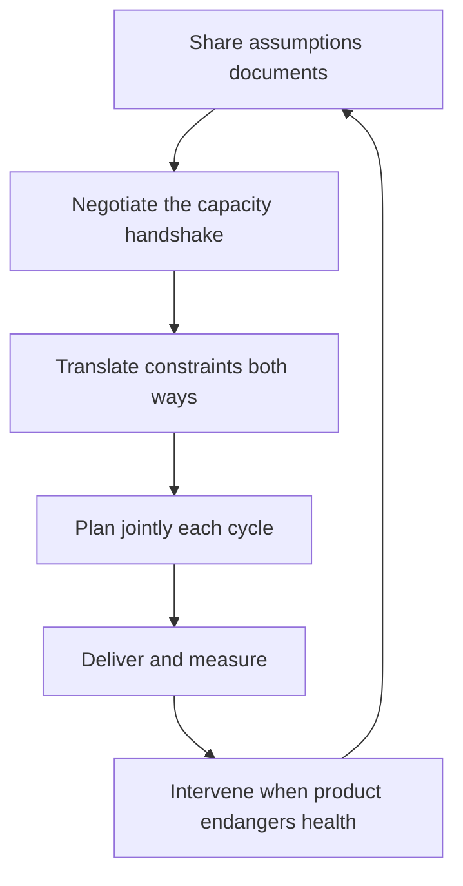

# Working With Product Strategy

> **Core skill:** The staff engineer couples technical strategy to product direction — sharing assumptions, negotiating the capacity handshake, and translating constraints in both directions so neither side plans against fiction.

## Why This Matters

Technical strategy and product strategy are planned by different people, on different timelines, against different evidence — and then executed by the same engineers. When the two documents contradict each other, the contradiction is resolved by whoever escalates loudest, not by whoever is right. The result is a roadmap that promises what the platform cannot deliver, or a platform built for a product that has already pivoted.

The staff engineer is the coupling point. Product leaders own the market question; engineering owns the capability question; nobody else sits in both conversations. Making the two strategies reference each other's constraints is not a coordination nicety — it is the difference between a roadmap that ships and one that stalls mid-quarter.

## Shared Assumptions Documents

The most common failure is hidden assumptions: product assumes the platform can scale to the new market, engineering assumes the product will not change direction. The shared assumptions document makes both explicit.

| Assumption | Product's Version | Engineering's Version | Status |
|------------|-------------------|-----------------------|--------|
| Scale | "The new segment doubles peak load" | "The current architecture holds at 2x with the planned work" | Agreed |
| Timeline | "Launch in Q3" | "Migration completes Q4; Q3 launch means a degraded path" | Conflict, unresolved |
| Longevity | "The legacy UI survives indefinitely" | "The legacy UI blocks the platform bet" | Conflict, unresolved |

The document is reviewed jointly at each planning cycle, and every conflict gets an owner and a date. Its purpose is not agreement — it is that disagreements become visible decisions instead of surprises.

## The Capacity Handshake

The handshake is the negotiation where product's roadmap needs and engineering's technical roadmap needs are traded against one finite capacity. It has three phases.

| Phase | Question | Output |
|-------|----------|--------|
| Product side | What does the roadmap require from engineering? | A priced list of product commitments |
| Engineering side | What does the technical strategy require from capacity? | A priced list of platform, debt, and bet commitments |
| Negotiation | What gives, and what is protected? | The agreed allocation, with named trade-offs |

The handshake fails when one side presents its needs as immovable. The staff engineer's role is to keep both lists visible and priced, so the negotiation is about trade-offs between real things. The protected items are the non-negotiable ones: the bets the strategy names, the debt that is actively costing, the compliance work that has a date.

## Translating Constraints Both Ways

Product and engineering speak different languages, and translation is a core staff skill. The translations must go in both directions, and they must be priced in the listener's currency.

| Engineering constraint | Product translation |
|------------------------|---------------------|
| "The monolith blocks the feature" | "This feature costs 3x more on the current architecture, and ships in 2 quarters instead of 1" |
| "We need a migration quarter" | "One quiet quarter now buys two features per quarter after" |
| "The platform bet is underfunded" | "Every feature slows down a little more until it is funded" |

| Product constraint | Engineering translation |
|--------------------|-------------------------|
| "Launch in Q3 or the market window closes" | "The window is real; here is the degraded-but-safe path and its cost" |
| "The segment is 10x the current users" | "Scale assumptions change the bet portfolio; here is what we would reprioritize" |
| "The feature is strategic for two quarters only" | "Then we build it cheap, not beautiful, and plan the sunset" |

The test of a good translation: the other side can repeat it back and act on it. "Latency" is not a translation; "the checkout conversion drops 2 percent per 100ms" is.

## Joint Planning Rituals

Coupling decays between planning cycles, so it needs standing rituals with fixed cadence.

| Ritual | Cadence | Purpose |
|--------|---------|---------|
| Assumptions review | Quarterly | Refresh the shared assumptions document |
| Capacity handshake | Each planning cycle | Negotiate the allocation before roadmaps are locked |
| Roadmap cross-check | Each cycle | Each side reviews the other's draft roadmap against the shared document |
| Post-launch review | After major releases | Compare what was promised to what shipped; feed the assumptions document |

The rituals exist to make coupling routine rather than heroic. A coupling that depends on the staff engineer personally chasing both sides every week is fragile; one that runs on calendar invitations survives vacations.

## When Product Strategy Endangers Technical Health

Sometimes the coupling breaks down badly: the roadmap commits to dates or scale that the platform cannot survive, and the risk is not a delay but an outage or an unrecoverable debt spiral. The intervention has a specific shape.

| Wrong move | Right move |
|------------|------------|
| Refusing in the launch meeting | Taking the concern to the product leader privately, with evidence |
| "You don't understand the tech" | "Here is what breaks, when, and what the alternatives cost" |
| Demanding the roadmap change | Offering the trade: the date, the scope, or the investment |
| Escalating to the CEO over the product lead | Agreeing with the product lead on the framing before escalating together |

The intervention's goal is a decision with eyes open, not a victory. Product leaders who feel ambushed defend the roadmap; product leaders who see the failure curve laid out honestly usually move the date themselves.

## Technology as Product Enabler vs Driver

The coupling question runs both ways: does technology serve product direction, or does it create it?

| Mode | Meaning | Staff role |
|------|---------|------------|
| Enabler | Technology executes the product vision | Make capability delivery predictable; translate cost curves |
| Driver | A technical capability opens a product possibility | Surface the possibility in product terms; help price it |

Most organizations live in enabler mode most of the time. The staff engineer's opportunity is recognizing driver moments — when a platform capability, a performance ceiling, or a data asset creates a product option nobody has priced — and bringing them to product as options, not as tech self-indulgence.



## Practical Applications

### Capacity Handshake Template

```markdown
# Capacity Handshake: [Cycle]

## Product Requirements
| Requirement | Cost | Date | Must-have? |
|-------------|------|------|------------|
| [feature] | [engineer-months] | [date] | [yes / no] |

## Engineering Requirements
| Requirement | Cost | Date | Must-have? |
|-------------|------|------|------------|
| [platform bet, debt item] | [engineer-months] | [date] | [yes / no] |

## The Trade
- Total available: [engineer-months]
- Total demanded: [engineer-months]
- Named trade-offs: [what gives, what is protected]
- Unresolved conflicts: [list, with owners and dates]
```

### Coupling Checklist

- [ ] Shared assumptions document exists and was reviewed this cycle
- [ ] Product roadmap prices are agreed by engineering, not assumed
- [ ] Technical roadmap prices are visible to product
- [ ] Every translation is priced in the listener's currency
- [ ] The handshake happened before either roadmap was locked
- [ ] Interventions use evidence and private framing, not meeting ambushes
- [ ] Driver opportunities are surfaced to product as priced options

## Common Pitfalls

| Pitfall | Why It Is a Problem | Better Approach |
|---------|---------------------|-----------------|
| **Planning against fiction** | Each side assumes the other's constraints; the roadmap dies in execution | Maintain the shared assumptions document |
| **The handshake skipped** | Capacity conflicts surface mid-quarter as emergencies | Negotiate before roadmaps lock |
| **Translation failure** | Engineering argues in tech terms; product hears noise | Price everything in the listener's currency |
| **The meeting ambush** | Product hears "we can't" for the first time in front of the exec team | Intervene privately with evidence first |
| **Technology self-indulgence** | Platform work justified to itself, invisible to product | Frame platform bets as product outcomes |
| **Coupling by heroics** | The link survives only because one person chases it | Build rituals that run on the calendar |

## Success Indicators

- The shared assumptions document shows agreed and resolved conflicts each cycle
- Roadmaps from both sides cite each other's constraints
- Capacity conflicts surface in the handshake, not mid-quarter
- Product leaders repeat engineering constraints in their own language
- Intervention conversations happen before incidents, not after

## Related Topics

- [[01_Writing_Technical_Strategy]]: the technical side of the coupling
- [[03_Capacity_and_Investment_Allocation]]: the capacity the handshake allocates
- [[04_Saying_No_at_Scale]]: declining what does not fit the coupled plan
- [[career-path/02_Senior_Software_Engineer/06_Communication_and_Influence/02_Stakeholder_Communication|Stakeholder Communication (Senior)]]: the stakeholder craft this scales
- [[04_Influence_and_Alignment/00_overview|Influence and Alignment]]: how the coupling gets agreed

## Summary

Working with product strategy means making the two strategies plan against each other's reality: a shared assumptions document that surfaces conflicts early, a capacity handshake that negotiates the allocation before roadmaps lock, and translations priced in the listener's currency in both directions. The staff engineer is the coupling point, keeping the relationship routine through rituals and intervening with evidence when the roadmap endangers technical health.
