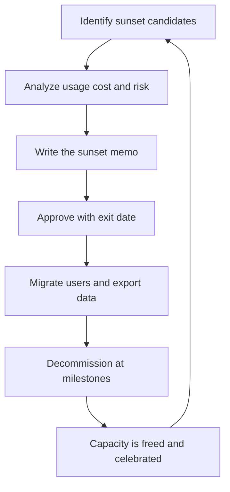

# Sunset and Exit Strategy

> **Core skill:** The staff engineer ends systems, tools, and commitments deliberately — with sunset memos, migration paths, and dates — and treats ending things as normal portfolio management rather than failure.

## Why This Matters

Every organization carries a graveyard of systems nobody chose to keep: the service that survived its purpose, the tool that lost its users, the platform that lost its bet. Each one consumes maintenance capacity forever — security patches, incident rotations, dependency upgrades — while delivering nothing. The cost compounds silently, because no single quarter feels the pain; it is spread across every team that must work around the corpse.

Nothing ends by default. Ending is a decision, and decisions need owners, evidence, and process. The staff engineer is the natural owner: they can see the whole portfolio, they can price the cost of keeping, and they have the credibility to make sunset a normal, celebrated act rather than an admission of failure.

## Why Nothing Ends

The forces that keep dead systems alive are predictable, and naming them is the first step to resisting them.

| Force | How It Operates | Countermeasure |
|-------|-----------------|----------------|
| Loss aversion | The system represents past investment; ending it feels like wasting it | Price the future cost of keeping; the past cost is gone either way |
| Orphaned ownership | The original team is gone; nobody feels authorized to end it | Assign explicit sunset ownership, including for orphaned systems |
| Cost asymmetry | Sunset costs are now and visible; keeping costs are forever and diffuse | Make the forever cost concrete: engineer-months per year |
| Risk fear | "What if someone still needs it?" | Usage data and a published migration window answer the fear |

The deepest countermeasure is a standing rule: every system has a review date and a named owner. A system with an owner and a date can be evaluated; an orphaned system can only be remembered.

## Sunset Candidates

Not every old system is a candidate. The screening uses four criteria, and a system qualifies when it fails on enough of them.

| Criterion | What to Measure | Sunset Signal |
|-----------|-----------------|---------------|
| Usage | Active users, traffic, transactions | Declining for two-plus quarters; no new onboardings |
| Maintenance cost | Incident count, patch burden, on-call load | Cost per active user is absurd and rising |
| Risk exposure | Security findings, compliance gaps, single points of failure | Risk is unmitigated and unmitigable at reasonable cost |
| Strategic misfit | Relationship to the strategy's direction and bets | The system is a non-goal made real; it blocks the direction |

The screening is a table, not an argument. A candidate that fails on usage and cost but sits on the critical path is not a sunset candidate; it is a migration dependency.

## The Sunset Memo

Every sunset gets a memo that answers three questions: why keep it is wrong, where the users go, and when it ends.

```markdown
# Sunset Memo: [System]

## Cost of Keeping
- Maintenance per year: [engineer-months, with breakdown]
- Risk exposure: [security, compliance, operational]
- Opportunity cost: [what the capacity would fund]

## Migration Path
- Replacement: [system or "no replacement needed"]
- User groups: [who uses it, how they move]
- Data export: [what data is preserved, how, for how long]
- Exceptions: [who stays until when, and why]

## Exit Plan
- Freeze date: [no new features, no new onboardings]
- Migration window: [dates]
- Decommission date: [the system is turned off]
- Owner: [name]
- Review point: [date when the plan is re-checked]
```

The memo makes the sunset a decision with a paper trail. Without it, sunsets happen by rumor and stall by inertia.

## Executing Sunsets

Execution is where sunsets fail, because the interesting part — the decision — is over and the tedious part remains. The execution discipline:

| Phase | Milestones |
|-------|------------|
| Freeze | Announce the sunset; stop new features and new onboardings; publish the timeline |
| Migrate | Move users group by group; export and verify data; track migration percentages publicly |
| Decommission | Turn off at the date; remove access; archive the data; delete or archive the code |
| Aftermath | Record the lesson; update the portfolio; publish what the sunset freed |

The migration must be tracked like any delivery, with a percentage, a date, and an owner. The most common execution failure is the sunset that freezes but never decommissions — the system enters a zombie state where it still costs on-call but no longer serves anyone.

## Sunk Cost Resistance

Sunk cost resistance is the sunset's constant enemy, at two levels. At the portfolio level, it shows up as "we already spent so much building this" — irrelevant, since the past spend is unrecoverable; the only question is the future cost of keeping. At the execution level, it shows up as the migration that stalls at 80 percent while the last users are individually fought for.

The discipline that defeats both: decisions are made on future costs, dates are made public, and the decommission date is treated as a commitment like any other. A sunset that slips once becomes a sunset that never happens.

## Celebrating Sunsets

Ending things must be visible and positive, because the organization learns from what is celebrated. A completed sunset gets the same public recognition as a shipped feature: the announcement names the owner, the users who migrated, and the capacity freed. Three effects follow: teams stop fearing sunset proposals, leaders start seeing decommission as a deliverable, and the portfolio stops accumulating corpses.

The celebration is also the mechanism that makes the next sunset easier. Each visible, well-executed sunset lowers the political cost of the next one.

## The Sunset Portfolio

Sunset work deserves portfolio visibility, not a corner of the backlog. A standing view answers: what is being sunset, who owns it, when it ends, and what capacity it frees.

| System | Owner | Freeze | Decommission | Capacity Freed |
|--------|-------|--------|--------------|----------------|
| [legacy service] | [name] | [date] | [date] | [engineer-months per year] |
| [orphaned tool] | [name] | [date] | [date] | [engineer-months per year] |

The portfolio view turns sunsets from episodic fights into a managed stream — and it gives leadership the one number they respond to: capacity reclaimed.



## Practical Applications

### Sunset Checklist

- [ ] Every system older than two years has an owner and a review date
- [ ] Candidates screened on usage, maintenance cost, risk, and strategic fit
- [ ] Sunset memo written with cost of keeping, migration path, and exit date
- [ ] Freeze announced publicly; no new features or onboardings after it
- [ ] Migration tracked publicly with a percentage and a date
- [ ] Decommission date held as a commitment
- [ ] Data exported, verified, and archived before shutdown
- [ ] Completed sunset announced and celebrated
- [ ] Portfolio view updated with capacity freed

## Common Pitfalls

| Pitfall | Why It Is a Problem | Better Approach |
|---------|---------------------|-----------------|
| **Zombie systems** | Frozen but never decommissioned; still costs on-call | Treat the decommission date as a commitment |
| **Sunset by rumor** | No memo, no dates; the effort dies in hallway conversations | Write the memo; decisions need paper trails |
| **Last-user heroics** | The migration stalls at 80 percent forever | Publish the exit date; exceptions get named deadlines |
| **Ending the wrong system** | Emotional targets sunset while true burdens survive | Screen on the four criteria, not on annoyance |
| **No celebration** | Sunsetting stays shameful; nobody proposes the next one | Announce completions like shipped features |
| **Sunk cost paralysis** | "We spent too much to stop" | Decide on future costs; the past is gone either way |

## Success Indicators

- The sunset portfolio shows systems with owners, dates, and freed capacity
- At least one sunset completed per quarter, on schedule
- Teams propose sunsets without fear; leaders treat them as deliverables
- Maintenance cost per system is visible and dropping
- The strategy review can name what was ended and what it freed

## Related Topics

- [[02_Technology_Betting]]: bets carry exit clauses from the start
- [[05_Strategy_Review_and_Adaptation]]: kill decisions precede sunsets
- [[03_Capacity_and_Investment_Allocation]]: the capacity sunsets reclaim
- [[career-path/02_Senior_Software_Engineer/08_Engineering_Economics_and_Trade_Offs/02_Build_vs_Buy_Decisions|Build vs Buy Decisions (Senior)]]: the keep-or-replace economics
- [[02_Cross_Team_Technical_Leadership/00_overview|Cross-Team Technical Leadership]]: migrating users across team boundaries

## Summary

Sunset and exit strategy is the discipline of ending things on purpose: screening candidates on usage, cost, risk, and strategic fit; writing memos that price keeping, name the migration path, and fix the exit date; executing migrations to a public decommission date; and celebrating completions so ending becomes normal. Nothing ends by default, and the staff engineer is the one who makes ending a managed, celebrated part of the portfolio.
