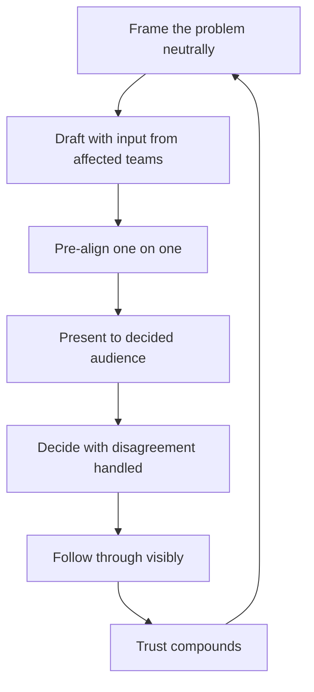

# Influence and Alignment

> **Core capability:** The staff engineer creates agreement among people with different incentives — through proposals that frame problems well, pre-alignment that prevents meeting battles, and disagreement handled constructively.

## Why This Matters

Staff work dies in two rooms: the meeting where the proposal wasn't pre-aligned, and the hallway after, where the losing side quietly declines to implement. Technical merit is table stakes; the differentiating skill is creating genuine agreement among teams and leaders whose incentives genuinely differ.

Influence at this level is built on a compounding asset: a track record of proposals that made people's work easier. That record earns the benefit of the doubt for the next proposal — which is the entire mechanism, because a staff engineer has no authority to require anything.

## Topics in This Capability Area

| Topic | Core Skill | When It Matters |
|-------|------------|-----------------|
| [[01_Writing_Proposals_That_Get_Adopted]] | Problem framing, options with trade-offs, recommendation | Every consequential proposal |
| [[02_Pre_Alignment_and_Coalitions]] | Winning before the meeting starts | Contested decisions; cross-team standards |
| [[03_Managing_Disagreement]] | Disagreeing well; handling objection and deadlock | Strong personalities; technical feuds |
| [[04_Building_Trust_Across_Teams]] | Earning the benefit of the doubt | Continuously; new orgs |
| [[05_Influencing_Leadership]] | Framing technical reality for executives | Investment asks; risk debates |
| [[06_Building_Consensus_Architecture]] | Decision processes that produce durable agreement | Org-wide standards; architecture boards |
| [[07_Influence_Ethics_for_Staff]] | Keeping influence transparent and auditable | Always |

## How Alignment Actually Happens

The presentation is the ceremony; the alignment happened before it.

## Senior vs Staff in Influence

| Activity | Senior engineer | Staff engineer |
|----------|-----------------|----------------|
| Proposals | Within the team's domain | Cross-team and org-level |
| Disagreement | Argues technical merit | Creates agreement across incentives |
| Leadership audience | Informs own manager | Influences directors and VPs |
| Trust radius | Own team | Multiple teams; earned deliberately |

## Practical Applications

### Influence Checklist

- [ ] Proposals frame the problem before proposing solutions
- [ ] Affected teams saw the draft before the meeting
- [ ] Objections are collected, answered in writing, and preserved
- [ ] Decisions record dissent, not erase it
- [ ] Follow-through after decisions is visible and credited
- [ ] Executive conversations lead with business impact
- [ ] Every influence move survives the transparency test

## Common Pitfalls

| Pitfall | Why It Is a Problem | Better Approach |
|---------|---------------------|-----------------|
| **Meeting ambush** | Decisions relitigated endlessly | Pre-align; the meeting confirms |
| **Solution-first proposals** | Readers argue the solution before agreeing on the problem | Problem framing first; options after |
| **Steamrolling dissent** | Compliance, not agreement; sabotage later | Answer objections in writing; record dissent |
| **Influence debt** | Spending trust faster than delivering value | Deliver between proposals; replenish |

## Success Indicators

- Proposals pass with adjustments, not battles
- Former skeptics cite your proposals in their own work
- Disagreement surfaces early and gets resolved, not buried
- Leaders repeat your framing in their own words
- Decisions stick — months later, nobody relitigates

## Related Capabilities

- [[02_Cross_Team_Technical_Leadership/00_overview|Cross-Team Technical Leadership]]: what influence delivers
- [[03_Technical_Strategy/00_overview|Technical Strategy]]: the durable artifact influence produces
- [[career-path/02_Senior_Software_Engineer/06_Communication_and_Influence/03_Influence_Without_Authority|Influence Without Authority (Senior)]]: the foundation this scales
- [[career-path/11_Engineering_Manager/05_Organizational_Awareness_and_Influence/00_overview|Organizational Awareness and Influence (EM)]]: the manager's parallel craft

## Summary

Influence and alignment is the staff engineer's core mechanism: proposals framed around shared problems, coalitions built before meetings, disagreement surfaced and answered in writing, and trust compounded by visible follow-through. No authority is coming — the track record is the authority.
