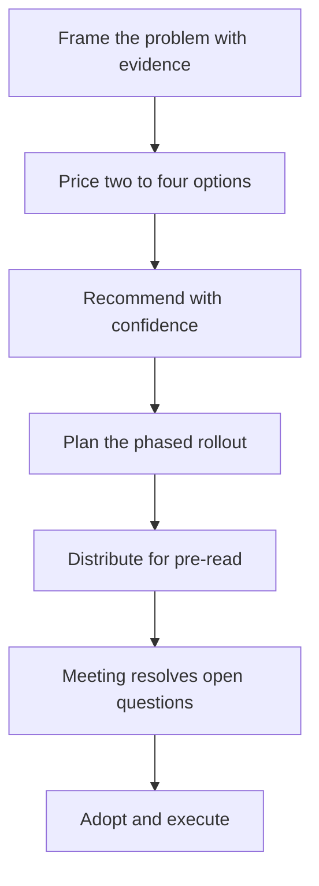

# Writing Proposals That Get Adopted

> **Core skill:** The staff engineer writes proposals that frame the problem with evidence, present priced options, recommend with stated confidence, and plan the rollout — so adoption follows from the document, not from lobbying.

## Why This Matters

At staff level, almost every consequential change starts as a written proposal. The document is not a formality around the real decision — it is the decision, because it is the only artifact that survives the meeting, travels to stakeholders who were not present, and gets cited months later. Proposals that get adopted are read once and understood; proposals that die are read once and resisted.

Adoption is won in the document's structure before it is won in any room. A proposal that proves the problem, prices its options honestly, and recommends with visible reasoning does most of its persuasion before the first meeting. A proposal that leads with its solution invites every reader to argue the solution — and readers argue what they can see.

## Proposal Anatomy

Every consequential proposal has five sections, in order. Skipping or blurring one of them is the most common cause of proposal death.

| Section | What It Must Do | Common Failure |
|---------|-----------------|----------------|
| Problem framing | Prove the problem exists, with evidence and the cost of inaction | Asserting the problem without evidence |
| Options | Present 2-4 real alternatives with trade-offs | One option, or options that are straw men |
| Recommendation | Name the choice, with confidence and reasoning | Hiding the recommendation "to stay neutral" |
| Rollout | Describe the phased path, with dates and owners | Stopping at the decision, ignoring execution |
| Open questions | List what is still unknown and what would change the decision | Pretending certainty; inviting ambush later |

## Problem Framing: Evidence and the Cost of Inaction

The problem framing is where proposals live or die. A reader who agrees the problem is real and costly will read the options charitably; a reader who doubts the problem will find flaws in every option.

| Weak framing | Strong framing |
|--------------|----------------|
| "Our deployment process is painful" | "Deploying takes 4 hours of manual steps; we deploy 3x per week; the cost is 12 engineer-hours weekly plus the incident risk of manual error" |
| "The platform doesn't scale" | "Peak traffic grew 40 percent per quarter for three quarters; p99 latency degraded 2x; the forecast crosses the SLO in Q3" |

The cost of inaction is the sentence that makes the proposal urgent without manufactured urgency: here is what it costs, every quarter, to not decide.

## Options: 2-4 with Trade-Offs

Options must be real. A proposal with one option is a demand; a proposal with a straw-man option is a manipulation. The discipline: each option gets its cost, its benefit, its risk, and the condition under which it would be the right choice. The last point matters most — an option that is right under some plausible condition is honest, and honesty is what makes the recommendation credible.

| Option | Cost | Benefit | Risk | Right When |
|--------|------|---------|------|------------|
| A: Do nothing | 12 engineer-hours weekly forever | No disruption | The cost compounds; SLO breach forecast | The problem is about to disappear |
| B: Fix the pipeline | 6 engineer-months | Deploys drop to 15 minutes; incidents fall | Migration risk during the change | The problem is structural and lasting |
| C: Buy a platform | License cost plus 2 engineer-months | Fastest time-to-value | Vendor lock-in; fit uncertainty | The problem is generic, not core |

## Recommendation: With Confidence

A proposal without a recommendation is a menu, and menus get punted. The recommendation states the choice, the confidence, and the reasoning in three sentences or less: "We recommend B, with medium-high confidence. It is the only option that removes the compounding cost, and its main risk — migration — is mitigated by the rollout in section four. We considered C, and rejected it because the problem is core to how we ship."

Confidence should be stated honestly. A recommendation that overstates certainty is adopted on false premises and dies in execution; one that names its uncertainty invites the reader into the reasoning instead of against it.

## Rollout: Phased

Adoption includes execution. The rollout section turns the decision into a plan with phases, dates, and owners, and it is the section that separates proposals from essays.

| Phase | Scope | Owner | Exit Condition |
|-------|-------|-------|----------------|
| Pilot | One team, one service | [name] | Pilot metrics meet the target |
| Expand | Half the organization | [name] | No regressions in the pilot population |
| Complete | Everything; old path decommissioned | [name] | Old path turned off, not just unused |

A phased rollout is also the risk management: the proposal can be adopted with a pilot as the first commitment, which makes the decision smaller and therefore easier.

## Open Questions

The open questions section lists what is unknown and what would change the recommendation. It is not weakness; it is the pre-commitment that prevents the ambush — "we didn't consider X" — from working in the review meeting, because X is already on the page with its consequence stated.

## Length and Format Discipline

The proposal must be readable in one sitting, on one screen: three to five pages, with the recommendation and its reasoning on the first page. The pattern that works at staff scale:

- **Page one:** the decision being asked for, the problem in three sentences, the recommendation, and the confidence.
- **Pages two to three:** the options with their trade-off tables.
- **Page four onward:** the rollout, open questions, and appendices.

Readers decide on page one and use the rest to verify. A proposal that buries its recommendation on page six is read as a request for discussion, not a request for decision.

## The Pre-Read Culture

The proposal is distributed before the meeting, and the meeting is not a reading session. The pre-read culture has two rules: the document is complete enough to decide from alone, and the meeting starts from the assumption that it was read. When the culture holds, meetings resolve open questions instead of re-arguing the document. When it does not, the proposal needs the pre-alignment work described in Pre-Alignment and Coalitions to survive the room.

## Appendices: Data and Prior Art

Everything that would bloat the body goes to the appendix: the raw data, the measurement methodology, the prior art from other teams or companies, the failed alternatives. The appendix is what lets a skeptical reader verify without slowing the deciding reader. Its existence is also a credibility signal — proposals with appendices are read as researched; proposals without them are read as asserted.

## The Proposal Review Meeting

The meeting format follows the document: the problem is confirmed in two minutes, the options are not re-presented, the open questions are resolved one by one, and the decision is recorded with any dissent. The chair's job is to protect the document — if the room is re-arguing page two, the meeting is off-format and should be stopped, not suffered.

## Common Proposal Killers

| Killer | How It Kills | Prevention |
|--------|--------------|------------|
| **Solution-only** | The problem is asserted, so the solution is argued | Prove the problem with evidence and the cost of inaction |
| **Unpriced options** | Trade-offs invisible; the room splits on taste | Price every option: cost, benefit, risk |
| **No rollout** | Adopted in principle, dead in execution | Write the phased plan with owners and dates |
| **No recommendation** | The menu gets punted to the next meeting | Recommend, with confidence and reasoning |
| **Recommendation buried** | Readers decide against it before they reach it | Decision and reasoning on page one |
| **Certainty theater** | Overstated confidence collapses at first obstacle | State confidence and open questions honestly |



## Practical Applications

### Proposal Template

```markdown
# Proposal: [Title]

## Decision Requested
- What we are deciding: [one sentence]
- Recommendation: [option, confidence]
- Decision deadline: [date]

## The Problem
- Evidence: [numbers, sources]
- Cost of inaction: [what it costs per quarter to not decide]

## Options
| Option | Cost | Benefit | Risk | Right When |
|--------|------|---------|------|------------|
| [A] | [cost] | [benefit] | [risk] | [condition] |

## Recommendation
- Choice: [option]
- Confidence: [high / medium / low]
- Reasoning: [three sentences max]

## Rollout
| Phase | Scope | Owner | Exit Condition |
|-------|-------|-------|----------------|
| [Pilot] | [scope] | [owner] | [condition] |

## Open Questions
- [question] — if answered [X], the recommendation changes to [Y]

## Appendix
- Data, methodology, prior art
```

### Proposal Checklist

- [ ] Problem proven with evidence and a priced cost of inaction
- [ ] Two to four real options, each with trade-offs and a right-when condition
- [ ] Recommendation stated with confidence and reasoning
- [ ] Rollout phased with owners, dates, and exit conditions
- [ ] Open questions listed, with their consequence for the recommendation
- [ ] Three to five pages; decision on page one
- [ ] Distributed for pre-read before the meeting

## Common Pitfalls

| Pitfall | Why It Is a Problem | Better Approach |
|---------|---------------------|-----------------|
| **Writing for the committee** | Every objection pre-answered; the document is unreadable | Write for one deciding reader; answer objections in appendices |
| **Straw-man options** | Readers spot the fake choice and discount the whole proposal | Make every option genuinely defensible under some condition |
| **No owner on the rollout** | The decision lands and nobody is accountable | Name owners and dates in the rollout section |
| **Meetings that re-read the document** | Wasted time; the room argues instead of deciding | Pre-read culture; the meeting resolves open questions only |
| **Vague problem statement** | Readers disagree on what is being solved | Lead with numbers; the problem is a fact, not an opinion |

## Success Indicators

- Proposals are approved with adjustments, not rewritten in the meeting
- Reviewers cite the problem framing in their own language
- The recommendation and its confidence are repeatable by readers
- Rollout phases complete on their dates
- Former skeptics cite the proposal's options in later decisions

## Related Topics

- [[02_Pre_Alignment_and_Coalitions]]: the adoption path before the meeting
- [[06_Building_Consensus_Architecture]]: the decision processes proposals feed
- [[career-path/02_Senior_Software_Engineer/06_Communication_and_Influence/01_Technical_Writing|Technical Writing (Senior)]]: the writing foundation this scales
- [[03_Technical_Strategy/00_overview|Technical Strategy]]: the strategy proposals serve
- [[01_The_Staff_Role_and_Scope/00_overview|The Staff Role and Scope]]: where proposals fit the role

## Summary

Proposals that get adopted are won in structure: a problem proven with evidence and a priced cost of inaction, two to four honest options, a recommendation with stated confidence, a phased rollout with owners, and open questions that pre-empt ambush. Held to three to five pages with the decision on page one, the proposal becomes the decision artifact — read once, understood, and cited for months after the meeting.
