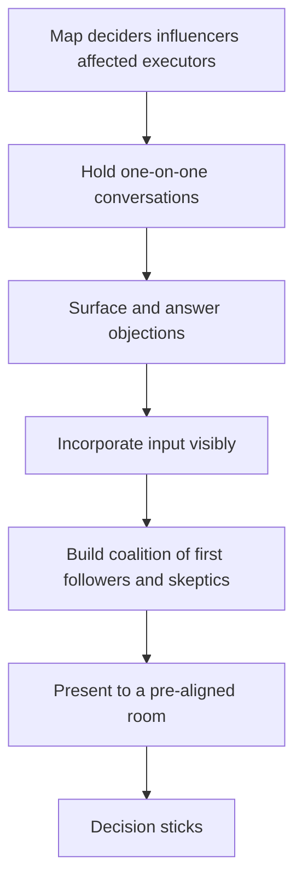

# Pre-Alignment and Coalitions

> **Core skill:** The staff engineer wins decisions before the meeting starts — mapping the people who matter, holding one-on-one conversations that surface objections, and incorporating input so visibly that the proposal becomes partly theirs.

## Why This Matters

Meetings do not make decisions; they confirm them. By the time a consequential proposal reaches a room, the outcome has usually been shaped by the conversations that happened before it — who was consulted, whose objections were answered, whose fingerprints are on the document. A proposal that enters the meeting cold is decided by whoever talks loudest or most senior; a proposal that enters pre-aligned is decided on its merits, because the merits were already debated privately where honesty is cheaper.

Pre-alignment is not manipulation; it is the ordinary work of making a decision well. Objections raised in a one-on-one can be answered with evidence; objections raised in a room become positions that people must defend in public. The staff engineer who skips pre-alignment is not being more honest — they are outsourcing the hard conversation to the worst possible venue.

## The Pre-Alignment Map

Before any conversation, map the people who matter for the decision. The map has four roles, and one person can hold several.

| Role | Who They Are | What They Need |
|------|--------------|----------------|
| Deciders | The person or group that formally decides | Clear options, honest trade-offs, no surprises |
| Influencers | People whose opinion shapes the decider | To be consulted; their concerns answered |
| Affected | Teams whose work the decision changes | To see the impact early; to shape the rollout |
| Executors | People who will implement the decision | To understand it and to have raised their objections first |

The map is written down — a table with names and roles — because the failure mode is forgetting the quiet influencer until the meeting. The most dangerous person in any decision is the one who was never consulted and discovers the proposal in the room.

## The One-on-One Pre-Conversation

Each pre-conversation has a shape: a genuine request for input, not a sales pitch. Three script patterns cover most of the work.

| Pattern | When to Use It | How It Sounds |
|---------|----------------|---------------|
| Curious | Early, when the proposal is still forming | "I'm exploring whether to fix the deployment pipeline. You've lived with it longest — what would you change first?" |
| Framing | When the proposal has a draft | "Here is the problem as I see it, and the direction I'm considering. What am I getting wrong?" |
| Objection surfacing | When the proposal is nearly final | "I'm close to recommending option B. If you were me, what would make you hesitate?" |

The third pattern is the one that wins decisions: it invites the objection while there is still time to answer it. The objection that surfaces in a one-on-one is a gift; the same objection in a meeting is a weapon.

## Incorporating Input Visibly

Pre-alignment only works if the input is visibly incorporated. People support proposals they shaped; people resist proposals that merely consulted them. The mechanics are small and concrete:

- The proposal's changelog names who contributed what: "Option C added after discussion with the payments team."
- Objections answered in writing appear in the document's appendix.
- The people consulted can see their influence in the final text.

The visible incorporation is what converts a consultation into a coalition. "They asked, and they changed the document" is the sentence that makes the next pre-conversation easy.

## The Coalition Build

A coalition is the group of people who will argue for the proposal when you are not in the room. It builds in a specific order.

| Stage | Who | Purpose |
|-------|-----|---------|
| First followers | The people most affected and most convinced | To co-author and co-own the proposal |
| Respected skeptics | The credible critics of your idea | To find and fix the real weaknesses early |
| Influencers | The people the decider listens to | To carry the proposal into the decision |
| The decider | The formal decision-maker | To decide, with all objections already answered |

The respected skeptic is the most valuable member of the coalition. A skeptic who was heard and partly answered becomes the proposal's strongest advocate — their support signals to everyone else that the idea survived scrutiny. The coalition that contains only enthusiasts is a clique, and cliques are discounted.

## When Pre-Alignment Fails

Sometimes the one-on-ones reveal an unresolvable conflict: two stakeholders with genuinely incompatible incentives, or a decider whose direction contradicts the proposal. The failure mode to avoid is pretending it did not happen and walking into the meeting anyway.

| Wrong move | Right move |
|------------|------------|
| Ignoring the conflict; hoping the meeting resolves it | Naming the conflict to the decider before the meeting |
| Escalating the conflict as a complaint | Escalating with options: what each resolution costs |
| Withdrawing the proposal in frustration | Testing whether the proposal can be reshaped to fit the incentives |
| Taking sides publicly | Letting the stakeholders resolve the incentive conflict; bringing the technical options |

When incentives are unresolvable at your level, the escalation is a decision request, not a grievance: "The data platform bet and the migration timeline cannot both hold with current capacity. Here are the three resolutions and their consequences. Which one should I plan against?"

## Pre-Alignment Ethics

Pre-alignment sits close to a line, and the line is visible: persuasion, not ambush. The tests that keep it clean.

| Legitimate | Not legitimate |
|------------|----------------|
| Consulting everyone who will be affected | Consulting only the people who agree |
| Answering objections with evidence | Reframing objections to make them look stupid |
| Incorporating input visibly | Taking credit for others' input |
| Building support for a real proposal | Building a voting bloc against a rival's proposal |
| Telling the decider what you are doing | Running a shadow campaign the decider would be surprised by |

The simplest ethical test: would every participant be comfortable if they saw the full list of who was consulted, what they said, and how their input was used? If the answer is no, the pre-alignment has become a campaign.



## Practical Applications

### Pre-Alignment Map Template

```markdown
# Pre-Alignment Map: [Decision]

| Role | Person | Position | Concern | Conversation Done? | Input Incorporated? |
|------|--------|----------|---------|--------------------|--------------------|
| Decider | [name] | [supportive / neutral / opposed] | [concern] | [yes / no] | [yes / no] |
| Influencer | [name] | [position] | [concern] | [yes / no] | [yes / no] |
| Affected | [name] | [position] | [concern] | [yes / no] | [yes / no] |
| Executor | [name] | [position] | [concern] | [yes / no] | [yes / no] |

## Objections Collected
| Objection | Source | Answer | Where Recorded |
|-----------|--------|--------|----------------|
| [objection] | [name] | [answer] | [proposal section] |

## Unresolved Conflicts
| Conflict | Resolution Options | Escalated To |
|----------|--------------------|--------------|
| [conflict] | [options with consequences] | [decider] |
```

### Pre-Alignment Checklist

- [ ] The map is written: deciders, influencers, affected, executors by name
- [ ] Every influential person had a one-on-one before the meeting
- [ ] Objections were collected in conversation, not discovered in the room
- [ ] Input is visible in the document: changelog, appendix, or named changes
- [ ] At least one respected skeptic has reviewed the proposal
- [ ] Unresolvable conflicts were escalated as options, not complaints
- [ ] The consultation list would survive full disclosure

## Common Pitfalls

| Pitfall | Why It Is a Problem | Better Approach |
|---------|---------------------|-----------------|
| **Consulting only allies** | The coalition is a clique; the room discounts it | Include the skeptics and the affected, early |
| **Sales-pitch one-on-ones** | People feel lobbied, not consulted; support is surface-level | Ask for input before asking for support |
| **Invisible incorporation** | Input collected and ignored; people feel used | Show the change and credit the source |
| **Ambush by meeting** | Unconsulted stakeholders discover the proposal in the room | Map the affected before the draft is final |
| **Coalition as weapon** | Building blocs against rivals rather than for decisions | Test every move against full disclosure |
| **Conflict denial** | Walking into the meeting hoping the room resolves it | Name the conflict and escalate with options |

## Success Indicators

- Meetings confirm decisions that were already shaped in one-on-ones
- Skeptics who were consulted argue for the proposal in the room
- The document shows whose input changed it
- Objections arrive in writing before the meeting, not as ambushes in it
- Decisions hold — months later, nobody says "we were never consulted"

## Related Topics

- [[01_Writing_Proposals_That_Get_Adopted]]: the proposal pre-alignment carries
- [[03_Managing_Disagreement]]: objections surfaced and answered in pre-alignment
- [[04_Building_Trust_Across_Teams]]: the trust pre-alignment draws on
- [[career-path/02_Senior_Software_Engineer/06_Communication_and_Influence/03_Influence_Without_Authority|Influence Without Authority (Senior)]]: the foundation this scales
- [[02_Cross_Team_Technical_Leadership/00_overview|Cross-Team Technical Leadership]]: aligning across team boundaries

## Summary

Pre-alignment and coalitions are how decisions actually get made: map the deciders, influencers, affected, and executors; hold one-on-ones that surface objections while they can still be answered; incorporate input so visibly that people own the proposal; and build a coalition that includes respected skeptics. Done with full transparency, pre-alignment turns the meeting into confirmation and the decision into something that sticks.
