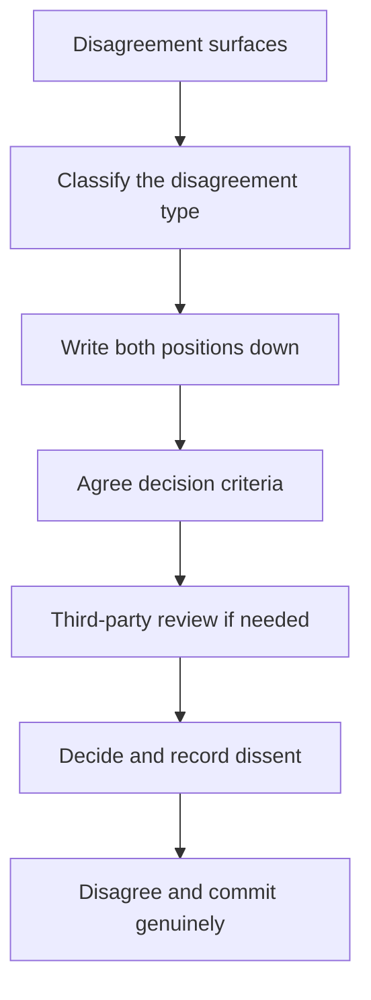

# Managing Disagreement

> **Core skill:** The staff engineer treats disagreement as raw material for better decisions — classifying its source, structuring the argument, escalating only with options, and committing genuinely once the decision is made.

## Why This Matters

Disagreement is not a failure of alignment; it is what alignment is made of. Every consequential technical decision contains real disagreements about merit, priorities, and risk, and the quality of the decision depends on whether those disagreements were worked through honestly or papered over. An organization that suppresses disagreement gets compliance — decisions that are never challenged and fail quietly.

The staff engineer is the person who can afford to make disagreement safe: they have the standing to structure it, the evidence base to resolve it, and the obligation to model how strong people disagree without breaking the work. The craft is in the sequence: understand what kind of disagreement it is, make it structured and written, decide against agreed criteria, and commit fully afterward.

## The Disagreement Taxonomy

Different disagreements need different treatment. The first move is classification.

| Type | What It Actually Is | How to Work It |
|------|---------------------|----------------|
| Technical merit | A genuine dispute about what is true or what works | Evidence, experiments, review by respected peers |
| Priorities | Agreement on facts, disagreement on what matters more | Criteria, capacity math, the strategy's non-goals |
| Risk appetite | Agreement on the plan, disagreement on acceptable risk | Explicit risk framing; scenarios with probabilities |
| Personal history | The dispute is a repeat of an old conflict | Separate the people from the position; name the pattern |

The personal-history category is the dangerous one. When the same two people disagree about everything, the disagreement is not about the current question, and no amount of technical evidence will resolve it until the pattern is named.

## The Structured Disagreement

An unstructured disagreement is a series of escalating assertions. A structured disagreement is a process with three steps.

| Step | What Happens | Output |
|------|--------------|--------|
| Written positions | Each side writes its position: claim, evidence, and what would change their mind | Two documents, not two speeches |
| Criteria agreement | Both sides agree on what the decision should be judged by | A short criteria list, agreed before any verdict |
| Third-party review | A respected neutral reviews the positions against the criteria | A recommendation both sides can live with |

The power of written positions is that they are stable: a written claim cannot be re-litigated by memory, and "what would change your mind" forces both sides to reveal their actual evidence threshold. The criteria step prevents the classic deadlock where both sides argue different questions — one about correctness, one about cost.

## Escalation as Last Resort

Escalation is not the first move when a disagreement is hard; it is the move when the structured process has failed or the disagreement sits above your pay grade. The form of escalation determines whether you gain credibility or burn it.

| Complaint escalation | Options escalation |
|----------------------|--------------------|
| "We disagree and they won't listen" | "We disagree. Here are the two positions in writing, the criteria we both accepted, and the three resolutions with consequences" |
| Asks for a verdict on your side | Asks for a decision between real options |
| Surprises the other party | The other party knows you are escalating and why |

Escalation with options is a decision request; escalation with complaints is a grievance. One gets resolved; the other gets managed.

## Disagree and Commit, Done Right

Disagree and commit is the mechanism that lets decisions proceed with genuine dissent on the record. It is frequently done badly — as "shut up and do it" — and the difference is visible in what happens after the decision.

| Bad version | Good version |
|-------------|--------------|
| Dissent is silenced; the dissenter quietly sabotages or checks out | Dissent is recorded in the decision record, with the dissenter's alternative |
| Commitment is assumed, not asked | The dissenter explicitly commits: "I argued for B; we chose A; I will make A work" |
| The dissenter's concerns are never revisited | The decision record names what would trigger a re-review of the decision |
| The dissenter is blamed if the decision fails | The review revisits both positions with the outcome data |

The staff engineer models the good version: argue hard before the decision, commit visibly after it, and never let a lost argument become a grudge. The organization watches how the most senior technical person loses — and copies it.

## Persistent Objectors

Some disagreements survive the decision. The persistent objector keeps raising the same concern in every forum, and the instinct to crush or ignore them is usually wrong — persistent objectors are sometimes the only honest memory of a decision's risk.

| Approach | When It Works |
|----------|---------------|
| Engage without capitulation | The objection has new evidence or a new angle; the decision record should absorb it |
| Give the objection a home | A named risk register entry or review trigger — the concern is tracked, not repeated |
| Set the boundary | The objection is being re-litigated without new information; name that, and move on |
| Re-review with data | The outcome data is in; the decision record says whether the objector was right |

The discipline is engagement without capitulation: the objector is heard, the concern is recorded and tracked, but the decision is not re-opened by repetition. If the objector turns out to be right, the review learns it from data — and the objector's credibility grows, which is the system working.

## Losing Gracefully: Your Own Disagreements

The long game of credibility is how you lose. The engineer who loses with grace — records the dissent, commits fully, and later revisits the outcome honestly — accumulates the most valuable asset in the organization: the reputation that their agreement means something. The engineer who loses badly — sulking, re-litigating, quietly withholding effort — teaches everyone that agreeing with them is the only safe option, which is the death of honest disagreement.

The graceful loss has three parts: a visible commitment after the decision, no public undermining during execution, and an honest review when the outcome data arrives — including the willingness to say the other side was right.



## Practical Applications

### Disagreement Brief Template

```markdown
# Disagreement Brief: [Question]

## Position A: [Person]
- Claim: [what we believe]
- Evidence: [evidence]
- What would change our mind: [condition]

## Position B: [Person]
- Claim: [what we believe]
- Evidence: [evidence]
- What would change our mind: [condition]

## Agreed Criteria
- [ ] [criterion 1, e.g. cost over two years]
- [ ] [criterion 2, e.g. risk of failure]
- [ ] [criterion 3, e.g. fit with strategy]

## Review
- Third-party reviewer: [name, if needed]
- Decision: [choice]
- Dissent recorded: [position, and what would trigger re-review]
- Commitment: [each side's stated commitment to the decision]
```

### Disagreement Handling Checklist

- [ ] The disagreement was classified before it was argued
- [ ] Positions are written, with evidence and mind-change conditions
- [ ] Criteria were agreed before the verdict
- [ ] Escalation, if any, carried options with consequences
- [ ] Dissent is in the decision record, not erased
- [ ] Each side stated its commitment to the decision
- [ ] The outcome will be revisited against data, including who was right

## Common Pitfalls

| Pitfall | Why It Is a Problem | Better Approach |
|---------|---------------------|-----------------|
| **Arguing different questions** | Both sides are right about different things; the deadlock is fake | Agree criteria before arguing the verdict |
| **Escalating as a complaint** | Burns credibility; the decision gets managed, not made | Escalate options with consequences |
| **Fake disagree-and-commit** | Silenced dissent resurfaces as sabotage | Record dissent; ask for explicit commitment |
| **Grudge accumulation** | Lost arguments become lost relationships | Separate the position from the person; commit visibly |
| **Crushing the persistent objector** | Sometimes the only honest memory of the risk is silenced | Record the objection; track it; let data arbitrate |
| **Winning at all costs** | A won argument can cost the relationship and the next decision | Argue the merits; the outcome data is the real verdict |

## Success Indicators

- Disagreements surface early and get structured, not buried
- Both sides can state the other's position accurately
- Decisions record dissent, and re-reviews revisit it with data
- People who lost arguments are seen committing fully to the decision
- Objectors who were right gain credibility, which keeps objections coming

## Related Topics

- [[02_Pre_Alignment_and_Coalitions]]: preventing avoidable battles
- [[01_Writing_Proposals_That_Get_Adopted]]: written positions and criteria
- [[06_Building_Consensus_Architecture]]: decision processes that record dissent
- [[07_Influence_Ethics_for_Staff]]: keeping disagreement fair
- [[05_Systems_Thinking_and_Organizational_Design/00_overview|Systems Thinking and Organizational Design]]: the org dynamics behind feuds

## Summary

Managing disagreement is the craft of turning conflict into better decisions: classify its source, move it to written positions with agreed criteria, escalate only with options, and commit genuinely after the decision. Dissent is recorded, not erased; persistent objectors are engaged without capitulation; and losing gracefully is the long game that keeps honest disagreement alive — because the credibility of your agreement depends on how you lose.
