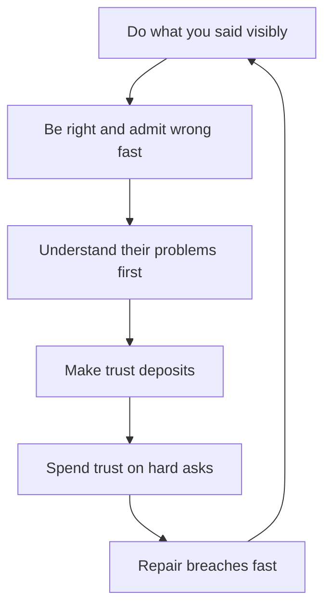

# Building Trust Across Teams

> **Core skill:** The staff engineer earns the benefit of the doubt at distance — through visible reliability, fast admission of error, and genuine empathy for other teams' problems — and manages trust deliberately like a ledger.

## Why This Matters

Trust is the staff engineer's operating currency. Unlike a manager, the staff engineer cannot compel anyone: teams adopt proposals they trust, leaders fund bets they trust, and peers share information with people they trust. And unlike a team lead, the staff engineer works at distance — across teams that do not see the daily work, with leaders who see only artifacts, and through documents that must carry credibility on their own.

Distance changes trust mechanics. Up close, trust is built by presence and shared work; at distance, it is built by visible patterns — the forecast that was right, the review that was useful, the help that arrived unasked. The staff engineer who understands this builds trust deliberately; the one who does not wonders why proposals that are technically right keep failing.

## Trust Mechanics at Distance

Three behaviors carry trust across distance. Each is a pattern that can be observed without working beside you.

| Mechanism | What It Looks Like | How to Build It |
|-----------|--------------------|-----------------|
| Reliability | Doing what you said, visibly, on the date you said | Publish commitments; meet them; announce the miss before the date |
| Competence | Being right, and admitting wrong fast | Bring evidence; when wrong, say so first and fully |
| Empathy | Their problems before your proposals | Learn each team's constraints before asking for their support |

The order matters. Reliability is the foundation — a person who cannot be counted on has no credibility to spend on competence or empathy. Empathy is what converts the other two from "useful" into "trusted": teams forgive a wrong forecast from someone who demonstrably understands their world.

## The Trust Ledger

The ledger is a mental model, made deliberate: every interaction is a deposit or a withdrawal, and the balance is what people act on when you make a hard ask.

| Deposits | Withdrawals |
|----------|-------------|
| Helped unasked: fixed their deploy issue, reviewed their doc, unblocked their dependency | Surprised them: a decision or change they discovered after the fact |
| Credited publicly: named their work and their contribution in front of leaders | Oversold: a forecast or promise that was softer than delivered |
| Delivered early: the migration step, the analysis, the answer ahead of the date | Wasted their time: a meeting or review that produced nothing |
| Admitted error: owned the mistake before being caught | Took credit: their idea, presented as yours |
| Absorbed cost: took the unglamorous work so they did not have to | Left them exposed: their plan changed because of you, without warning |

The ledger discipline has three rules. First, count withdrawals honestly — they are easy to miss and expensive. Second, do not assume the balance: at distance, deposits only count when they are visible, so visibility is part of the deposit. Third, do not spend the balance casually: a trust balance exists to fund hard asks, and hard asks are rare.

## Repairing Trust Breaches

Breaches happen; the repair determines the cost. The repair sequence is short, and the order is fixed.

| Step | What It Looks Like |
|------|--------------------|
| Acknowledge fast | "The forecast was wrong, and here is what actually happened" — before being asked |
| No excuses | Context is fine after the admission; excuses before it read as deflection |
| Fix and prevent | What is being done now, and what changes so it does not recur |
| Rebuild visibly | New commitments, met on the new dates, so the pattern re-establishes |

The unforgivable version is the breach that is discovered, not confessed. Discovery converts a reliability failure into a character question; confession keeps it a performance question, which is fixable.

## Trust with Leadership

Leadership trust has its own ledger with different entries. Leaders do not watch you work; they watch your forecasts, your risk calls, and your surprises.

| What Builds It | What Destroys It |
|----------------|------------------|
| Forecasts that held; estimates with stated uncertainty | Forecasts that were hopes; surprises at the deadline |
| Bad news delivered early, with a plan | Bad news delivered late, with an explanation |
| Risk called before it materialized | Risk discovered in the incident review |
| Options with consequences | Problems without options |

The no-surprises rule is the leadership trust contract: nothing a leader cares about should ever reach them as a surprise. The staff engineer who delivers the bad news first, with options, is trusted with harder and harder problems; the one who delivers it last is trusted with less and less.

## Trust Transfer

Trust is contagious in both directions. When a respected leader or senior engineer vouches for you, their balance extends to you — and when you vouch for someone, yours extends to them. This is how a new staff engineer starts: borrowed credibility.

| Direction | How It Works | The Obligation |
|-----------|--------------|----------------|
| Borrowed | A leader introduces you; their endorsement opens the first doors | Deliver on the endorsement fast; the loan converts to your own balance |
| Extended | You vouch for a team's work or a person's judgment | Only vouch for what you verified; a bad endorsement taxes both balances |
| Guarded | Borrowed credibility is spent down by early missteps | Sequence the first months: low-risk wins first, hard asks later |

The ethics of trust transfer are strict: borrowing is fine, trading is fine, but lending someone else's credibility without their knowledge is theft. Vouching is a real commitment with a real price.



## Practical Applications

### Trust Ledger Template

```markdown
# Trust Ledger: [Quarter]

## Deposits Made
| Date | Team | Deposit | Visibility |
|------|------|---------|------------|
| [date] | [team] | [what I did] | [who saw it] |

## Withdrawals Spent
| Date | Team | Withdrawal | Balance Before | Balance After |
|------|------|------------|----------------|---------------|
| [date] | [team] | [hard ask made] | [level] | [level] |

## Repairs Needed
| Date | Breach | Acknowledged? | Fix | Prevention |
|------|--------|---------------|-----|------------|
| [date] | [what happened] | [date confessed] | [fix] | [change] |

## Borrowed and Extended
- Credibility borrowed from: [name] — endorsement to honor by [date]
- Credibility extended to: [name] — verified on [date]
```

### Trust Building Checklist

- [ ] Commitments are published, met, and misses announced before the date
- [ ] Errors are admitted first and fully, with the fix
- [ ] Each major team's constraints are known before asking anything of them
- [ ] One unasked help given this week, visibly
- [ ] No surprise delivered to a leader this quarter
- [ ] Every hard ask was priced against the ledger balance
- [ ] Every endorsement given was verified first

## Common Pitfalls

| Pitfall | Why It Is a Problem | Better Approach |
|---------|---------------------|-----------------|
| **Deposits made invisibly** | At distance, unseen help does not build trust | Make deposits visible: credit, announcements, named contributions |
| **Surprise as a habit** | Leaders learn to expect the worst from you | The no-surprises contract: early bad news with options |
| **Overselling** | The forecast beats reality; the next forecast is discounted | State uncertainty; under-promise the delivery |
| **Breach discovered, not confessed** | A performance failure becomes a character question | Acknowledge before being asked |
| **Spending trust on trivia** | The balance is gone when the real ask arrives | Reserve hard asks for what matters; build between them |
| **Vouching unverified** | A bad endorsement taxes your balance and theirs | Verify before you extend; decline to vouch when unsure |

## Success Indicators

- Teams you have never worked with take your review seriously
- Leaders cite your forecasts as the reliable ones
- Hard asks are met with "if you say it is needed, it is" rather than scrutiny
- Breaches are confessed early and repaired once
- New people inherit your endorsement and it holds

## Related Topics

- [[03_Managing_Disagreement]]: trust under strain
- [[02_Pre_Alignment_and_Coalitions]]: trust as the pre-alignment currency
- [[07_Influence_Ethics_for_Staff]]: the ethical boundary of trust-building
- [[career-path/02_Senior_Software_Engineer/06_Communication_and_Influence/00_overview|Communication and Influence (Senior)]]: the foundation this scales
- [[02_Cross_Team_Technical_Leadership/00_overview|Cross-Team Technical Leadership]]: trust across team boundaries

## Summary

Trust across teams is built deliberately, not hoped for: visible reliability, fast admission of error, and genuine empathy for other teams' problems, managed like a ledger with honest withdrawals and fast repairs. Leadership trust runs on the no-surprises contract, and borrowed credibility from respected people is how a new staff engineer starts — provided the loan is repaid with delivery and every endorsement is verified first.
