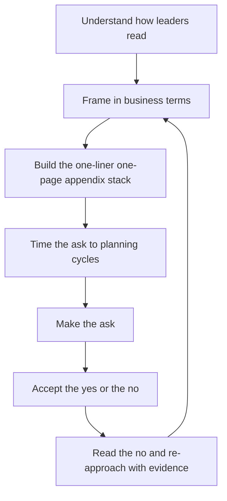

# Influencing Leadership

> **Core skill:** The staff engineer frames technical reality in the terms leaders decide by — outcomes, risk, options, and asks — and builds the relationship before it is needed, so technical truth reaches decisions intact.

## Why This Matters

Leadership does not reject technical arguments because it disagrees with them; it rejects them because they arrive in the wrong currency. A leader deciding between initiatives is weighing outcomes, risk, and cost — and a proposal that arrives as "we need to migrate to the event-driven architecture" is a proposal that never gets priced, because its value was never translated. The staff engineer who cannot translate loses every argument that matters, regardless of technical merit.

Influencing leadership is not flattery or salesmanship; it is translation plus timing. The engineer who can state what a decision costs, what it protects, and what the alternatives are becomes the leader's trusted technical advisor — the person called before the decision, not after the surprise.

## How Leaders Read

Leaders process proposals through a fixed set of filters. Knowing the filters is knowing how to write for them.

| Filter | The Question Behind It | The Translation |
|--------|------------------------|-----------------|
| Outcomes | What changes for the business? | Revenue, cost, risk, speed, customers — named and quantified |
| Risk | What could go wrong, and what does it cost? | Failure modes with probabilities and mitigations |
| Options | What else could we do? | Real alternatives with their own trade-offs |
| Asks | What exactly do you want from me? | A decision, a resource, or a date — stated in one sentence |

A proposal that passes all four filters in order — outcome first, risk second, options third, ask last — is readable by any leader in the organization. A proposal that leads with the technology is readable only by engineers.

## Framing Technical Work in Business Terms

The core translation table, learned by every staff engineer:

| Technical reality | Business framing |
|-------------------|------------------|
| "We need to fix the monolith" | "Feature velocity is declining 20 percent per year; the fix restores it within two quarters" |
| "The platform is underfunded" | "Every feature now costs more than the last; the cost curve inverts with the investment" |
| "We have a security debt backlog" | "Risk register: three open findings with public-exploit potential; the ask closes them by quarter end" |
| "The migration is blocked" | "The launch date depends on the migration date; here is what unblocking it costs" |

| Business concept | Technical translation |
|-------------------|----------------------|
| Revenue protection | The SLO work that prevents the outage that would cost customers |
| Cost curves | The compounding maintenance cost of the legacy system |
| Optionality | The platform bet that makes three future product moves possible |
| Risk registers | The ranked list of technical exposures with owners and dates |

The four concepts in the second table — revenue protection, cost curves, optionality, risk registers — cover most of what leaders are actually buying when they fund technical work. If a proposal cannot be expressed through one of them, the proposal is probably not ready.

## The Executive Communication Stack

Executive communication is layered, because leaders read at different depths depending on the stakes. The stack serves every audience at once.

| Layer | Content | Length | Use |
|-------|---------|--------|-----|
| One-liner | The decision, the outcome, the ask | One sentence | The hallway, the email subject, the meeting opener |
| One-pager | The problem, the recommendation, the options, the risk | One page | The decision document |
| Appendix | Data, methodology, prior art, full analysis | As long as needed | The verification layer for skeptics |

The discipline is that each layer stands alone: the one-liner must be true if nothing else is read, and the appendix must answer any challenge the one-pager raises. The stack is what makes "send me the details" a safe answer — the details exist, organized, before they are asked for.

## Timing Asks to Planning Cycles

A technically perfect ask at the wrong time is a no. Leadership capacity for decisions runs on cycles: planning windows, budget cycles, and review gates. The staff engineer maintains a calendar of these windows and sequences asks accordingly.

| Window | What Is Decidable | Staff Discipline |
|--------|-------------------|------------------|
| Planning cycle | Roadmap and capacity allocation | Proposals land here, fully formed |
| Budget cycle | Investment and headcount | Bets and platform asks land here, priced |
| Between cycles | Small, reversible decisions | Never big asks; use the time to build evidence |
| Crisis | Emergency interventions only | A crisis is a window for protection, not for new bets |

The timing discipline has a second half: the ask is prepared before the window opens, not during it. The proposal that lands on day one of planning, already pre-aligned and priced, is the one that gets funded; the one that lands at the end of the cycle gets deferred.

## Building the Relationship Before You Need It

The trusted-advisor position cannot be built during the ask. It is built in the quiet quarters: the risk called early, the forecast that held, the bad news delivered with options, the leader's question answered completely and briefly. The deposit schedule is steady and small — one visible act of technical honesty per month is enough — and the withdrawals are rare and large.

The relationship is built with the leader's staff too: the chief of staff, the finance partner, the product counterpart who briefs the leader. These are the people who decide what the leader reads, and being useful to them is being present in the leader's information flow.

## When Leadership Says No

A no is not the end of the process; it is data. The discipline is to read the no before re-approaching.

| Reading | What It Means | The Move |
|---------|---------------|----------|
| The outcome was not compelling | The translation failed | Re-frame in business terms; strengthen the outcome case |
| The risk was too high | The mitigation failed | Add de-risking: pilot, phased rollout, kill criteria |
| The timing was wrong | The window was missed | Re-sequence to the next cycle; keep building evidence |
| The trust was insufficient | The relationship failed | Deliver on smaller commitments; re-approach later |
| The answer is actually no | Priorities genuinely exclude it | Accept it, record the reasoning, revisit only with new evidence |

The re-approach is only legitimate with new evidence or a new window. Re-approaching with the same argument is lobbying; re-approaching with the pilot results, the competitor's move, or the incident that materialized is advisor behavior.

## The Trusted Technical Advisor Position

The end state of this craft is a position, not a technique: the leader who calls you before the decision because your framing is reliable, your risk calls are honest, and your asks are rare and priced. The position has three properties.

| Property | What It Looks Like |
|----------|--------------------|
| Called early | The leader asks "what breaks first?" before the roadmap is set |
| Heard in full | Technical truth reaches the decision without dilution |
| Consulted repeatedly | The relationship survives noes; the advice is still sought |

The position is fragile in one way: it depends on honesty outranking advocacy. The advisor who starts bending truth to win the current argument loses the position permanently — leaders forgive a lost proposal, but not a manipulated one.



## Practical Applications

### Executive One-Pager Template

```markdown
# Decision Brief: [Title]

## One-Liner
[The decision, the outcome, the ask — one sentence]

## The Problem
- Business impact: [outcome at risk, quantified]
- Evidence: [one number or one incident that proves it]

## Recommendation
- What: [the choice]
- Outcome: [what changes for the business]
- Cost: [resource, time]
- Risk: [top failure mode and mitigation]

## Options
| Option | Outcome | Cost | Risk |
|--------|---------|------|------|
| [A] | [outcome] | [cost] | [risk] |

## The Ask
- Decision needed: [yes / no / resource / date]
- By: [date]

## Appendix
- Full analysis, data, prior art
```

### Leadership Influence Checklist

- [ ] The proposal passes the four filters: outcome, risk, options, ask
- [ ] Value is expressed in business terms: revenue, cost, optionality, risk
- [ ] The one-liner stands alone and is true
- [ ] The ask is timed to the right planning window
- [ ] Deposits were made before this ask: risk calls, held forecasts, early bad news
- [ ] A no was read for its cause, not re-argued
- [ ] Re-approaches carry new evidence, never the same argument

## Common Pitfalls

| Pitfall | Why It Is a Problem | Better Approach |
|---------|---------------------|-----------------|
| **Tech-first framing** | The leader never sees the outcome; the proposal is never priced | Translate first: outcome, risk, cost |
| **The ask without options** | Leaders decide between options; a demand gets deferred | Bring real alternatives with trade-offs |
| **Wrong window** | Perfect proposal, wrong cycle, automatic deferral | Keep the planning calendar; land asks in the window |
| **Relationship by fire drill** | First contact with leadership is the crisis | Deposit steadily in quiet quarters |
| **Re-arguing the no** | Same argument, new meeting; credibility drains | New evidence or a new window, or accept the no |
| **Winning the argument, losing the truth** | The framed case overstates; the advisor position is lost | Honesty outranks advocacy, always |

## Success Indicators

- Leaders restate your proposals in their own words, correctly
- The one-pager is forwarded, not summarized, to the next level
- Your risk calls are cited in reviews that happened without you
- A no was followed by a funded re-approach on new evidence
- The leader asks for your view before the roadmap is set

## Related Topics

- [[01_Writing_Proposals_That_Get_Adopted]]: the proposal as the ask vehicle
- [[04_Building_Trust_Across_Teams]]: the trust leadership buys into
- [[03_Technical_Strategy/00_overview|Technical Strategy]]: the strategy leaders approve
- [[career-path/11_Engineering_Manager/05_Organizational_Awareness_and_Influence/00_overview|Organizational Awareness and Influence (EM)]]: the manager's parallel craft
- [[career-path/02_Senior_Software_Engineer/06_Communication_and_Influence/02_Stakeholder_Communication|Stakeholder Communication (Senior)]]: the foundation this scales

## Summary

Influencing leadership is translation plus timing: frame technical work through outcomes, risk, options, and asks; express value in business terms like cost curves and optionality; build the one-liner, one-pager, appendix stack; and land asks in the right planning windows. The relationship is built in quiet quarters and spent on rare, priced asks, and a no is read for its cause and re-approached only with new evidence. The end state is the trusted technical advisor — called early, heard in full, and honest enough to stay.
