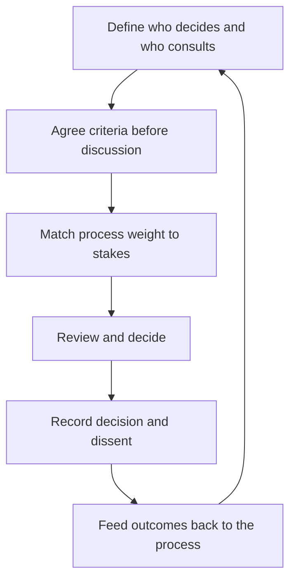

# Building Consensus Architecture

> **Core skill:** The staff engineer designs decision processes that produce durable agreement — clear decision rights, criteria agreed before discussion, recorded dissent, and process weight matched to the stakes.

## Why This Matters

Every organization makes technical decisions somehow. The question is whether the process produces decisions that stick. In a process-less organization, decisions are made by whoever is loudest, most senior, or most persistent, and they are relitigated endlessly because nobody agreed to the terms. In an over-processed organization, every decision — including the trivial — drags through the same machinery and the machinery collapses under its own weight.

Consensus architecture is the design of the middle path: the right person deciding, with the right people consulted, against criteria agreed in advance, with dissent recorded and outcomes fed back. The staff engineer is the natural architect — the person who sees decisions across teams, feels the pain of bad processes, and has the standing to change how the organization decides.

## Decision Process Design

Every decision process starts with two questions: who decides, and by what criteria?

| Role | Meaning | Who Fills It |
|------|---------|--------------|
| Decides | The person or body whose call it is | The accountable owner; for org-wide standards, a review board |
| Consulted | People whose input shapes the decision | Affected teams, domain experts, downstream consumers |
| Informed | People who find out after | Everyone else who must live with it |

The decision rights table is written down, because the most common process failure is ambiguity about who actually decides. When everyone believes they have veto power, nothing decides; when nobody knows who decides, everything escalates.

The second question — criteria — must be answered before the discussion, not after. Criteria agreed in advance ("we will choose by cost over two years, then risk, then team fit") make the discussion about evidence. Criteria invented during the discussion make the discussion about rhetoric.

## The Architecture Review Board

For org-wide technical decisions, a standing review board is the standard mechanism. Its design determines whether it is a bottleneck or a service.

| Design Element | Options | Guidance |
|----------------|---------|----------|
| Composition | 5-8 senior engineers with rotating membership | Breadth beats seniority; rotate to spread load |
| Cadence | Weekly or biweekly, fixed slot | Fixed beats ad hoc; ad hoc boards starve |
| Decision rights | Approve, reject, or return for revision | No advisory boards: advice without rights is theater |
| Scope | The kinds of decisions that must pass through | Defined narrowly; everything else stays with teams |
| Timebox | Hard limit per item | A board that debates forever is a bottleneck |

The board's value is consistency: the same criteria applied to every major decision, with the record showing why. Its risk is capture — a board that rubber-stamps its members' pet projects, or a board whose membership never changes and whose taste ossifies. The defenses are written criteria, recorded dissent, and rotating membership.

## RFC Processes

The RFC (request for comments) is the workhorse of technical decision-making. Its design is a template, a timeline, and a resolution rule.

| Element | Design Choice |
|---------|---------------|
| Template | Problem, options, recommendation, rollout, open questions — the proposal anatomy |
| Timeline | A fixed comment window (one to two weeks), stated on the document |
| Resolution | The decider closes the RFC with a decision record; comments do not vote |
| Escalation | Unresolved objections route to the decision rights holder, with options |

The timeline is the design element that separates RFC from eternal discussion. An RFC without a closing date is a discussion forum; an RFC with a date and a decider is a decision process.

## Lightweight Consensus for Small Decisions

Not every decision deserves a board or an RFC. Process weight must match stakes, or the process dies of its own weight.

| Decision Size | Process |
|---------------|---------|
| Trivial, reversible | Decide and inform; no process |
| Small, reversible | Team-level discussion; a short decision record |
| Medium, semi-reversible | Written proposal, consult affected, decider closes |
| Large, irreversible | Full RFC or review board, with criteria and recorded dissent |

The discipline is stating the weight explicitly: "this is a team-level call, here is the record" prevents the small decision from being dragged into the heavyweight process by someone who disagrees.

## Recording Decisions and Dissent

A decision that is not recorded does not exist — it becomes a memory that decays into a rumor. The decision record is short and fixed.

```markdown
# Decision Record: [Title]

- Date: [date]
- Decider: [name]
- Decision: [what was decided]
- Criteria: [the criteria it was judged by]
- Options considered: [the real alternatives]
- Dissent: [who disagreed, with their position]
- Re-review trigger: [what would reopen the decision]
```

The dissent line is the record's most important feature. Recording dissent does not weaken the decision; it strengthens it — it proves the decision survived disagreement, and it gives the dissenters a legitimate place to stand while they commit. A record without dissent is either a unanimous decision or a suppressed one, and the reader cannot tell which.

## Process Anti-Patterns

| Anti-Pattern | Why It Is a Problem | Better Approach |
|--------------|---------------------|-----------------|
| **Consensus theater** | Everyone votes; nobody decides; the meeting never ends | Name the decider; comments inform, they do not decide |
| **Eternal RFC** | The comment window never closes; the proposal rots | Fixed timeline; the decider closes on the date |
| **Decide-by-silence** | No objection means approval; the loud minority and the silent majority both distort | Explicit approvals and a recorded decision |
| **Board as bottleneck** | Every decision queues; teams route around the board | Narrow scope; timebox items; lighter process for small calls |
| **Criteria invented mid-discussion** | The argument is won by rhetoric, not evidence | Agree criteria before the discussion |
| **Decisions without records** | Memory decays; the org relitigates from rumor | Fixed decision record with dissent and re-review trigger |



## Practical Applications

### RFC Template

```markdown
# RFC: [Title]

- Status: [draft / in review / decided]
- Decider: [name]
- Comment window: [start date] to [end date]

## Problem
- Evidence: [numbers, sources]
- Cost of inaction: [priced]

## Options
| Option | Cost | Benefit | Risk | Right When |
|--------|------|---------|------|------------|
| [A] | [cost] | [benefit] | [risk] | [condition] |

## Recommendation
- Choice: [option]
- Confidence: [high / medium / low]
- Reasoning: [three sentences]

## Rollout
| Phase | Scope | Owner | Exit Condition |
|-------|-------|-------|----------------|
| [Pilot] | [scope] | [owner] | [condition] |

## Open Questions
- [question] — consequence for the recommendation: [consequence]

## Resolution
- Decision: [to be filled by the decider]
- Dissent: [to be filled with positions]
- Re-review trigger: [to be filled]
```

### Consensus Process Checklist

- [ ] The decider is named for every decision class
- [ ] Criteria are written before the discussion
- [ ] Process weight matches stakes; small decisions stay light
- [ ] The board has fixed cadence, narrow scope, and real decision rights
- [ ] Every RFC has a comment window and a closing date
- [ ] Decision records include dissent and re-review triggers
- [ ] Decisions are recorded, not remembered

## Common Pitfalls

| Pitfall | Why It Is a Problem | Better Approach |
|---------|---------------------|-----------------|
| **Consensus theater** | Meetings until exhaustion; the loudest win | Name the decider; comments inform, they do not decide |
| **Eternal RFC** | Proposals rot in review; decisions happen by drift | Fixed timeline and a decider who closes |
| **Decide-by-silence** | Silence is read as consent; quiet dissent resurfaces later | Record explicit positions and dissent |
| **One-size process** | Trivial decisions queue behind large ones | Weight the process to the stakes |
| **Unrecorded decisions** | The org relitigates from decaying memory | Fixed decision record, filed where the org can find it |
| **Criteria by rhetoric** | Arguments won by charisma instead of evidence | Criteria written before the discussion starts |

## Success Indicators

- Decisions are made by the named decider, on the stated date
- The decision record exists for every consequential call, with dissent
- Teams use the process voluntarily instead of routing around it
- The board's decisions are consistent and its record is cited
- Re-review triggers fire and are honored

## Related Topics

- [[01_Writing_Proposals_That_Get_Adopted]]: the proposals the process runs on
- [[03_Managing_Disagreement]]: the dissent the process records
- [[02_Cross_Team_Technical_Leadership/00_overview|Cross-Team Technical Leadership]]: the standards the process governs
- [[career-path/05_Tech_Lead/01_The_Tech_Lead_Role_and_Operating_Model/05_Navigating_Ambiguity_and_Incomplete_Authority|Navigating Ambiguity (Tech Lead)]]: operating without complete authority
- [[career-path/11_Engineering_Manager/05_Organizational_Awareness_and_Influence/02_Influence_Strategies_for_Managers|Influence Strategies for Managers (EM)]]: the manager's parallel craft

## Summary

Consensus architecture is the design of decisions that stick: named decision rights, criteria agreed before discussion, process weight matched to stakes, and a board and RFC machinery that run on fixed cadence and timelines. Every decision is recorded with its dissent and its re-review trigger, so the organization decides once and learns from the outcome — instead of relitigating from memory.
