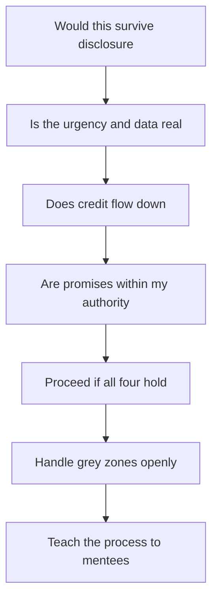

# Influence Ethics for Staff

> **Core skill:** The staff engineer keeps influence transparent, honest, and auditable — persuasion that survives disclosure, credit that flows down, and commitments that are never made on someone else's behalf.

## Why This Matters

The staff engineer's influence surface is large: proposals that redirect whole teams, recommendations that leadership funds, coalitions that shape careers. Most of that influence is exercised without anyone checking it — no manager reviews every framing choice, and no committee audits every omission. The only guard is the staff engineer's own standards, applied consistently.

Ethical influence is not a constraint on effectiveness; it is the precondition for it. Influence that survives disclosure compounds — every person who discovers how you operate and remains comfortable is a person who will trust you with more. Influence that depends on opacity collapses the moment it is inspected, and staff-level work is always inspected eventually. The transparency test is not a moral ornament; it is the risk management of the career.

## The Staff Influence Surface

Before setting standards, name the surface they apply to. The staff engineer shapes decisions others live with, in ways that are easy to undercount.

| Influence Act | Who Lives With It |
|---------------|-------------------|
| Framing a problem in a proposal | Everyone who reads it; the framing decides what is considered |
| Choosing which options to include | The teams whose option was omitted |
| Timing an ask to a planning cycle | The initiatives that lose the capacity race |
| Pre-aligning with some stakeholders first | The stakeholders consulted last |
| Recommending a direction to leadership | Every team that must execute it |
| Crediting or omitting contributors | The people whose work was or was not named |

Each of these is legitimate — the staff role is made of them. The ethical question is never whether to influence; it is whether each act would survive being shown, in full, to everyone it affects.

## The Four Ethical Lines

Four lines define ethical influence at staff level. Each has a test.

| Line | The Test | Violation Looks Like |
|------|----------|----------------------|
| Transparency | The act survives full disclosure | Selective consultation, hidden agendas, ambush timing |
| Honesty | No manufactured urgency or data | "This is urgent" when it is not; cherry-picked or invented metrics |
| Credit | Credit flows down, never up | Others' work presented as yours; contributors omitted |
| Commitment | No promises on others' behalf | "The team will deliver by March" without the team's agreement |

The four lines interact: a transparent process usually prevents dishonesty, and honest credit usually prevents commitment violations. But each must be checked separately, because each fails in its own way.

## Influence vs Manipulation

The distinction is not always crisp, and pretending it is crisp is itself a risk. The practical table:

| Dimension | Influence | Manipulation |
|-----------|-----------|--------------|
| Information | Complete enough to decide; unknowns named | Selected to produce the desired conclusion |
| Alternatives | Real options, including ones that weaken your case | Straw men, omitted options, false dichotomies |
| Audience | Everyone who is affected is consulted | Only the people who agree are consulted |
| Timing | Honest about when and why the ask is now | Timed to exploit absence, mood, or ignorance |
| Disclosure | Would survive the room seeing everything | Depends on the room not seeing something |
| Reversibility | The other party could have decided otherwise with full information | The other party would have decided differently |

The reliable test is the last row: if the other party had everything you know, would they still decide the same way? If yes, the influence is ethical even when it is strong. If no, it is manipulation regardless of intent.

## Grey Zones and Their Honest Handling

Between the clear cases sits a band of grey. The staff engineer's discipline is not to pretend the grey is white — it is to handle each grey zone openly.

| Grey Zone | Why It Is Grey | Honest Handling |
|-----------|----------------|-----------------|
| Selective emphasis | Every argument emphasizes its strong points | Emphasize, but do not omit; name the weakness before others do |
| Timing | When an ask lands shapes its outcome | Be honest about the timing and its reason; avoid ambush windows |
| Coalition boundaries | You cannot consult everyone | Say who was consulted and invite the omitted to respond |
| Framing choice | Every frame is a choice | Choose the frame that is most truthful, not most persuasive |
| Confidentiality | Some constraints cannot be shared | Say that a constraint exists and is confidential, rather than hiding it |

The rule for all grey zones: make the choice visible. A grey choice that is disclosed becomes a judgment others can weigh; the same choice hidden becomes a manipulation discovered.

## Teaching Ethical Influence

The staff engineer's ethical obligations extend to the people who learn influence by watching. Mentees copy the visible craft — the pre-alignment, the framing, the coalition — and the invisible standards along with it. Teaching ethical influence means making the process visible on purpose:

- Show the consultation list and explain why each person was included.
- Show the options that were cut and why, including the ones that hurt your case.
- Show the changelog of who contributed what.
- Name the grey zones you encountered and how you handled them.
- Debrief the lost arguments and the noes as openly as the wins.

A mentee who learns only the techniques has learned the manipulation kit; a mentee who learns the techniques with their ethical scaffolding has learned the craft.

## Refusing Unethical Asks

The staff engineer will eventually be asked to bend the standards: a leader who wants a rosier forecast, a peer who wants a proposal that conceals a risk, a coalition that wants a stakeholder excluded. The refusal is a professional act, not a personal one, and it has a shape.

| Wrong refusal | Right refusal |
|---------------|---------------|
| Silent compliance; rationalized later | "I can't present that as the forecast; here is what the data actually says" |
| Moral lecture | "I'm not able to do that; here is what I can do instead" |
| Public embarrassment of the asker | Private, prompt, and specific; the asker keeps face |
| Refusal without alternatives | The honest version of the outcome they wanted, plus the path to it |

The refusal is also a signal. Every clean refusal raises the price of unethical asks in the organization; every silent compliance lowers it. The staff engineer who refuses well is not being difficult — they are maintaining the currency that everyone's influence runs on.

## The Transparency Audit

The practical discipline is a periodic self-audit, run like a review.

```markdown
# Influence Self-Audit: [Quarter]

## Disclosure Test
- [ ] Would every consulted party be comfortable seeing the full consultation list?
- [ ] Does every proposal name its weaknesses and its omitted options?
- [ ] Is any urgency in my asks manufactured?

## Honesty Test
- [ ] Every number in my materials is verifiable, with a source
- [ ] No evidence was selected to hide a contrary conclusion
- [ ] Uncertainties are stated with their magnitude

## Credit Test
- [ ] Every contributor in the last quarter's work is named somewhere visible
- [ ] No one else's idea was presented as mine

## Commitment Test
- [ ] No promise was made on behalf of a team without its agreement
- [ ] Every commitment I made is on a date and was met or renegotiated

## Grey Zone Log
| Grey Zone | How I Handled It | Disclosed? |
|-----------|------------------|------------|
| [zone] | [handling] | [yes / no] |
```



## Practical Applications

### Ethical Influence Checklist

- [ ] Every proposal would survive the room seeing everything behind it
- [ ] No manufactured urgency; every deadline has a real driver
- [ ] Data is verifiable, sourced, and not selected to hide a contrary conclusion
- [ ] Contributors are named visibly; no idea borrowed without credit
- [ ] No commitment made on behalf of a team without its agreement
- [ ] Grey zones are handled openly, with the choice visible
- [ ] The mentees watching learned the standards, not just the techniques
- [ ] Unethical asks were refused cleanly, with alternatives

## Common Pitfalls

| Pitfall | Why It Is a Problem | Better Approach |
|---------|---------------------|-----------------|
| **The win that costs the truth** | The framing that wins the argument bends the record | Honesty outranks advocacy; the record outlives the win |
| **Invisible credit** | Work taken without naming; the contributor learns to withhold | Name contributors in every visible artifact |
| **Manufactured urgency** | The fake deadline teaches everyone to discount deadlines | Real drivers only; urgency is a fact, not a device |
| **Promising for others** | The team is committed without being asked; delivery fails | Commit only what your authority covers; ask first |
| **Grey zones hidden** | The hidden choice becomes a discovered manipulation | Disclose the grey choice and its reasoning |
| **Silent compliance** | The unethical ask succeeds; the next one is easier to make | Refuse cleanly, privately, with alternatives |

## Success Indicators

- Proposals survive scrutiny without redaction
- Contributors are named and credit disputes are absent
- Deadlines you state are taken at face value
- Teams agree to commitments they actually made
- Mentees run their own audits and bring their grey zones to you

## Related Topics

- [[02_Pre_Alignment_and_Coalitions]]: pre-alignment done ethically
- [[03_Managing_Disagreement]]: disagreement kept fair
- [[04_Building_Trust_Across_Teams]]: trust built transparently
- [[07_Organizational_Learning_and_Mentoring/00_overview|Organizational Learning and Mentoring]]: teaching the craft to mentees
- [[01_The_Staff_Role_and_Scope/00_overview|The Staff Role and Scope]]: the responsibility the role carries

## Summary

Influence ethics for staff is the discipline of influence that survives disclosure: transparency about process and timing, honesty about urgency and data, credit that flows down, and commitments never made on others' behalf. Grey zones are handled openly rather than hidden, the standards are taught to mentees along with the techniques, and unethical asks are refused cleanly with alternatives. The four-line audit is the mechanism, and the reason is practical: influence that survives inspection compounds, and influence that depends on opacity ends the first time someone looks.
