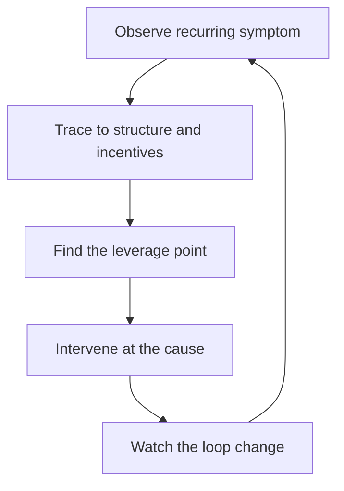

# Systems Thinking and Organizational Design

> **Core capability:** The staff engineer reads the organization as a system — seeing how structure, incentives, and feedback loops produce technical outcomes — and uses that reading to fix causes, not symptoms.

## Why This Matters

Repeated technical problems are usually not technical. The service that's always breaking, the team that always ships late, the standard nobody follows — trace any recurring failure back far enough and you find a structure or incentive that produces it on schedule. Treating symptoms at staff level means fixing the same bug forever.

Systems thinking is the staff engineer's diagnostic lens: Conway's Law coupling your architecture to your org chart, feedback loops with delays that make local optimization feel right, constraints that determine where leverage actually exists. Staff engineers who see the system propose changes that keep working after they walk away.

## Topics in This Capability Area

| Topic | Core Skill | When It Matters |
|-------|------------|-----------------|
| [[01_Systems_Thinking_Fundamentals]] | Stocks, flows, feedback loops, delays | Diagnosing any recurring problem |
| [[02_Conways_Law_in_Practice]] | Reading org structure in the architecture | Service design; team formation |
| [[03_Incentives_and_Behavior]] | Predicting behavior from incentive structures | Repeated "people problems" |
| [[04_Organizational_Design_Options]] | Team topologies and structure choices | Re-orgs; scaling phases |
| [[05_Fixing_Structure_Not_Symptoms]] | Intervening at the causal level | Chronic conflicts; recurring incidents |
| [[06_Models_for_Decision_Making]] | Using mental models without being used by them | Complex ambiguous decisions |
| [[07_Limits_of_Local_Optimization]] | Why local improvements can harm the whole | Performance "improvements" org-wide |

## The Systems Diagnostic Loop

If the same problem returns next quarter, you treated a symptom.

## What Changes from Senior to Staff

| Activity | Senior engineer | Staff engineer |
|----------|-----------------|----------------|
| Recurring problems | Fixes the instance | Fixes the producing structure |
| Org awareness | Knows own team's context | Reads org-system interactions deliberately |
| Re-org input | Consulted on team impact | Proposes structure informed by Conway |
| Optimization | Improves own area | Guards the whole against local optimization |

## Practical Applications

### Systems Thinking Checklist

- [ ] Recurring problems get traced to structure, not reassigned to people
- [ ] Architecture reviews include the org chart as an input
- [ ] Incentive changes are considered before behavioral blame
- [ ] Team topology proposals cite Conway explicitly
- [ ] "Fixes" are watched for one full cycle after landing
- [ ] Local optimization proposals get an org-level impact check

## Common Pitfalls

| Pitfall | Why It Is a Problem | Better Approach |
|---------|---------------------|-----------------|
| **Symptom whack-a-mole** | Same problems return on schedule | Trace to structure; intervene at cause |
| **Conway denial** | Architecture fights the org chart and loses | Design structure and system together |
| **Incentive blindness** | Blaming people for what incentives produce | Ask what the system rewards before who |
| **Model worship** | Frameworks applied where they don't fit | Models as lenses, not answers |

## Success Indicators

- Chronic problems stop recurring after your interventions
- Team topology and architecture proposals cite each other
- Leadership asks for your read before re-orgs
- "Why is this always breaking?" questions get structural answers
- Interventions survive your departure from the area

## Related Capabilities

- [[02_Cross_Team_Technical_Leadership/00_overview|Cross-Team Technical Leadership]]: where structural insight lands
- [[03_Technical_Strategy/00_overview|Technical Strategy]]: systems reading feeds strategy
- [[07_Organizational_Learning_and_Mentoring/00_overview|Organizational Learning and Mentoring]]: making the lens common property
- [[career-path/11_Engineering_Manager/02_Team_Formation_and_Health/00_overview|Team Formation and Health (EM)]]: the manager's view of the same system

## Summary

Systems thinking turns recurring problems from bugs into diagnoses: trace symptoms to structure and incentives, find the leverage point, intervene at the cause, and watch the loop change. Staff engineers with this lens fix things that stay fixed — because the system, not the symptom, changed.
