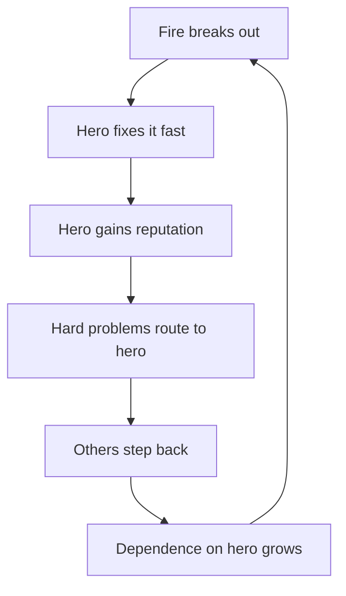

# Systems Thinking Fundamentals

> **Core skill:** Reading engineering organizations as systems of stocks, flows, feedback loops, and delays — so interventions land on leverage points instead of symptoms.

## Why This Matters

Most recurring engineering problems are produced, not caused. The backlog that never shrinks, the velocity that dips after every good hire, the incident that returns every quarter — each is a behavior of a system, and each behavior has a producing structure. Engineers who see only events fix the same thing forever; engineers who see the system fix it once.

A system is a set of elements connected by flows and feedback: work flows into a backlog stock, trust accumulates or drains between teams, technical debt compounds with interest. The staff engineer's edge is reading these connections — knowing which stock is filling, which loop is reinforcing, and which delay is hiding the real effect of a change.

Systems literacy also changes how you argue. Instead of "we should do X," you can say "if we change Y, then Z will shift after about two quarters, because the loop that produces the symptom is this one." That is a falsifiable claim about the org, and it is the difference between opinion and diagnosis.

## Stocks and Flows

A stock is something that accumulates or drains; a flow is the rate at which it changes. Most org problems are stock problems misread as flow problems.

| Stock | Flows In | Flows Out | Engineering Example |
|---|---|---|---|
| **Backlog** | New requests, discovered defects | Completed work, abandoned items | Tickets pile up faster than throughput drains them |
| **Technical debt** | Shortcuts, deferred refactors | Refactor effort, rewrite cycles | Every hotfix adds interest until velocity stalls |
| **Trust** | Reliable delivery, honest estimates | Missed commitments, surprises | Cross-team trust drains in a week and refills over a year |
| **Knowledge** | Pairing, docs, reviews | Attrition, time decay, reorgs | One key departure drains the stock overnight |
| **On-call load** | Incidents, page-happy alerts | Automation, hardening, runbooks | Each new service adds load faster than tooling removes it |

Rule of thumb: when a stock stays constant despite effort, either the inflow is higher than you think or the outflow is lower than you think. Measure flows, not just the stock level — the level is a lagging indicator of the flows you can actually change.

## Feedback Loops

Two loop types explain most organizational behavior:

| Loop Type | Behavior | Engineering Signature |
|---|---|---|
| **Balancing** | Self-correcting toward a target | Reviews catch defects; alerts trigger rollback; re-orgs reset ownership |
| **Reinforcing** | Self-amplifying growth or collapse | Success breeds more success; one skipped review normalizes skipping |

### Three loops to read in your org

**The incident loop.** Every incident produces urgency, urgency produces quick fixes, quick fixes skip hardening, and skipped hardening produces the next incident. The loop stabilizes at high pain unless deliberate prevention investment — itself a delayed flow — breaks it. If incidents recur on schedule, this loop is running.

**The hero culture loop.** The engineer who fixes things fast is trusted with more fires; others step back because the hero will handle it; the hero's expertise concentrates; the next fire needs the hero. The reinforcing loop grows a single point of failure on both the system and the person. It feels like excellence and behaves like a fragility machine.

**The tool sprawl loop.** Each team picks its own tool for a genuine local need; integration cost grows; teams compensate by choosing even more isolated tools; the platform fragments. Autonomy without a coordination cost in the decision feeds the loop — the fix is to put integration cost back into the decision, not to remove autonomy.



## Delays

Delays are why interventions feel wrong: you act, nothing happens, you act harder, and then everything changes at once.

| Delay | What It Does | Practical Consequence |
|---|---|---|
| Hiring to productivity | New hires cost velocity for one to three months before adding | Teams misread growth as decline and stop hiring |
| Debt to velocity | Shortcuts pay now, bill later | Debt feels free until the bill arrives all at once |
| Refactor to payoff | Cleanup shows results only after the work is done | Refactors get cancelled right before they would pay off |
| Trust to delivery | Trust follows consistent delivery with a lag | One missed deadline discounts months of reliability |
| Standard to adoption | Standards spread on team-change cycles | Adoption metrics look like failure for two quarters |

The practical rule: when evaluating any intervention, wait one full delay period before judging it. Most orgs judge early and revert exactly when the effect was about to arrive.

## Leverage Points

Donella Meadows' leverage hierarchy, adapted for engineering organizations, from least to most powerful:

| Leverage Point | What It Means | Engineering Example | Leverage |
|---|---|---|---|
| **Parameters** | Numbers you can tune | Alert thresholds, sprint lengths, review quotas | Low |
| **Buffers** | Size of stocks | Backlog caps, hiring plans, team sizes | Low |
| **Information flows** | Who sees what, when | Shipping dashboards, incident data, spend visibility | Medium |
| **Rules** | Incentives and constraints | Ownership policies, review requirements, budgets | Medium |
| **Goals** | What the system optimizes for | Ship features vs run reliably vs grow revenue | High |
| **Mindset** | The paradigm the system runs on | Speed means more people vs fewer handoffs | Highest |

Note where leverage concentrates: changing a goal or an information flow changes behavior everywhere; changing a parameter changes one number. Staff engineers spend their scarce political capital on the upper rows, not on tuning thresholds.

## Thinking Tools

Two practices make systems thinking concrete instead of mystical:

| Tool | What It Shows | How to Use It |
|---|---|---|
| **Causal loop diagram** | Which variables drive which, and whether loops balance or reinforce | Draw the loop behind a recurring problem; find the arrow you can cut |
| **Behavior-over-time graph** | How a stock actually moved over quarters | Plot backlog, cycle time, or on-call load; look for patterns, not points |
| **Stock-flow sketch** | Where accumulation happens | Count inflows against outflows for a stock that never moves |

Use the tools in a one-hour session with the team that lives inside the loop. The diagram's real value is the disagreement it surfaces — different people hold different halves of the loop, and the drawing merges them.

## Practical Applications

### Systems Reading Checklist

- [ ] Pick one recurring problem and name its producing stock and flows
- [ ] Draw the causal loop diagram with the team that lives inside the loop
- [ ] Identify the delays in the loop and mark how long each one is
- [ ] Locate the problem on the leverage hierarchy before proposing anything
- [ ] State one prediction: what changes, and after what delay
- [ ] Plot a behavior-over-time graph for the stock you are trying to move

### Causal Loop Sketch Template

```markdown
# Causal Loop: [Problem Name]

## Stock
[What accumulates or drains]

## Flows
- In: [What adds to the stock]
- Out: [What removes from the stock]

## Loop Structure
[Variable] -> [Variable] -> [Variable] -> back to start
Loop type: balancing / reinforcing

## Delays
- [Variable] to [Variable]: [estimated delay]

## Leverage Point
[Where we could intervene, and why that spot]

## Prediction
[If we do X, then Y changes after Z weeks]
```

## Common Pitfalls

| Pitfall | Why It Is a Problem | Better Approach |
|---|---|---|
| **Event thinking** | Treating one incident as a one-off hides the loop producing it | Ask what produces this class of event on schedule |
| **Stock blindness** | Managing effort instead of accumulation | Track the stock level and its flows, not just activity |
| **Ignoring delays** | Judging interventions before their effect arrives | Wait one full delay period before evaluating |
| **Diagram theater** | Causal loops drawn once and never used | Use the diagram to make and test a prediction |
| **Low-leverage fixing** | Tuning parameters when the goal is the problem | Ask whether the goal or information flow should change |
| **Blame substitution** | Naming the person when the loop recruits anyone | Design so that no person is required for failure |

## Success Indicators

- You can draw the loop behind any recurring org problem in one sitting
- Predictions from loop analysis come true on the expected timeline
- Teams you work with start sketching loops themselves
- Interventions target leverage points, not parameters, by default
- Delays are named and measured before changes are judged

## Related Topics

- [[02_Conways_Law_in_Practice]]: structure mirrors communication
- [[03_Incentives_and_Behavior]]: the rules that shape loop behavior
- [[05_Fixing_Structure_Not_Symptoms]]: intervening at the causal level
- [[06_Technical_Risk_and_Judgment/00_overview|Technical Risk and Judgment]]: risk recurrence is a loop phenomenon
- [[02_Cross_Team_Technical_Leadership/00_overview|Cross-Team Technical Leadership]]: where structural insight lands

## Summary

Systems thinking replaces event-based fixing with structural diagnosis: name the stock, trace the flows, find the loops and delays, locate the leverage point, and intervene there with a stated prediction. The payoff is interventions that keep working after you leave — because the producing structure, not the symptom, changed.
