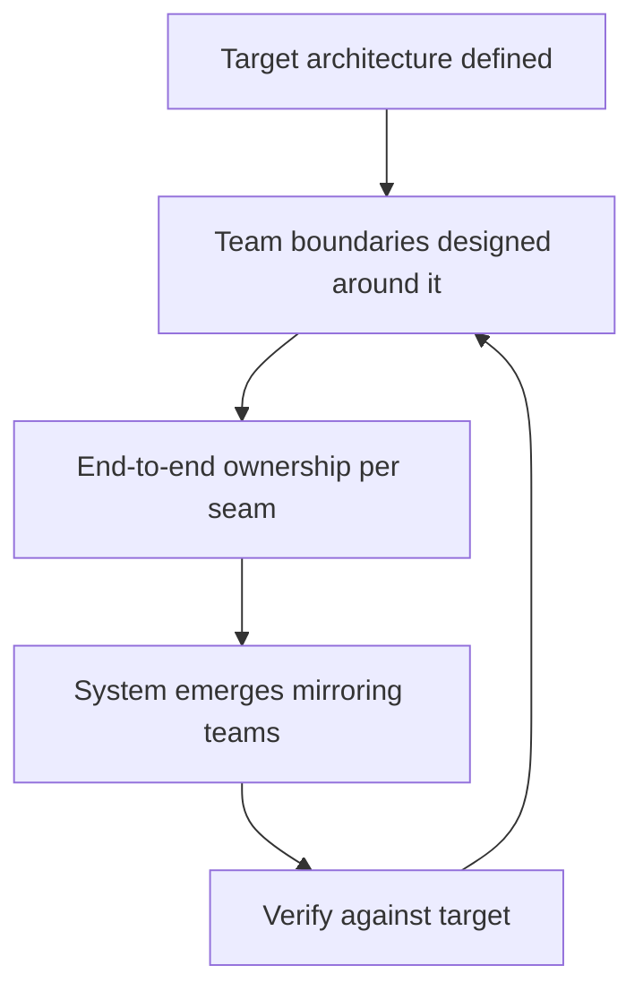

# Conway's Law in Practice

> **Core skill:** Reading your org chart in your architecture, using reverse Conway to design teams that produce the architecture you want, and knowing when to accept the coupling you cannot fight.

## Why This Matters

Organizations design systems that mirror their communication structure. If two teams must coordinate to ship, the software will grow a seam at exactly that boundary — regardless of what the architecture diagram says. Every mismatch between org chart and architecture is paid for daily in handoffs, ownership arguments, and integration glue.

This is one of the few laws in software engineering that is reliably, repeatably true. The staff engineer treats it as an input to design, not a curiosity: when a service boundary is wrong, the cheapest fix is often the org chart, not the code. Reverse Conway — designing the team structure to produce the architecture you want — is one of the highest-leverage moves available at this level.

## The Law and Its Evidence

**Statement:** Any organization that designs a system will produce a design whose structure is a copy of the organization's communication structure.

| Evidence Pattern | What It Looks Like in Practice |
|---|---|
| **Uniform modules** | Every team owns a slice of every service, so every service grows the same internal module list |
| **Org chart in the repo** | Repository boundaries track reporting lines more than domain boundaries |
| **Integration glue teams** | Constant cross-team friction produces a dedicated team whose only job is gluing services together |
| **Duplicated services** | Two teams that could not agree on ownership each build their own version of the same capability |
| **Handoff-shaped APIs** | API contracts match the handoff cadence of teams, not the semantics of the domain |

The evidence test is simple: look at the system's seams — where teams must coordinate to change anything — and compare them to the seams the architecture would need. If they differ, the org wins eventually.

## Reverse Conway

Reverse Conway is the deliberate inversion: define the target architecture first, then shape team boundaries so the communication structure produces it.

| Step | Action | Example |
|---|---|---|
| **1. Define target architecture** | Agree on the system's ideal seams | Checkout and payments as separate domains with an event interface |
| **2. Map communication needs** | List every cross-boundary conversation the target requires | Only the event contract crosses the boundary |
| **3. Align team boundaries** | Give one team end-to-end ownership of each seam | One team owns checkout through its data store |
| **4. Remove contradiction** | Eliminate structures that force the old coupling | Kill the integration team; make the owners integrate |
| **5. Verify** | Watch whether the system drifts toward the target | Review ownership and coupling after two quarters |

Reverse Conway is not a one-time re-org; it is a continuous practice. Every new team, every new service, and every re-org either moves the architecture toward the target or away from it. The staff engineer is the one who notices which.



## Conway Signals in Code Review

Code review is where Conway's Law becomes visible early. Coupled code is usually coupled teams.

| Signal in Review | Structural Meaning | Question to Ask |
|---|---|---|
| Same files change across many teams' PRs | Ownership is shared, so communication is forced | Who really owns this module, and who should? |
| Integration tests always fail together | Two teams ship on an implicit contract | Should the contract be explicit and versioned? |
| One team reviews another's code constantly | The seam is in the wrong place | Should the boundary move into one team's scope? |
| Every change needs a cross-team meeting | Architecture is paying for org mismatch | Is the org chart or the architecture easier to change? |

Treat these signals as architecture data, not process noise. A review that keeps pulling in the same outside team is a boundary error being taxed on every change.

## Team Topologies Quick Map

Team Topologies (Skelton and Pais) gives a vocabulary for the four team types that cover most needs:

| Topology | Purpose | When It Fits |
|---|---|---|
| **Stream-aligned** | Owns a slice of business value end to end | Default choice for most product work |
| **Platform** | Provides self-service capabilities others build on | Recurring shared needs: CI/CD, data, auth |
| **Enabling** | Helps other teams adopt practices, then leaves | Skill adoption across teams for a bounded period |
| **Complicated-subsystem** | Holds rare deep expertise in one domain | Payment rails, ML models, hardware drivers |

The common failure is using enabling teams as permanent headcount or letting platform teams become ticket queues. Topologies are assignments, not identities — a team's topology should change as its job changes.

## When to Accept Conway

Fighting Conway's Law is expensive; sometimes alignment is the right answer.

| Situation | Accept or Fight | Why |
|---|---|---|
| Team boundaries are stable and mandated | Accept | Structure the architecture around the seams you can't move |
| A boundary is wrong but a re-org is not happening | Accept, document | Note the cost; propose again when the org opens |
| You control team formation | Fight (reverse Conway) | Shape boundaries to produce the target architecture |
| One boundary fights you constantly | Fight selectively | One well-chosen structural change beats ten workarounds |

Accepting Conway is not surrender — it is choosing your battles. The documented decision to align architecture to an unmovable org chart, with the cost named, is a legitimate architecture choice. The failure mode is accepting silently and paying forever without anyone deciding it.

## Practical Applications

### Conway Practice Checklist

- [ ] Draw the org chart and the architecture side by side; mark every mismatch
- [ ] List the top five cross-team handoffs and name the architecture seam each one creates
- [ ] For the next service boundary decision, ask what team structure it implies
- [ ] Code review signals for coupled teams feed a quarterly boundary review
- [ ] Every new team formation proposal names its Conway consequence

### Boundary Decision Template

```markdown
# Service Boundary: [Name]

## Communication Structure
- Teams involved: [list]
- Current coordination cost: [handoffs per week, meetings per quarter]

## Target Architecture
- Intended seam: [boundary description]
- Required communication across seam: [contract only, or ongoing]

## Conway Check
- Does the org chart produce this seam, or fight it?
- If it fights: reverse Conway change needed, or accept and document?

## Decision
[Align architecture to org, or change org structure]

## Review Date
[When to re-check]
```

## Common Pitfalls

| Pitfall | Why It Is a Problem | Better Approach |
|---|---|---|
| **Conway denial** | Architecture drawn without the org chart fails on contact | Design seams that match real communication |
| **Re-org theater** | New boxes on the chart, same communication paths | Change who talks to whom, not just who reports to whom |
| **Permanent enabling teams** | Enabling teams that never leave become dependencies | Time-box enabling engagements with exit criteria |
| **Platform ticket queues** | Platform teams become bottlenecks instead of self-service | Measure platform success by adoption, not request volume |
| **Ignoring review signals** | Coupled teams stay coupled because nobody reads the pattern | Review the review data quarterly |
| **Fighting every boundary** | Waging war on the org chart exhausts your capital | Accept the unmovable, fight the fixable, document both |

## Success Indicators

- Architecture seams match team boundaries, and the mismatches are documented decisions
- Reverse Conway changes measurably reduce cross-team handoffs
- New services are owned end to end by a single team by default
- Code review patterns show fewer cross-team couplings quarter over quarter
- Your org chart and architecture can be explained in one diagram

## Related Topics

- [[01_Systems_Thinking_Fundamentals]]: orgs as systems of loops and flows
- [[04_Organizational_Design_Options]]: the structure levers reverse Conway uses
- [[03_Technical_Strategy/00_overview|Technical Strategy]]: target architecture comes from strategy
- [[02_Cross_Team_Technical_Leadership/00_overview|Cross-Team Technical Leadership]]: leading the coordination changes
- [[career-path/06_Software_Architect/00_overview|Software Architect]]: the specialist depth path

## Summary

Conway's Law turns the org chart into an architecture input: the system will mirror communication structure whether you plan it or not, so plan it. Read the coupling signals in code review, apply reverse Conway where you control team formation, accept and document the boundaries you cannot move, and treat every re-org as an architecture decision — because that is exactly what it is.
