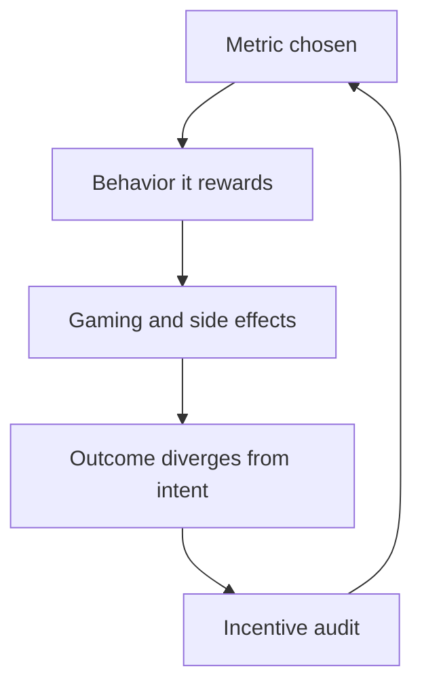

# Incentives and Behavior

> **Core skill:** Predicting organizational behavior from the incentive structure, auditing what the system actually rewards, and intervening on incentives before blaming people.

## Why This Matters

People do what the system pays them to do. Not what the mission says, not what the strategy deck says — what the metrics, reviews, and rewards actually reinforce. When a team hoards knowledge, batches work, or avoids risk, the honest first question is not "who is wrong" but "what does the system reward here."

Repeated "people problems" are almost always incentive problems wearing a human costume. The staff engineer's move is to audit the incentive structure the way you would audit an architecture: find what the system actually rewards, trace the side effects, and change the incentive — not the people. This is uncomfortable work, because it means admitting that metrics you inherited are quietly manufacturing the behavior you complain about.

## The Incentive Audit

An incentive audit asks one question: what does this system actually reward?

| Audit Question | What to Look For | Example Finding |
|---|---|---|
| What metric is visible in reviews? | The metric people believe they are judged on | Story points per sprint, tickets closed |
| What happens to the outlier? | The behavior the org amplifies | The engineer who ships fastest gets the hardest projects |
| What is never measured? | The cost that everyone absorbs silently | Knowledge sharing, cross-team help, debt reduction |
| What would a rational person do? | The behavior the structure predicts | Batch small PRs to inflate throughput numbers |
| Who benefits from the current state? | The constituency that resists change | The team whose velocity looks great while debt accrues |

Run this audit before every "why won't they just..." conversation. The answer is usually in the structure.

## Common Incentive Failures

| Metric | Rewarded Behavior | Second-Order Damage |
|---|---|---|
| **Velocity points** | Bigger estimates, batched work, smaller PRs | Throughput theater; delivery slows in reality |
| **Individual hero metrics** | Hoarding the hardest problems, owning knowledge privately | Single points of failure; juniors never stretch |
| **Uptime in a silo** | Avoiding any change that could touch the service | Risk aversion; the system calcifies |
| **Ticket count** | Splitting and gaming tickets | Noise grows; real problems hide in fake granularity |
| **Deployment count** | Deploying for the number, not the value | Churn; incidents from meaningless releases |

The signature of an incentive failure is metric improvement with outcome deterioration. If the number goes up and the org gets worse, the metric is doing its job — the job is wrong.

## Aligning Incentives with Goals

The fix is to attach metrics to the outcome you actually want, at the level where the outcome is owned:

| Goal | Team-Level Outcome Metric | Learning Mechanism |
|---|---|---|
| Fast delivery | Cycle time for shipped value, not points | Blameless reviews of what delayed the flow |
| Reliability | Error budgets with team ownership | Postmortems that change structure, not blame |
| Knowledge spread | Bus factor per critical area | Rotation, pairing, and documented decisions |
| Quality | Defect escape rate trending down | Root-cause loops feeding the right teams |
| Cross-team health | Handoff latency between teams | Friction reviews, not heroics |

Outcome metrics at team level create the right unit of accountability: the team owns the outcome and the structure that produces it. Individual metrics survive only where the individual genuinely owns the outcome alone — a shrinking set in modern engineering.

## The Incentive Intervention Ladder

Intervene in this order, cheapest first:

| Rung | Intervention | Example | Risk |
|---|---|---|---|
| **1. Change the metric** | Measure something truer | Track cycle time instead of points | Gamers adapt; watch for new games |
| **2. Change the reward** | Pay for the behavior you want | Public credit for unblocking others | Culture lag; old habits persist |
| **3. Change the structure** | Remove the situation that forces the trade-off | Split the team so no one owns two conflicting goals | Expensive, slow, high leverage |

Most interventions fail because they stop at rung one while the structure still punishes the new behavior. If the goal is knowledge sharing but the review still rewards solo heroics, the sharing will be a hobby, not a behavior.



## Second-Order Effects and Goodhart's Law

Goodhart's Law: when a measure becomes a target, it ceases to be a good measure. Every metric, once attached to a reward, starts to bend the behavior it measures.

| Metric | First-Order Effect | Second-Order Effect | Third-Order Effect |
|---|---|---|---|
| Cycle time target | Faster flow | Teams cut corners on review | Incidents rise; cycle time worsens |
| Test coverage target | More tests | Tests written to hit the number | False confidence; coverage theater |
| On-call resolution target | Faster closes | Mitigation without root cause | Same incident recurs weekly |
| Cost reduction target | Leaner spend | Teams defer maintenance | Bigger bill later, with interest |

The discipline is second-order thinking about every metric: what will people do to move this number, and what will that do next? If you cannot name the second order, you have not finished designing the metric.

## Practical Applications

### Incentive Audit Checklist

- [ ] Name the three most visible metrics in your org and what each rewards
- [ ] Find one metric whose improvement correlates with outcome decline
- [ ] Identify who benefits from the current incentive structure
- [ ] Propose the rung-one change: a truer metric with a stated second-order watch
- [ ] Check that the reward structure supports the new metric before shipping it
- [ ] Schedule a re-audit one quarter after any incentive change

### Incentive Change Proposal Template

```markdown
# Incentive Change: [Metric Name]

## Current State
- Metric: [what is measured]
- Reward: [what happens to the people who move it]
- Behavior produced: [observed behavior]

## Second-Order Effects
- What people will do to game it: [list]
- What that will cause next: [list]

## Proposed Change
- New metric or reward: [description]
- Alignment: [which goal this serves]
- Team-level or individual: [level]

## Risks
- New gaming vector: [description]
- Who resists: [constituency]

## Review
- Re-audit date: [one quarter out]
```

## Common Pitfalls

| Pitfall | Why It Is a Problem | Better Approach |
|---|---|---|
| **Blame before audit** | Assuming people are the problem skips the producing structure | Audit the incentive before judging the behavior |
| **Metric without second order** | The gaming arrives exactly as predicted — by you, later | Name the second-order effect before shipping the metric |
| **Individual metrics for team outcomes** | Rewards solo behavior in work that is inherently collective | Measure at the level where the outcome is owned |
| **Changing metrics, not rewards** | The old reward keeps paying for the old behavior | Move up the ladder: metric, reward, structure |
| **Goodhart denial** | Pretending your metric is immune to gaming | Assume it will be gamed; design the response |
| **Incentive theater** | Announcing values the structure contradicts | Change the structure first, announce after |

## Success Indicators

- Recurring behavior problems get traced to incentives before people
- Every metric you own has a named second-order effect and a review date
- Team-level outcome metrics replace individual proxy metrics
- Behavior changes within one or two quarters of incentive changes
- Colleagues run incentive audits before proposing "culture fixes"

## Related Topics

- [[01_Systems_Thinking_Fundamentals]]: incentives as the rules of the system
- [[04_Organizational_Design_Options]]: structure is the deepest incentive
- [[07_Limits_of_Local_Optimization]]: metrics that reward the local and harm the global
- [[04_Influence_and_Alignment/00_overview|Influence and Alignment]]: changing what the org pays attention to
- [[career-path/11_Engineering_Manager/01_People_Development/00_overview|People Development (EM)]]: the manager's view of the same system

## Summary

Incentives are the rules of the organizational game: people do what the system rewards, and the system's failures are usually the metrics' fault, not the people's. Audit what is actually rewarded, watch for second-order effects and Goodhart's Law, and intervene up the ladder — metric, reward, structure — with a named prediction. The org that changes its incentives changes its behavior without ever having a culture conversation.
