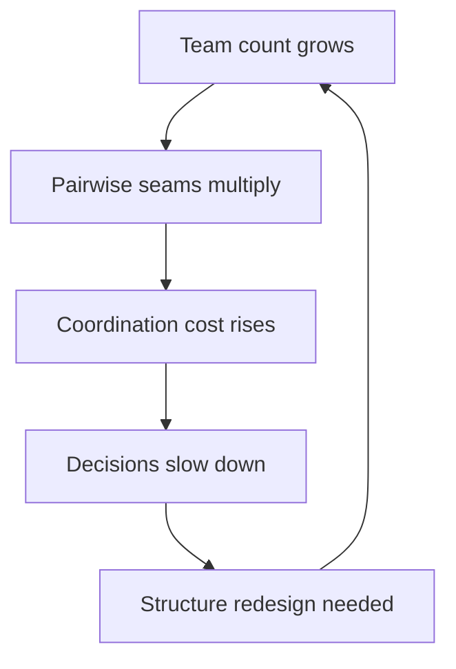

# Organizational Design Options

> **Core skill:** Knowing the structure levers — team boundaries, platform vs product teams, centralization vs federation — and when each is the right answer for the current scaling stage.

## Why This Matters

Structure is the strongest lever in the systems toolkit: it determines who talks to whom, what gets owned, and where work waits. A team structure that fights the work produces chronic friction, duplicated effort, and slow decisions — and no amount of process will fix it. The staff engineer who can propose structure is consulted on re-orgs instead of surprised by them.

Organizational design is not an HR activity; it is an engineering activity with an org chart as its artifact. The design space is small and well understood: team boundaries, platform vs product teams, centralization vs federation. The skill is mapping the current pain to the structural cause and knowing what each scaling stage breaks.

## Design Levers

| Lever | Question It Answers | Options |
|---|---|---|
| **Team boundaries** | Where are the seams of ownership? | By service, by domain, by customer, by skill |
| **Platform vs product** | Who builds shared capability? | Product teams own everything; a platform team owns the shared layer |
| **Centralization vs federation** | Who decides for shared things? | Central authority, federated councils, full autonomy |
| **Team size and shape** | How does work fit people? | Squads, feature teams, stream-aligned, enabling, complicated-subsystem |
| **Ownership model** | Who is accountable when it breaks? | Single team, shared, matrixed |

Each lever interacts with the others: platform teams without centralization decide nothing; centralization without platform teams decides everything slowly. The design problem is choosing a consistent combination, not picking levers in isolation.

## Scaling Stages and What Breaks

| Stage | Signature | What Breaks First |
|---|---|---|
| **Startup** | One team, everyone talks to everyone | Informal communication stops scaling at about ten people |
| **Scale-up** | Multiple teams, one platform | Ownership gaps: nobody owns the shared seams between teams |
| **Enterprise** | Many teams, many platforms, multiple locations | Coordination cost explodes; decisions crawl up and down hierarchies |

The common story: startup speed comes from full communication; scale-up keeps the startup structure and pays in duplicated effort and integration glue; enterprise adds process to compensate, and the process becomes the bottleneck. Each stage needs a deliberate structural change, not more of the previous stage's structure.

## Team Formation Patterns

| Pattern | Definition | When It Fits | When It Fails |
|---|---|---|---|
| **Feature teams** | Cross-functional teams own features end to end | Product work with clear value slices | When features cut across hard technical seams |
| **Platform teams** | Own the shared self-service layer | Recurring shared needs with many consumers | When they become ticket queues instead of platforms |
| **Enabling teams** | Help other teams adopt practices, time-boxed | Skill adoption, migrations, standards rollout | When they never leave and become dependencies |
| **Complicated-subsystem teams** | Hold rare deep expertise | Payments, ML, protocol work | When their scope creeps into product work |
| **Stream-aligned** | Own a slice of business value end to end | Default for most product organizations | When boundaries ignore technical coupling |

The selection rule: choose the smallest number of team types that covers the work, and make the boundary choices explicit — every boundary is a Conway decision about the future architecture.

## Coordination Cost Math

Coordination cost grows quadratically with team count: with N teams, there are N x (N-1) / 2 pairwise seams that can require coordination.

| Teams | Pairwise Seams | Practical Consequence |
|---|---|---|
| 3 | 3 | Everyone can still talk to everyone |
| 6 | 15 | Some seams get ignored; problems start hiding |
| 10 | 45 | Seams are managed by process, not conversation |
| 20 | 190 | Process becomes the dominant cost |

This math is why reducing the number of seams — not the number of teams — is the design goal. Ten teams with one shared platform have ten platform-consumer relationships instead of forty-five pairwise ones.

## Design Principles

| Principle | Meaning | Test |
|---|---|---|
| **Minimize coordination** | Put the work and the ownership in the same place | Can a team ship its slice without a cross-team meeting? |
| **Maximize autonomy** | Teams can decide and act within their boundary | Is the team's dependency list short and stable? |
| **Clear ownership** | Every system has exactly one accountable team | Can you name the owner of every service from memory? |
| **Aligned incentives** | Team goals match org goals | Does optimizing locally help globally? |
| **Reversible structure** | Boundaries can move without trauma | Is the architecture modular enough to survive a re-org? |

A structure that satisfies these five principles runs on its own energy; one that violates them consumes management attention permanently.



## When to Propose Redesign

Chronic friction is the signal; the table maps symptom to structure:

| Symptom | Likely Structural Cause | Design Response |
|---|---|---|
| Missed deadlines across teams | Ownership of shared components unclear | Assign single owners; split the seam |
| Duplicated effort | Teams rebuilding the same capability | Platform team or federation for that capability |
| Slow decisions | Too many seams on the critical path | Flatten the path; push decision to the lowest competent level |
| Standards ignored | Adoption cost higher than compliance cost | Make the standard a platform default, not a rule |
| Constant escalations | No level owns the intersection | Add an owning body for the shared space |

Propose redesign when symptoms repeat for two or more quarters with no structural change — and propose it with the pain data, not as a preference. The org will not move for elegance; it will move for evidence.

## Practical Applications

### Org Design Checklist

- [ ] Draw the current structure: teams, seams, and the top five handoffs
- [ ] Name which scaling stage you are in and what it is breaking
- [ ] Count the pairwise seams and identify the top coordination consumers
- [ ] Check the five design principles against the current structure
- [ ] For each chronic symptom, map it to a structural cause
- [ ] Draft the smallest structural change with a stated prediction

### Structure Proposal Template

```markdown
# Structure Proposal: [Change Name]

## Current State
- Teams and boundaries: [diagram or list]
- Chronic symptoms with evidence: [symptom, data, duration]

## Root Structure
- Seam or ownership gap producing the symptoms: [description]

## Proposed Change
- New boundaries / platform / governance: [description]
- Coordination seams before vs after: [numbers]

## Principle Check
- Minimize coordination: [how]
- Maximize autonomy: [how]
- Clear ownership: [how]

## Risks and Reversibility
- What could go wrong: [list]
- How to unwind: [description]

## Pilot
- Scope and duration: [description]
- Success criteria: [list]
```

## Common Pitfalls

| Pitfall | Why It Is a Problem | Better Approach |
|---|---|---|
| **Re-org as ritual** | Restructuring without a structural cause changes nothing | Change structure only when the seam is the problem |
| **Startup nostalgia** | Keeping full communication structure past its scale | Adopt structure deliberately as the org grows |
| **Platform as ticket queue** | Platform teams serving requests become the bottleneck | Platform success is self-service adoption |
| **Ignoring the math** | More teams without seam reduction costs more, not less | Count seams before and after any design |
| **Principle-free design** | Boundaries chosen by politics produce chronic friction | Test every boundary against the five principles |
| **One-size structures** | Copying another company's org chart | Design from your own seams and scaling stage |

## Success Indicators

- Chronic friction symptoms map to named structural causes, and both trend down
- The org chart and architecture are discussed as one system
- New teams are formed with explicit boundary and ownership statements
- Coordination cost is measured, not assumed
- Your structure proposals are requested before re-orgs, not after

## Related Topics

- [[02_Conways_Law_in_Practice]]: boundaries as architecture decisions
- [[05_Fixing_Structure_Not_Symptoms]]: when to change structure rather than process
- [[07_Limits_of_Local_Optimization]]: structure that rewards the whole
- [[03_Technical_Strategy/00_overview|Technical Strategy]]: structure serves strategy
- [[career-path/05_Tech_Lead/05_Team_Development_and_Mentoring_Leadership/00_overview|Team Development and Mentoring Leadership (Tech Lead)]]: the team-level view

## Summary

Organizational design is the strongest lever in the systems toolkit: pick boundaries, platform vs product shape, and centralization level to match the scaling stage, minimize pairwise seams, and maximize clear ownership and autonomy. Propose redesign when chronic symptoms trace to structure — with evidence and a pilot — and remember that every boundary decision is a Conway decision about the architecture you will get.
