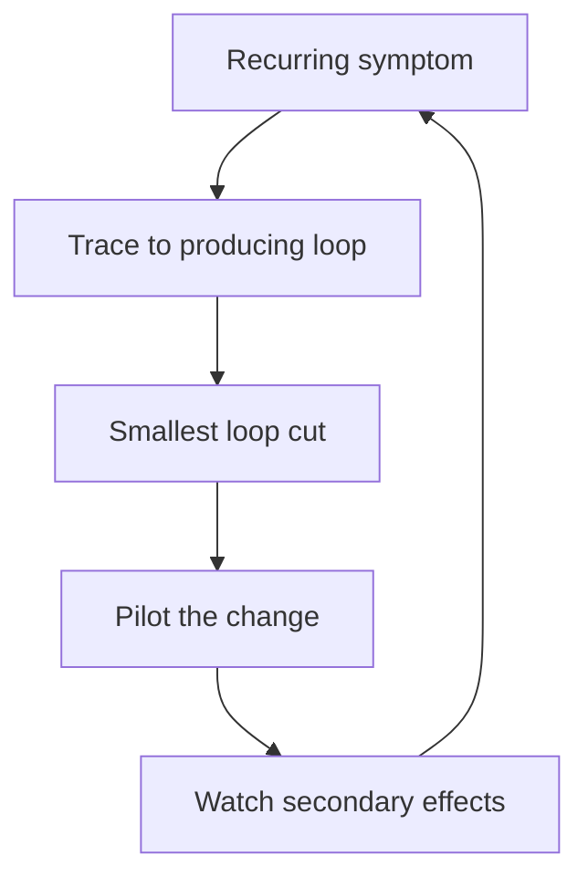

# Fixing Structure Not Symptoms

> **Core skill:** Tracing recurring symptoms to the structures that produce them, designing the smallest intervention that breaks the producing loop, and piloting it while watching for secondary effects.

## Why This Matters

Every recurring problem has a producer. Missed deadlines, slow releases, ignored standards, recurring incidents — each is generated on schedule by a structure, an incentive, or a missing ownership. Treating the symptom means fixing the same thing forever; treating the structure means fixing it once, and the org notices the difference.

The discipline matters most at staff level because the org will keep asking you to fix symptoms. A new process for missed deadlines, another meeting for slow releases, a louder reminder for ignored standards — these feel like action and change nothing. The staff skill is refusing the symptom fix gracefully and bringing the producing loop into the room instead.

## Symptom vs Structure Diagnosis

| Symptom | Structural Questions | Likely Producing Structure |
|---|---|---|
| Missed deadlines | Who owns the shared dependency? When does ownership start? | Unclear ownership of the critical path |
| Slow releases | Who owns the pipeline? Is it owned by anyone? | Pipeline ownership split across teams |
| Ignored standards | What does compliance cost? What does non-compliance cost? | Adoption cost higher than the penalty |
| Recurring incidents | Who owns the system after launch? Who pays for hardening? | Ownership gap between build and run |
| Duplicated tools | Who pays for integration? Who decides? | Autonomy without coordination cost |
| Heroics required | Who can operate this when the expert is away? | Knowledge concentrated by incentive or accident |

The diagnostic move is the same every time: find the loop that produces the symptom, then find the arrow in that loop that you can cut with the least collateral damage.

## The Diagnostic Method

1. **Trace the symptom to its producing loop.** Ask "what produces this on schedule?" until you reach a loop, not a person. If the answer is a person, ask what recruits that person into the role.
2. **Name the leverage point in the loop.** Where does the loop get its energy? Ownership, incentives, information, or rules — in that order of preference.
3. **Design the smallest structural change that breaks the loop.** One ownership change, one incentive change, one default changed. If the intervention needs a committee to sustain it, it is too big.
4. **Pilot the change.** Bound it in scope and time. A pilot is how you learn the loop's real shape without betting the org.
5. **Watch secondary effects.** Every loop cut moves energy elsewhere. Watch adjacent metrics for one full cycle.



## Intervention Design

The intervention is a cut in the loop, not a new process bolted on:

| Producing Loop | Smallest Structural Cut | Why It Works |
|---|---|---|
| Incidents recur because no owner pays for hardening | Assign one accountable owner with a hardening budget | Ownership changes what gets funded |
| Standards ignored because compliance is expensive | Make the standard the platform default | Compliance becomes the path of least resistance |
| Releases slow because pipeline ownership is split | Move the pipeline into one owning team | The seam disappears; the meeting disappears |
| Deadlines missed on shared dependencies | Split the dependency or give one team end-to-end ownership | The critical path has exactly one owner |
| Knowledge hoarded because sharing pays nothing | Make unblocking others part of the review | The reward structure changes behavior |

A good cut is small enough to pilot, sharp enough to notice, and structural enough that it does not need you to sustain it.

## Pilot and Secondary Effects

| Phase | Action | Watch For |
|---|---|---|
| **Design** | Bound scope, pick metrics, set duration | What adjacent systems could absorb the energy |
| **Run** | Let the change operate; do not micro-manage | Early gaming, resistance from the old beneficiaries |
| **Measure** | Compare the pilot metrics to the baseline | Improvement here, deterioration elsewhere |
| **Decide** | Roll out, adjust, or revert | The loop's true shape, now visible |

Secondary effects are not failures; they are information. A cut that moves incidents from team A to team B has revealed a second producing loop — which is exactly what the pilot was for.

## Case Patterns

| Pattern | Example | Structural Fix |
|---|---|---|
| **Standards ignored** | The code style guide has 40% adoption after a year | Move the standard into the linter, formatter, and template; remove the choice |
| **Incidents recurring** | The same service breaks every release cycle | Give the service one owner, one error budget, one hardening plan |
| **Deadlines always late** | Every cross-team milestone slips two weeks | Find the seam producing the slip and own it end to end |
| **Onboarding too slow** | New hires take a quarter to ship | Document the critical path; make the environment one command |

Each pattern has the same shape: a recurring symptom, a producing structure, and a cut that removes the structure instead of managing its output.

## When It IS a People Problem

Some problems really are people problems, and the honest distinction protects your credibility:

| Signals of Structure | Signals of People |
|---|---|
| The behavior recurs across different people in the same role | The behavior recurs in the same person across different roles |
| The system makes the bad behavior the rational choice | The person knows the right behavior and chooses otherwise |
| Multiple people independently produce the symptom | The person resists feedback and coaching |
| The symptom disappears when the structure changes | The symptom persists through structure changes |

Rule: structure first, people second. When you have genuinely changed the structure and the person still produces the failure, it is a people problem — and then it is a manager's problem to resolve with performance management, not yours to accommodate forever. Say this out loud; it is the honest end of the analysis.

## Practical Applications

### Structural Fix Checklist

- [ ] Write the symptom and its producing loop in one paragraph
- [ ] Identify the smallest cut and name what breaks in the loop
- [ ] Check: does this cut need a committee to sustain it? If yes, shrink it
- [ ] Define pilot scope, metrics, and duration before landing anything
- [ ] Name the likely secondary effects and where to watch for them
- [ ] Decide in advance when you will revert

### Pilot Brief Template

```markdown
# Structural Pilot: [Change Name]

## Symptom
[What recurs, with evidence]

## Producing Loop
[Loop description: variables and arrows]

## The Cut
[Smallest structural change]

## Pilot Scope
- Teams involved: [list]
- Duration: [one full cycle]
- Metrics: [before and after]

## Predicted Secondary Effects
[What moves elsewhere, and where to watch]

## Decision Criteria
- Roll out if: [condition]
- Adjust if: [condition]
- Revert if: [condition]
```

## Common Pitfalls

| Pitfall | Why It Is a Problem | Better Approach |
|---|---|---|
| **Process patchwork** | New processes on top of broken structure add load without fixing it | Cut the loop; let the process disappear |
| **Blaming the nearest person** | The person is usually the loop's recruit, not its cause | Trace to the structure that recruited them |
| **Heroic interventions** | Changes that only you can sustain revert when you leave | Design cuts that run on the structure's own energy |
| **Skipping the pilot** | Full-scale structural change without evidence is a gamble | Pilot, measure, then scale |
| **Ignoring secondary effects** | Energy moves and the fix looks like it failed | Watch adjacent metrics for one full cycle |
| **Structure denial** | Calling a structural problem a people problem forever | Apply the structure/people test honestly |

## Success Indicators

- The same symptoms stop recurring after your interventions
- Your pilots have explicit decision criteria and are actually reverted when wrong
- Colleagues bring you loops, not just complaints
- Secondary effects are caught early because you predicted them
- Structural fixes outlast your presence in the area

## Related Topics

- [[01_Systems_Thinking_Fundamentals]]: the loop vocabulary for diagnosis
- [[03_Incentives_and_Behavior]]: incentives as the loop's fuel
- [[04_Organizational_Design_Options]]: the structure levers available
- [[06_Technical_Risk_and_Judgment/00_overview|Technical Risk and Judgment]]: incidents as symptom sources
- [[02_Cross_Team_Technical_Leadership/00_overview|Cross-Team Technical Leadership]]: leading fixes across team lines

## Summary

Fixing structure not symptoms is the staff engineer's core intervention discipline: trace the recurring symptom to its producing loop, design the smallest structural cut, pilot it with named metrics and predicted secondary effects, and decide on evidence. The distinction between structural and people problems must be made honestly — but only after the structure has actually been changed.
