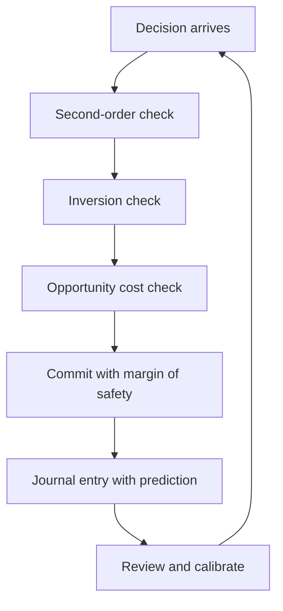

# Models for Decision Making

> **Core skill:** Using a toolkit of mental models — second-order thinking, inversion, opportunity cost, margin of safety, two-way doors — without being used by them.

## Why This Matters

Staff decisions are the ones nobody else can make: ambiguous, expensive, and irreversible at team scale. The difference between a good and a bad staff decision is rarely intelligence — it is whether the decision was examined through the right lenses before commitment. Mental models are those lenses, and a small set of them covers most of the decision space.

Models matter even more for the reasoning they force into the open. When you can say "this is a one-way door with a thin margin of safety, and the opportunity cost is the platform work we would skip," the decision becomes reviewable and teachable. Decisions made by intuition alone are unteachable — and the staff engineer is expected to grow the next decision-makers.

## The Staff Toolkit

| Model | Question It Asks | Used For |
|---|---|---|
| **Second-order thinking** | And then what? | Any decision with delayed consequences |
| **Inversion** | What would guarantee failure? | Risk identification, plan hardening |
| **Opportunity cost** | What does this choice push out? | Portfolio and budget decisions |
| **Margin of safety** | How wrong can I be and still be fine? | Irreversible bets, capacity plans |
| **Two-way doors** | Can we cheaply reverse this? | Deciding how much analysis to invest |
| **Theory of constraints** | What single step limits the flow? | Throughput and delivery problems |
| **Tragedy of the commons** | Who shares this resource and pays the cost? | Shared infrastructure, budgets, on-call |
| **Pareto** | Where is 80% of the value? | Scoping, prioritization, remediation |

None of these models decide anything. They are questions that make the deciding sharper — and the discipline is applying them before the decision, not citing them after.

## Model Fit Table

| Decision Type | Best Models | Why |
|---|---|---|
| Adopting a new technology | Two-way doors, opportunity cost, second-order thinking | Reversibility and what you give up dominate |
| Cutting a feature or project | Opportunity cost, Pareto | What survives matters more than what dies |
| Staffing and org structure | Tragedy of the commons, theory of constraints | Shared resources and the flow bottleneck |
| Reliability investment | Margin of safety, second-order thinking | The cost of being wrong compounds |
| Migration or rewrite | Inversion, margin of safety, two-way doors | Failure modes and reversibility decide |
| Prioritization | Pareto, opportunity cost | Value concentration and trade-offs |

Match the model to the decision's real risk profile. A reversible choice deserves two-way-door speed; an irreversible one deserves inversion and margin of safety before commitment.

## Model Stacking

Single models miss what pairs catch. Stacking two or three lenses on one decision is where the leverage is:

| Stack | What It Reveals |
|---|---|
| Two-way doors + opportunity cost | "Cheap to reverse, but reversing costs us the platform quarter" |
| Inversion + margin of safety | "The failure mode is silent data loss, so we need a six-month runway of export" |
| Theory of constraints + Pareto | "The bottleneck is one review queue, and 80% of the delay lives there" |
| Second-order + commons | "Faster for us, but every team pays the shared cache tax" |

The habit to build: for any decision above a cost threshold, name two models and run both. The disagreement between models is usually the interesting part of the decision.

## Model Limits and Overuse

Every model has a failure mode when applied beyond its range:

| Model | Overuse Failure | When to Stop Using It |
|---|---|---|
| Second-order thinking | Analysis paralysis; infinite regress | When the second order is priced and the third is speculative |
| Inversion | Designing for failure instead of success | When it blocks reasonable forward motion |
| Opportunity cost | Endless comparison; nothing ever chosen | When the best option is clear enough to commit |
| Margin of safety | Over-buffering that becomes waste | When the buffer costs more than the risk it covers |
| Two-way doors | Using reversibility as an excuse to decide badly | When reversal costs are hidden or growing |
| Pareto | Ignoring the long tail that contains the incident | When the 20% is actually the critical 20% |
| Theory of constraints | Optimizing one step while others starve | When the constraint moves faster than you measure |

The check: a model is a tool you can put down. If a model keeps producing the same answer regardless of the problem, it has become a belief — and beliefs do not get tested.

## Building a Decision Journal

The journal is the staff decision habit that compounds: every significant decision gets a dated entry, and every entry gets revisited.

```markdown
# Decision Journal: [Decision Title]

- Date: [YYYY-MM-DD]
- Decision: [What was chosen]

## Context
[What was true, what was uncertain]

## Options Considered
- [Option] — [why rejected]

## Models Applied
- [Model]: [what it revealed]

## Prediction
- [If this decision is right, what will we observe, by when]

## Review
- Review date: [six to twelve months out]
- What happened: [filled in at review]
- Grade: [right / right for wrong reasons / wrong for right reasons / wrong]
```

The journal converts hindsight into calibration: over a few years you learn which of your instincts were right and which models misled you. That calibration is the actual staff skill.



## Practical Applications

### Model Use Checklist

- [ ] State the decision's reversibility before choosing an analysis depth
- [ ] Apply at least two models; write what each reveals
- [ ] For irreversible decisions, run inversion and name the failure modes
- [ ] Name the opportunity cost of the choice out loud
- [ ] Write the prediction and the review date in your journal
- [ ] Review one old journal entry this quarter and grade it honestly

## Common Pitfalls

| Pitfall | Why It Is a Problem | Better Approach |
|---|---|---|
| **Model worship** | Frameworks applied where they don't fit produce confident wrong answers | Check fit against the decision's real risk profile |
| **Single-lens decisions** | One model's blind spot becomes the decision's blind spot | Stack two models and compare |
| **Hindsight citation** | Citing a model after the outcome to look prescient | Write the model and prediction before the decision |
| **Analysis paralysis** | Second-order thinking with no stopping rule | Price the second order; stop at the third |
| **Journal neglect** | No written prediction means no calibration | Journal every significant decision; review on a date |
| **Model as belief** | The same model answers every problem | Notice when a model stops being questioned |

## Success Indicators

- Significant decisions are made with named models and written predictions
- Your journal shows calibration improving over time
- Colleagues adopt the models after seeing them work
- You can state the opportunity cost of your own portfolio
- Decisions hold up at review because the reasoning was recorded

## Related Topics

- [[01_Systems_Thinking_Fundamentals]]: the system view behind the models
- [[06_Technical_Risk_and_Judgment/00_overview|Technical Risk and Judgment]]: pricing as a decision model
- [[03_Technical_Strategy/00_overview|Technical Strategy]]: decisions at portfolio scale
- [[04_Influence_and_Alignment/00_overview|Influence and Alignment]]: making reasoning persuasive
- [[career-path/02_Senior_Software_Engineer/03_Architecture_and_Design_Judgment/00_overview|Architecture and Design Judgment (Senior)]]: the foundations

## Summary

Mental models are the staff engineer's decision lenses: second-order thinking, inversion, opportunity cost, margin of safety, two-way doors, theory of constraints, the tragedy of the commons, and Pareto cover most of the decision space. Match models to the decision's risk profile, stack two or more lenses, watch for overuse, and record every significant decision with a prediction in a journal — because calibrated judgment is built from reviewed decisions, not from intuition.
