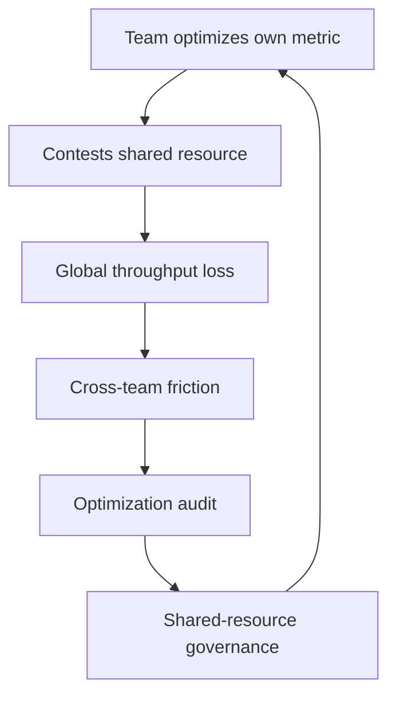

# Limits of Local Optimization

> **Core skill:** Recognizing when a team's local improvement harms the org's global throughput — and negotiating the shared-resource governance that fixes it.

## Why This Matters

Every team optimizes what it can see. That is usually good — and sometimes it is exactly wrong. A team that caches aggressively, owns its schema tightly, or tunes its budget can improve its own metrics while degrading the systems everyone else depends on. The org's throughput is not the sum of team optima; it is the joint outcome of how teams share the resources between them.

The staff engineer is the only role paid to see the whole. Teams see their cache, their schema, their on-call; staff sees the shared cache, the shared database, the shared budget. That vantage is a responsibility: when local optimization bites the global optimum, someone has to say so with data, and someone has to design the governance that fixes it without destroying autonomy.

## Local vs Global Optimization

| Dimension | Local Optimum | Global Optimum |
|---|---|---|
| Perspective | One team's metrics | Org-level outcomes |
| Horizon | This quarter | Multiple quarters |
| Resource view | What the team owns | What everyone shares |
| Failure mode | Optimizing a shared thing alone | Sub-optimizing so everyone wins less |
| Example | Team cache evicts others' data | Cache is sized and governed for all consumers |

The classic confusion: local metrics improve while global outcomes decline, and nobody can see both at once. The staff read is the correlation between the two over time.

## Where Local Optima Bite

| Shared Resource | Local Optimization | Global Cost |
|---|---|---|
| **Shared caches** | Aggressive eviction, private namespaces | Cache hit rates collapse for everyone; infra bill doubles |
| **Shared DB schemas** | Tightening columns to fit one team's access | Every other consumer pays migration and lock costs |
| **Shared on-call** | Optimizing alert noise for one team | Pages still fire; the shared rotation absorbs the load |
| **Budget silos** | Spending the full budget each quarter | Panic buying; no money for cross-team fixes |
| **Headcount silos** | Hoarding capacity for own roadmap | The critical shared platform starves for years |

The pattern in every row: the resource is shared, the decision is local, and the cost lands outside the decision-maker's metrics. The fix is never "stop optimizing" — it is governance that puts the shared cost back into the local decision.

## The Optimization Audit

Before challenging a local optimization, run the audit — you need the map before the argument:

- [ ] Who else touches this resource? Name every consumer.
- [ ] What does the resource cost per consumer, and who pays?
- [ ] What would the optimal global allocation look like?
- [ ] What information would the local team need to choose globally well?
- [ ] What governance would make the globally good choice locally rational?

The audit's output is usually not "the team is wrong" but "the team cannot see the cost." Fix the visibility and the behavior often follows.

## Negotiation Patterns for Shared Resources

Three patterns cover most shared-resource conflicts:

| Pattern | How It Works | When It Fits |
|---|---|---|
| **Split ownership** | Partition the resource so each team owns its part | The resource can be cleanly divided |
| **Federated governance** | A council of consumers sets rules and budgets together | The resource is inherently shared and contested |
| **Platform team** | A dedicated team owns the shared layer as a product | The resource is large, stable, and heavily reused |

| Pattern | Strengths | Weaknesses |
|---|---|---|
| Split ownership | Full autonomy, no coordination | Only works when seams are clean |
| Federated governance | Fair, buy-in from all | Slow; meetings; consensus drag |
| Platform team | Fast, professional, self-service | Expensive; can become a bottleneck |

Choose by the resource's shape, not by preference: clean seams → split; contested commons → federated; heavy reuse → platform.



## The Staff Role as Global Optimizer

You are the only one paid to see the whole — that is the job description, not the ambition. Concretely:

| Staff Action | Example |
|---|---|
| **Name the global metric** | "Org release throughput," "total infrastructure cost per user" |
| **Show the local-global gap** | "Team A's cache change saved 2ms locally and added $40k monthly" |
| **Design the governance** | Federated cache council with quotas and a review cadence |
| **Protect the commons** | Refuse optimizations that externalize cost, with the data on the table |
| **Make global thinking visible** | Publish the global metrics teams should optimize against |

The role is unpopular sometimes: saying no to a team's clever local win is not a popularity move. It is the move the org pays staff to make — and the data makes it defensible.

## Measuring Global Outcomes

Local metrics stay, but they must be paired with the global ones they can harm:

| Local Metric | Global Pair | Why the Pair Matters |
|---|---|---|
| Team cache hit rate | Total cache cost and cross-team hit rate | Local tuning can destroy shared value |
| Team migration speed | Cross-team integration breakage | Fast local change can tax everyone else |
| Team on-call load | Shared rotation load | Local alert tuning moves pages, not removes them |
| Team budget burn | Org cost per outcome | Silo spending starves the commons |
| Team delivery speed | Org time-to-value for customers | Local speed can be global theater |

Report the pair, not the local number. A dashboard that shows only the local metric is how the org learns to sub-optimize.

## Practical Applications

### Global Optimization Checklist

- [ ] For every major resource, name all consumers and the cost allocation
- [ ] Run the optimization audit before challenging a local win
- [ ] Choose the governance pattern that fits the resource's shape
- [ ] Pair every local metric with its global counterpart in reporting
- [ ] Publish the global metrics teams should be optimizing against
- [ ] Review shared-resource governance quarterly

### Shared Resource Case Template

```markdown
# Shared Resource Case: [Resource Name]

## Consumers
- [Team or system]: [how it uses the resource]

## Local Optimization in Question
[What changed, whose metrics improved]

## Global Cost
[Measured impact on other consumers and org outcomes]

## Audit Result
- Visibility gap: [what the local team could not see]
- Incentive gap: [what the structure rewarded]

## Governance Proposal
- Pattern: split ownership / federated governance / platform team
- Design: [quotas, rules, cadence]

## Decision and Review
- Agreed change: [description]
- Review date: [quarterly]
```

## Common Pitfalls

| Pitfall | Why It Is a Problem | Better Approach |
|---|---|---|
| **Local blindness** | Optimizing what you can see while taxing what you can't | Pair local metrics with global counterparts |
| **Commons denial** | Treating shared resources as private property | Name all consumers before any optimization |
| **Autonomy absolutism** | Refusing governance on shared things | Governance is what makes autonomy safe |
| **Global paralysis** | "It's not optimal" blocking all progress | Accept local wins that don't harm the whole |
| **Unmeasured global claims** | Asserting global harm without data | Run the audit; show the cost |
| **Council bloat** | Federated governance that governs everything | Limit federation to genuinely shared, contested resources |

## Success Indicators

- Global metrics are published and cited in team decisions
- Shared-resource changes go through the audit before landing
- Local optimizations that externalize cost get caught before merge
- Governance bodies exist only where resources are genuinely shared
- Teams can name the global outcome they are optimizing for

## Related Topics

- [[01_Systems_Thinking_Fundamentals]]: the system view of shared resources
- [[03_Incentives_and_Behavior]]: why local metrics produce local behavior
- [[04_Organizational_Design_Options]]: platform teams as a governance answer
- [[06_Technical_Risk_and_Judgment/00_overview|Technical Risk and Judgment]]: concentration and shared exposure
- [[career-path/05_Tech_Lead/02_System_Ownership_and_Production_Responsibility/03_Technical_Debt_Leadership|Technical Debt Leadership (Tech Lead)]]: the team-level parallel

## Summary

Local optimization is the default behavior of healthy teams — and a standing threat to the global optimum. The staff role is to see the shared resource, run the audit, pair local metrics with global ones, and design the governance — split ownership, federation, or platform — that makes the globally good choice locally rational. It is the least thanked job in the org and the one nobody else can do.
