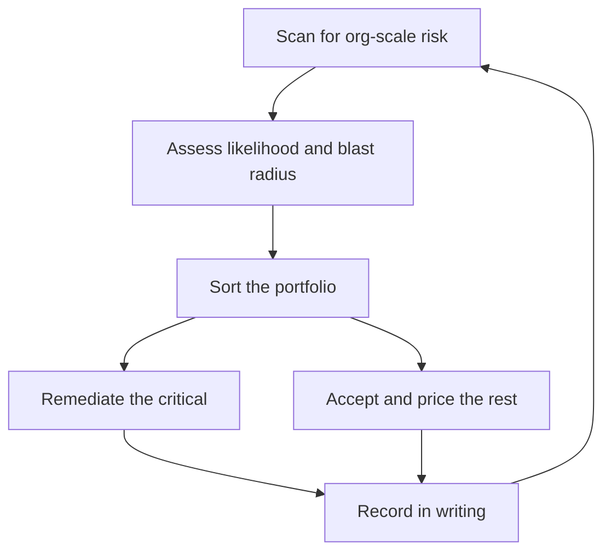

# Technical Risk and Judgment

> **Core capability:** The staff engineer sees organizational-scale technical risk early — architecture erosion, dependency exposure, security posture, concentration risk — and manages it explicitly: assessed, priced, accepted in writing, or remediated.

## Why This Matters

At staff level, risk stops being something you flag and becomes something you own. The risks that matter now are slow and structural: the architecture eroding one shortcut at a time, the critical dependency with no alternative, the key-person knowledge concentrated in two heads, the compliance surface nobody mapped. None of these page anyone at 3am — until each suddenly does.

Staff judgment shows in the portfolio: which risks get remediated now, which get priced and accepted, which get escalated with options. The failure mode isn't missing risks — it's treating all risks as equally urgent, which means treating none of them as urgent.

## Topics in This Capability Area

| Topic | Core Skill | When It Matters |
|-------|------------|-----------------|
| [[01_Seeing_Org_Scale_Risk]] | Reading risk portfolios, not incident lists | Quarterly; after growth spurts |
| [[02_Architecture_Erosion]] | Detecting and countering structural decay | Always; velocity dips |
| [[03_Dependency_Risk_Management]] | Mapping concentration and exit options | Vendor choices; platform reliance |
| [[04_Security_and_Compliance_Posture]] | Holding the org-level security view | Growth; new data domains; audits |
| [[05_Risk_Pricing_and_Acceptance]] | Making acceptance explicit, priced, and owned | Every accepted risk |
| [[06_Escalating_Risk_With_Options]] | Escalation that leads, not alarms | When risk exceeds your authority |
| [[07_Post_Incident_Organizational_Learning]] | Turning incidents into structural fixes | After every serious incident |

## The Risk Ownership Loop

Unrecorded acceptance is denial with extra steps.

## What Changes from Senior to Staff

| Activity | Senior engineer | Staff engineer |
|----------|-----------------|----------------|
| Risk horizon | Team's systems and releases | Org portfolio across teams |
| Response | Flags and fixes in own area | Owns portfolio decisions across teams |
| Acceptance | Escalates acceptance decisions | Accepts in writing, with price and owner |
| Incidents | Responds and hardens component | Extracts org-level structural fixes |
| Security | Follows team practices | Holds cross-team posture view |

## Practical Applications

### Risk Ownership Checklist

- [ ] An org-scale risk register exists with likelihood, blast radius, and owner
- [ ] Architecture health is reviewed for erosion on a cadence
- [ ] Every critical dependency has mapped exit options
- [ ] Accepted risks are written, priced, and re-reviewed quarterly
- [ ] Escalations carry options and a recommendation, never just alarm
- [ ] Serious incidents produce at least one structural fix

## Common Pitfalls

| Pitfall | Why It Is a Problem | Better Approach |
|---------|---------------------|-----------------|
| **All-risk urgency** | Everything priority one means nothing is | Portfolio sort: remediate, price, or exit |
| **Silent acceptance** | Unowned risks become careersending surprises | Written acceptance with price and review date |
| **Alarm-only escalation** | Leadership gets problems without paths | Escalate with options and recommendation |
| **Incident amnesia** | Same contributing factors, different tickets | Track contributing-factor recurrence org-wide |

## Success Indicators

- Risk register is current and leadership actually reads it
- Accepted risks get re-reviewed, not forgotten
- Dependency exits are rehearsed or mapped before needed
- Erosion trends reverse after interventions
- Incident postmortems change structure, not just code

## Related Capabilities

- [[02_Cross_Team_Technical_Leadership/00_overview|Cross-Team Technical Leadership]]: remediation ships through teams
- [[03_Technical_Strategy/00_overview|Technical Strategy]]: bets and risk are one conversation
- [[05_Systems_Thinking_and_Organizational_Design/00_overview|Systems Thinking and Organizational Design]]: why risk recurs structurally
- [[career-path/02_Senior_Software_Engineer/05_Quality_Reliability_Security/00_overview|Quality Reliability Security (Senior)]]: the foundations
- [[career-path/08_Security_Engineer/00_overview|Security Engineer]]: the specialist depth path

## Summary

Technical risk at staff level is a portfolio owned in writing: scan for org-scale exposure, assess blast radius, remediate the critical, price and accept the rest, escalate with options, and convert incidents into structural change. The discipline is making every acceptance explicit — because unrecorded risk is just unscheduled surprise.
