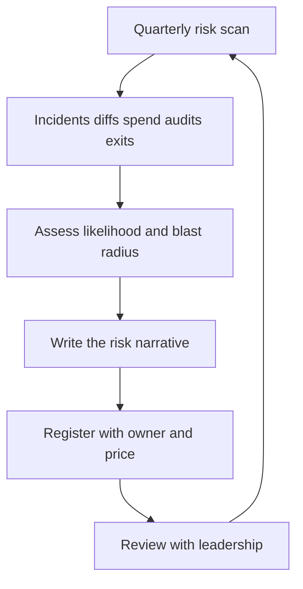

# Seeing Org-Scale Risk

> **Core skill:** Reading the organization's risk portfolio — architectural, operational, financial, compliance, concentration — instead of reacting to incident lists.

## Why This Matters

The risks that end careers and companies are slow and structural: the architecture eroding one shortcut at a time, the critical dependency with no alternative, the compliance surface nobody mapped, the spend curve that quietly triples. None of them page anyone at 3am — until each suddenly does, all at once.

At staff level, risk stops being something you flag and becomes something you scan for, assess, and own. The scan is the difference between risk management and risk reaction: a quarterly, systematic read of the org's exposure across five categories, from sources that already exist — incidents, diffs, spend, audits, exits — if you know where to look.

## Org-Scale Risk Sources

| Risk Source | Examples | Typical Blast Radius |
|---|---|---|
| **Architectural** | Coupling, erosion, unowned seams | Every team touching the coupled area |
| **Operational** | Key persons, single regions, no runbooks | Service availability; knowledge loss |
| **Financial** | Cloud spend curves, licensing cliffs | Budget surprise; forced cuts |
| **Compliance** | Data sprawl, retention gaps, residency violations | Fines, audit failures, market access |
| **Concentration** | Vendor, platform, single-dependency bets | The whole platform when one bet fails |

Each category has its own clock: architectural risk compounds in months, operational risk in weeks, financial risk in quarters, compliance risk in audit cycles, concentration risk in vendor timelines. A portfolio view holds all five clocks at once.

## The Quarterly Risk Scan

Run quarterly, from inputs that already exist:

| Input Source | What It Reveals | Risk Category It Feeds |
|---|---|---|
| **Incident postmortems** | Recurring contributing factors | Architectural, operational |
| **Diff and code review data** | Erosion velocity, shortcut frequency | Architectural |
| **Spend reports** | Cost curves, waste, concentration | Financial |
| **Audit findings** | Compliance gaps, access sprawl | Compliance |
| **Exit interviews and departures** | Key-person concentration | Operational, concentration |
| **Dependency updates** | Abandonment, pricing changes | Concentration |

The scan's output is not a list — it is a risk portfolio with narratives. If a scan produces no risks, the scan is broken, not the org.

## Risk Narratives

Every risk needs a story that makes its blast radius concrete. A narrative turns "the auth service is coupled to the monolith" into "if the monolith deploys badly, every login in every market fails for hours."

| Risk | Weak Description | Strong Narrative |
|---|---|---|
| Architectural | "Coupling is high" | "Three teams change the same module; one bad merge takes down checkout for all regions" |
| Operational | "Key-person risk on payments" | "The payments expert is one person; their week of leave froze all payment changes" |
| Financial | "Cloud spend rising" | "At this curve, spend doubles in three quarters and forces a feature freeze" |
| Compliance | "Data sprawl" | "Customer data sits in four unclassified stores; a residency audit would fail this quarter" |
| Concentration | "We rely on vendor X" | "Vendor X's pricing change would add 30% to our largest cost line with no alternative" |

Write the narrative, then price it (see [[05_Risk_Pricing_and_Acceptance]]).

## The Register

The register is the org's written memory of its risk portfolio. Minimal viable fields:

| Field | Purpose |
|---|---|
| **Risk ID** | Stable identifier for discussion |
| **Risk and narrative** | What could happen, with blast radius |
| **Likelihood** | Qualitative or range, with rationale |
| **Impact** | Cost, time, or reputation range |
| **Owner** | One named person accountable |
| **Mitigation in place** | What already reduces it |
| **Status** | Open, accepted, mitigated, retired |
| **Review date** | When it gets re-priced |

```markdown
# Risk Register Entry

- Risk ID: RISK-2026-014
- Risk: [one sentence]
- Narrative: [what happens, to whom, how bad]
- Likelihood: [low/medium/high or range]
- Impact: [cost/time/reputation range]
- Owner: [name]
- Mitigation in place: [description]
- Status: open / accepted / mitigated / retired
- Review date: [next quarterly scan]
```

## Risk Review with Leadership

The register earns its place by being reviewed with leadership on the scan cadence:

| Practice | Why |
|---|---|
| Bring the portfolio, not the list | Leadership decides among risks, not about each one |
| Lead with narratives and prices | Blast radius and cost are the decision inputs |
| Flag changes since last review | New risks, retired risks, re-priced risks |
| End with decisions, not updates | Each risk gets remediate, accept, or defer — in writing |
| Keep the register current between reviews | The scan is quarterly; the register is continuous |

The review converts the register from a document into a decision system. If leadership never sees it, you have a list, not a portfolio.



## Practical Applications

### Risk Scan Checklist

- [ ] Collect inputs from all five sources within the last month
- [ ] Draft narratives with concrete blast radius for each candidate risk
- [ ] Price likelihood and impact as ranges, with rationale
- [ ] Assign an owner to every open risk before the review
- [ ] Present the portfolio to leadership with decisions requested
- [ ] Update the register with every decision made

## Common Pitfalls

| Pitfall | Why It Is a Problem | Better Approach |
|---|---|---|
| **Incident-list thinking** | Managing yesterday's fires as the risk portfolio | Scan for slow structural risks on a cadence |
| **Unpriced risks** | No cost means no priority; everything is urgent | Price likelihood and impact for every entry |
| **Ownerless entries** | Risks without owners are wishes | Every register row names one accountable person |
| **Register theater** | A document nobody reviews is decoration | Review with leadership quarterly, decisions in writing |
| **Narrative-free registers** | Rows without stories don't move anyone | Write the blast radius as a story |
| **Scanning once** | A single scan goes stale within a quarter | Run the scan on a cadence, update continuously |

## Success Indicators

- The register holds the five risk categories, all priced and owned
- Leadership reads the register and asks for the next review
- New risks are added within weeks of appearing, not quarters
- Narratives are cited in budget and roadmap discussions
- Risk decisions — remediate, accept, defer — are made in writing

## Related Topics

- [[02_Architecture_Erosion]]: the architectural category in depth
- [[03_Dependency_Risk_Management]]: the concentration category in depth
- [[05_Risk_Pricing_and_Acceptance]]: turning scan findings into priced decisions
- [[06_Escalating_Risk_With_Options]]: when a risk exceeds your authority
- [[03_Technical_Strategy/00_overview|Technical Strategy]]: bets and risk are one conversation

## Summary

Org-scale risk is a portfolio, not an incident list: scan quarterly across architectural, operational, financial, compliance, and concentration sources; write each risk as a narrative with blast radius; price it; assign an owner; and review the register with leadership as a decision system. The discipline that makes it work is cadence — the scan runs whether or not anything is on fire, because the dangerous risks never announce themselves.
