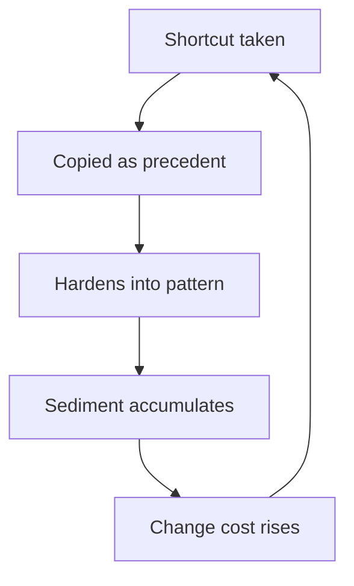

# Architecture Erosion

> **Core skill:** Detecting structural decay early — rising change cost, incident clustering, clone services, framework drift — and countering it with refactor budgets, paved paths, and erosion reviews.

## Why This Matters

Architectures do not fail dramatically; they erode quietly. A shortcut becomes a precedent, the precedent becomes a pattern, the pattern becomes sediment — and the org wakes up one day with a system nobody can change safely. The erosion is invisible in any single decision and obvious in aggregate: change costs rise, incidents cluster, and every new service clones the last one.

Erosion is a staff-level risk because no single team owns it. Each shortcut is locally rational; the sediment is globally expensive. Detecting it requires reading signals across teams, and countering it requires interventions that span them — refactor budgets, paved paths, and design-review gates that catch the erosion at the point of entry.

## Erosion Mechanics

The decay chain is short and predictable:

| Stage | What Happens | Example |
|---|---|---|
| **Shortcut** | A one-off deviation, justified by urgency | Direct DB access from a new service |
| **Precedent** | The shortcut gets copied because it worked | Second service repeats the pattern |
| **Pattern** | The deviation becomes the local style | New services assume direct DB access is normal |
| **Sediment** | The architecture's intent is no longer visible | The intended layering exists only in docs |

The lever is at the first two stages: shortcuts are survivable, precedents are where erosion becomes architecture. Catching the second occurrence is the cheapest prevention available.



## Erosion Signals

| Signal | What It Indicates | How to Detect It |
|---|---|---|
| **Rising change cost** | Coupling is compounding | Time-per-change trend across teams |
| **Incident clustering** | Erosion is now operational | Postmortem data grouped by service area |
| **Clone services** | The platform isn't reusable | New services duplicating existing capabilities |
| **Framework drift** | Governance has lost the center | Library and framework versions diverging per team |
| **Dead layers** | The architecture diagram is fiction | Layers nothing calls, abstractions bypassed |
| **Skip reviews** | Governance is perceived as cost | Design reviews bypassed or rubber-stamped |

None of these is fatal alone. The portfolio of signals is the diagnosis: two or more trending together means the architecture's intent is losing to its inertia.

## The Erosion Audit

Run the audit on the scan cadence, with three lenses:

| Audit Dimension | What to Look For | Output |
|---|---|---|
| **Complexity hotspots** | Modules with disproportionate change and defect density | Ranked list of erosion epicenters |
| **Dependency direction violations** | Arrows pointing against the intended layering | Violation map with owning teams |
| **Dead layers** | Abstractions nothing uses, layers nothing calls | Removal candidate list |

The audit is a half-day exercise per major system, and its output feeds the risk register: each hotspot gets an owner, a narrative, and a price — or it is not a risk, it is a fact.

## Counter-Measures

| Measure | How It Works | When to Use |
|---|---|---|
| **Refactor budget** | A standing fraction of capacity for structural work | Erosion confirmed; debt already compounding |
| **Paved paths** | The blessed approach is the default, others cost more | Recurring reinvention of the same capability |
| **Erosion reviews in design reviews** | Every design review checks the erosion signals | The normal gate, made structural |
| **Architecture tests** | Automated checks for dependency violations | When violations recur despite reviews |
| **Erosion debt register** | Named hotspots with owners and prices | When the audit finds more than can be fixed now |

Counter-measures are most effective in combination: the paved path makes the shortcut rare, the review catches the exceptions, and the budget pays for the backlog the audit found.

## The Erosion Conversation with Leadership

Leadership does not respond to "the architecture is decaying" — it responds to velocity data:

| Argument | Evidence That Moves It |
|---|---|
| Change cost is rising | Time-to-ship trend per change, by system |
| Erosion now costs incidents | Incident count clustered in hotspots |
| The paved path would pay | Time saved per change once on the path |
| The refactor budget returns | Projected velocity recovery over two quarters |

Frame erosion as a velocity problem with a price, and the budget conversation becomes arithmetic instead of aesthetics. The staff engineer's job is to keep that arithmetic current — re-measured, not asserted.

## When Erosion Is Acceptable

Not all erosion is neglect. The distinction is documentation:

| Dimension | Deliberate Pragmatism | Neglect |
|---|---|---|
| Decision | Someone chose it, with a reason | Nobody noticed |
| Record | Written: trade-off, owner, revisit date | Nothing written anywhere |
| Boundary | The pragmatism is scoped to an area | It spreads without limit |
| Review | Revisited on a date | Never revisited |
| Exit | A plan to pay it down exists | No plan, no price |

The same shortcut can be either, depending on whether it was chosen. The staff practice is not eliminating pragmatism — it is insisting that pragmatism arrive with a written decision, an owner, and a revisit date. What is chosen and documented is strategy; what is unchosen and undocumented is erosion.

## Practical Applications

### Erosion Control Checklist

- [ ] Run the three-lens audit on the scan cadence
- [ ] Feed hotspots into the risk register with owners and prices
- [ ] Confirm the paved path is genuinely the path of least resistance
- [ ] Add erosion checks to the design review template
- [ ] Bring velocity data, not adjectives, to the leadership conversation
- [ ] Document every accepted pragmatism with owner and revisit date

### Erosion Audit Template

```markdown
# Erosion Audit: [System Name]

## Hotspots
- [Module]: [change cost trend, defect density]

## Dependency Violations
- [Source] -> [Target] should not exist: [owning teams]

## Dead Layers
- [Layer or abstraction]: [evidence nothing uses it]

## Erosion Register
| Hotspot | Owner | Narrative | Price | Revisit |
|---|---|---|---|---|

## Counter-Measures in Place
- [Paved path / refactor budget / review gate]: [status]
```

## Common Pitfalls

| Pitfall | Why It Is a Problem | Better Approach |
|---|---|---|
| **Erosion denial** | "It's fine, we know the system" — until nobody does | Audit on a cadence; measure, don't assume |
| **Aesthetic arguments** | "This is ugly" loses to "we're shipping" | Speak velocity, incidents, and price |
| **All-or-nothing refactors** | Giant rewrites fail and discredit the cause | Refactor budgets and paved paths, incrementally |
| **Rubber-stamp reviews** | The gate exists but nothing is caught | Put erosion checks in the review template |
| **Undocumented pragmatism** | Shortcuts chosen in silence become sediment | Document every accepted deviation with a revisit date |
| **Hotspot amnesia** | Audit findings that never reach the register | Feed every finding into the risk register |

## Success Indicators

- Change-cost trend flattens or reverses after counter-measures
- Incident clustering in former hotspots declines
- New services use the paved path by default
- Design reviews catch erosion signals before merge
- Accepted pragmatism is always documented and dated

## Related Topics

- [[01_Seeing_Org_Scale_Risk]]: erosion as a register category
- [[03_Dependency_Risk_Management]]: dependency drift as an erosion vector
- [[05_Risk_Pricing_and_Acceptance]]: pricing erosion hotspots
- [[03_Technical_Strategy/00_overview|Technical Strategy]]: the target architecture erosion protects
- [[career-path/05_Tech_Lead/02_System_Ownership_and_Production_Responsibility/03_Technical_Debt_Leadership|Technical Debt Leadership (Tech Lead)]]: the team-level debt practice

## Summary

Architecture erosion is the quiet compounding of locally rational shortcuts into globally expensive sediment. Detect it through rising change cost, incident clustering, clone services, and framework drift; audit it with complexity, dependency, and dead-layer lenses; counter it with refactor budgets, paved paths, and review gates; and sell it to leadership as velocity arithmetic. The distinction between pragmatism and neglect is a written decision with an owner and a date.
