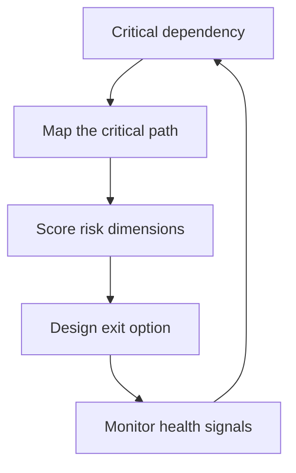

# Dependency Risk Management

> **Core skill:** Mapping the org's dependency exposure — open source, vendors, platforms, people — and designing exit options before the dependency becomes the constraint.

## Why This Matters

Every system runs on dependencies it did not build: libraries, SaaS vendors, internal platforms, and the people who know them. Each dependency is a bet that the provider will keep serving you at an acceptable price, quality, and pace. The bets are individually reasonable and collectively invisible — until a library is abandoned, a vendor reprices, a platform re-orgs, or the one expert leaves.

Dependency risk is a staff-level concern because it crosses teams: the critical path of the whole org runs through a dependency map nobody owns. Managing it means knowing which dependencies are on the critical path, what each could do to hurt you, and what you would do if it did — before the moment of need.

## Dependency Taxonomy

| Type | Examples | Primary Risk Dimensions |
|---|---|---|
| **Own code** | Internal services, shared libraries | Knowledge, ownership, quality drift |
| **Open source** | Libraries, frameworks, tools | Abandonment, license changes, CVEs |
| **Vendor SaaS** | Cloud, analytics, payments, LLM APIs | Pricing, lock-in, availability, roadmap |
| **Internal platform** | CI/CD, data platform, auth | Re-orgs, roadmap shifts, service levels |
| **People** | The engineers who hold system knowledge | Departure, burnout, concentration |

The taxonomy matters because risk dimensions differ: a library can be forked, a vendor can be negotiated with, a person can be paired with — each needs its own exit design.

## Risk Dimensions per Type

| Dimension | Question to Answer | Watch For |
|---|---|---|
| **Abandonment** | Is the project or vendor still alive and maintained? | Release gaps, unresponsive maintainers |
| **Pricing** | Could the cost change materially? | Repricing events, consumption models |
| **Lock-in** | How hard is leaving, really? | Proprietary formats, data gravity |
| **Knowledge** | Who understands this dependency? | Single-expert concentration |
| **Availability** | What happens when the provider has an outage? | No fallback path, no SLAs |
| **Security posture** | How fast are vulnerabilities fixed? | CVE response time, disclosure policy |

Score each critical dependency on the dimensions that apply. The scoring is the map; the map is what makes the risk discussable.

## The Dependency Map

Build the critical path: which dependencies, if they failed, would stop the org's most important outcomes?

| Map Step | Action | Output |
|---|---|---|
| **List** | Enumerate dependencies per system | Full inventory |
| **Rank** | Score criticality by blast radius | Critical list |
| **Map** | Draw the critical dependencies on the org's value path | Critical path diagram |
| **Score** | Rate each critical dependency on its risk dimensions | Risk matrix |
| **Review** | Re-score on the risk scan cadence | Living map |

The map's value is the conversations it forces: two teams discovering they share a critical dependency, a "strategic" vendor revealed as a convenience, an "internal platform" exposed as a single person's script.

## Exit Option Design

Every critical dependency needs a plausible exit, designed before it is needed:

| Mechanism | What It Buys | Design Note |
|---|---|---|
| **Abstraction seams** | The freedom to swap the implementation | Keep the seam thin; do not abstract everything |
| **Export paths** | The data to leave with | Scheduled exports, open formats, API access |
| **Dual-run capability** | The ability to run the alternative | Rehearse the exit on a non-critical path |
| **Contract pins** | The documented interface that stabilizes the swap | Version the contract you depend on |

Exit options are insurance: you buy them for the dependencies where failure would be catastrophic, and you rehearse them occasionally. An exit that has never been rehearsed is a theory.

## Dependency Health Monitoring

| Health Signal | Source | Action When It Deteriorates |
|---|---|---|
| Release cadence | Package registry, changelog | Evaluate alternatives while the dependency still works |
| Community activity | Issues, contributors, maintainer count | Document the risk; consider a fork plan |
| Security posture | CVE feeds, advisory process | Update or isolate; price the exposure |
| Vendor roadmap | Roadmap calls, changelogs | Map the divergence from your needs |
| Internal knowledge | Bus factor per dependency | Pair, document, rotate |

Monitor on the scan cadence, not reactively: the health signals trend before the failures arrive, and the trend is the early warning.

## Negotiating with Vendors and Platforms

You have more leverage than you think — if you know your exit cost:

| Negotiation | What to Ask For | Leverage |
|---|---|---|
| **SLAs** | Concrete availability and response commitments | Your spend and your exit option |
| **Roadmap input** | Features you need, prioritized | Early adopter value you provide |
| **Pricing protection** | Caps or grandfathering on price changes | Contract term and exit readiness |
| **Data portability** | Export APIs and formats, contractually | Regulatory and strategic necessity |
| **Escalation paths** | Named support and incident channels | Your account's revenue weight |

The negotiation posture: you are a customer with an exit option, not a hostage. Vendors price desperation; do not arrive desperate.

## Concentration Risk Thresholds

| Signal | Threshold Worth Discussing | Response |
|---|---|---|
| Single vendor on the critical path | One provider for a core capability | Map the exit; dual-run the alternative |
| One platform for everything | One internal platform with no alternative | Federate or platform it properly |
| One person per critical dependency | Bus factor of one | Pair, document, rotate immediately |
| One library for a core function | No maintained alternative in the space | Track the health signals closely |
| One region for the whole org | Single location for everything critical | Document the blast radius; price a second region |

Concentration is not always avoidable — sometimes the best dependency is the only dependency. The discipline is knowing your concentration, pricing it, and having the exit theory before the concentration bites.



## Practical Applications

### Dependency Risk Checklist

- [ ] Build the dependency inventory and critical path map
- [ ] Score every critical dependency on the risk dimensions
- [ ] Design a plausible exit for each critical dependency
- [ ] Rehearse one exit per year on a non-critical path
- [ ] Track health signals on the scan cadence
- [ ] Negotiate SLAs and export paths for the top vendors

### Critical Dependency Entry Template

```markdown
# Critical Dependency: [Name]

## Role
- Systems using it: [list]
- Why it is on the critical path: [description]

## Risk Scores
- Abandonment: [score and evidence]
- Pricing: [score and evidence]
- Lock-in: [score and evidence]
- Knowledge: [score and evidence]
- Availability: [score and evidence]
- Security posture: [score and evidence]

## Exit Option
- Abstraction seam: [description]
- Export path: [description]
- Dual-run rehearsal: [date or none]

## Health Monitoring
- Signals tracked: [release cadence, CVEs, roadmap]
- Review cadence: [quarterly]
```

## Common Pitfalls

| Pitfall | Why It Is a Problem | Better Approach |
|---|---|---|
| **Inventory amnesia** | Dependencies added in sprints never enter the map | Register every new dependency at adoption |
| **Exit-less reliance** | No exit designed until the crisis | Design exits for critical dependencies in advance |
| **Vendor hostage posture** | No leverage because no exit option exists | Build the exit theory before the negotiation |
| **Knowledge blind spot** | People dependencies left off the map | Score bus factor like any other risk |
| **Monitoring by mood** | Health checked only when something breaks | Monitor signals on a fixed cadence |
| **Concentration denial** | "We'd never switch anyway" | Price the concentration; keep the theory current |

## Success Indicators

- The critical path map exists and is current
- Every critical dependency has a written exit option
- One exit rehearsal happens per year
- Vendor negotiations start from leverage, not desperation
- Health signals are reviewed on the scan cadence

## Related Topics

- [[01_Seeing_Org_Scale_Risk]]: concentration as a risk category
- [[02_Architecture_Erosion]]: framework drift as dependency decay
- [[05_Risk_Pricing_and_Acceptance]]: pricing dependency exposure
- [[07_Organizational_Learning_and_Mentoring/00_overview|Organizational Learning and Mentoring]]: the people-dependency half
- [[career-path/02_Senior_Software_Engineer/01_Technical_Ownership/00_overview|Technical Ownership (Senior)]]: the team-level foundation

## Summary

Dependency risk management turns the org's invisible reliance on libraries, vendors, platforms, and people into a scored, mapped, and insured portfolio: build the critical path map, score each critical dependency on abandonment, pricing, lock-in, knowledge, availability, and security, design exit options before they are needed, monitor health on a cadence, and negotiate from the leverage of a rehearsed exit. The dependencies you cannot name are the ones that will name themselves.
