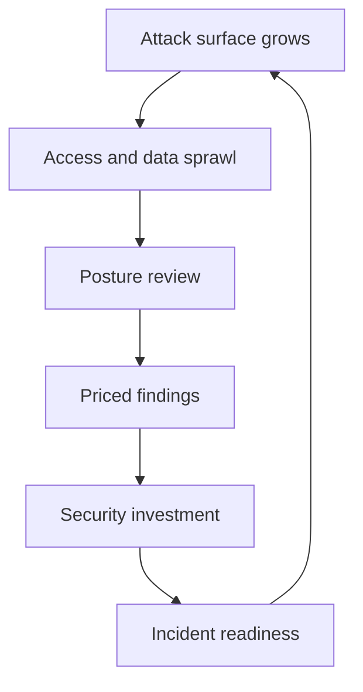

# Security and Compliance Posture

> **Core skill:** Holding the org-level security and compliance view — architecture-level threat surfaces, compliance as a design constraint, and priced security investment.

## Why This Matters

Code-level security is the team's job: input validation, auth checks, dependency hygiene. The staff view is the level above: what the whole architecture exposes, where data sprawls beyond classification, how access accumulates faster than it is revoked, and whether the org could respond to a breach at all. These are not bugs; they are posture — and posture is what gets the org breached, fined, or failed in an audit.

Compliance at this level is a design constraint, not a checklist: data residency shapes where systems can run, audit trails shape what must be logged, retention shapes what must be deleted. Every new system inherits the posture; the staff engineer makes posture part of the design conversation rather than a surprise at audit time.

## The Staff View of Security

| Level | Who Owns It | Examples |
|---|---|---|
| **Code-level** | Teams | Input validation, secrets in code, dependency CVEs |
| **System-level** | Tech leads | Auth boundaries, least privilege, network segmentation |
| **Architecture-level** | Staff | Threat surface across systems, data flows, trust boundaries |
| **Org-level** | Staff with leadership | Posture, readiness, investment, compliance |

The architecture-level questions: where can an attacker stand, what can they reach from there, what data is in reach, and what would detect them? A threat surface map of the whole org — not per-service checklists — is the staff artifact.

## Compliance as Design Constraint

| Constraint | Design Impact | Failure Mode |
|---|---|---|
| **Data residency** | Where systems may run and store data | Regions chosen without data rules; retrofit chaos |
| **Audit trails** | What must be logged and for how long | Immutable, queryable logs designed late |
| **Retention** | What must be deleted and when | Data kept forever; deletion built as an afterthought |
| **Access records** | Who has seen what, provably | No evidence for the "who accessed it" question |
| **Breach notification** | The clock that starts at discovery | No protocol; the clock burns while org figures it out |

The design rule: put compliance constraints into system requirements at the same moment as latency and cost. Retrofitting residency or retention is an order of magnitude more expensive than designing it in.

## The Posture Review

Run on the risk scan cadence, with four lenses:

| Lens | What to Check | Common Finding |
|---|---|---|
| **Access sprawl** | Who can reach what, and is it revoked? | Former employees and stale service accounts still entitled |
| **Secret hygiene** | Where secrets live and rotate | Keys in repos, configs, and image layers |
| **Dependency CVEs** | Exposure in the dependency map | Known vulnerable versions on the critical path |
| **Data classification coverage** | Is all data classified and treated accordingly? | Unclassified stores holding customer data |

Each lens feeds the register with priced findings. The review's output is not a security wishlist — it is the posture portfolio with owners and prices.



## Working with Security Teams

Security as enabler, not gate: the posture conversation changes when security teams are partners in delivery rather than the final veto.

| Gate Model | Enabler Model |
|---|---|
| Review at the end, block on findings | Standards and paved paths checked continuously |
| Security says no | Security shows the cheaper safe path |
| Findings are a scorecard | Findings are a shared risk portfolio |
| Teams hide work from security | Teams consult security at design time |

The staff lever: bring security into design reviews early, and make their standards into defaults so compliance is the path of least resistance. A security team that only gates will be bypassed; one that enables will be consulted.

## Security Investment Cases

Security investment sold as priced risk, not fear:

| Investment | Priced Argument | Fear Argument (Avoid) |
|---|---|---|
| Access revocation automation | Revoking stale access costs X; expected breach cost is Y | "We might get hacked!" |
| Secret scanning | Leaked-secret incidents cost X per year, tooling costs less | "Secrets are dangerous!" |
| CVE remediation capacity | Critical CVEs on the critical path, expected exploit cost | "There's a vulnerability!" |
| Incident forensics capability | Detection-to-remediation time costs X per hour of breach | "We need to be ready!" |

The pattern: expected value, ranges, and the comparison to the mitigation's cost. Fear mobilizes once; arithmetic mobilizes repeatedly.

## Incident Readiness at Org Level

Readiness is a capability, not a document:

| Capability | Question It Answers | Minimum Viable Form |
|---|---|---|
| **Forensics** | What happened, provably? | Log access, evidence preservation, timeline reconstruction |
| **Legal protocol** | Who speaks to whom, when? | Pre-agreed notification and counsel escalation |
| **Communication** | Who tells customers and regulators? | Drafted templates, named owners |
| **Containment authority** | Who can cut access or take systems down? | Named decision rights, rehearsed |
| **Post-incident learning** | Does the org improve from breaches? | The postmortem discipline applied at org level |

Readiness is rehearsed, not hoped for. One tabletop exercise per year converts the protocol from theory to reflex.

## Practical Applications

### Posture Checklist

- [ ] Maintain a threat-surface map of the org's systems and data flows
- [ ] Compliance constraints appear in system requirements at design time
- [ ] Run the four-lens posture review on the scan cadence
- [ ] Security teams are consulted at design time, not just at the gate
- [ ] Every security ask is priced against the risk it reduces
- [ ] One incident-readiness rehearsal per year

### Posture Finding Template

```markdown
# Posture Finding: [Finding Name]

## Finding
[What was found, with evidence]

## Exposure
- Systems affected: [list]
- Data at risk: [classification and volume]
- Likelihood: [range]
- Impact: [cost range]

## Recommendation
- Fix: [description]
- Cost: [estimate]
- Owner: [name]
- Deadline: [date]

## Status
open / accepted / mitigated / retired
```

## Common Pitfalls

| Pitfall | Why It Is a Problem | Better Approach |
|---|---|---|
| **Code-level tunnel vision** | Fixing bugs while the threat surface grows | Hold the architecture-level view |
| **Checklist compliance** | Passing audits while posture decays | Compliance as design constraint, continuously |
| **Security as gate** | Blocking at the end teaches teams to bypass | Enabler model: standards as defaults |
| **Fear-based funding** | Scare stories stop working after the first false alarm | Price the risk; compare to the fix |
| **Unrehearsed readiness** | Protocols that exist only on paper | Rehearse annually; find the gaps |
| **Posture amnesia** | Reviews run, findings never reach the register | Every finding priced, owned, and tracked |

## Success Indicators

- The threat-surface map is current and used in design reviews
- Compliance constraints appear in new system requirements by default
- Access sprawl and secret findings trend down across reviews
- Security teams are consulted early, and their standards are the defaults
- Incident readiness has been rehearsed and the gaps closed

## Related Topics

- [[01_Seeing_Org_Scale_Risk]]: security and compliance as register categories
- [[03_Dependency_Risk_Management]]: CVE exposure in the dependency map
- [[07_Post_Incident_Organizational_Learning]]: the org-level learning loop
- [[career-path/08_Security_Engineer/00_overview|Security Engineer]]: the specialist depth path
- [[career-path/02_Senior_Software_Engineer/05_Quality_Reliability_Security/00_overview|Quality Reliability Security (Senior)]]: the code-level foundation

## Summary

The staff security view is architecture and org level: map the threat surface, treat compliance as a design constraint, review posture across access, secrets, CVEs, and classification, work with security as an enabler, and fund remediation as priced risk. Readiness is a rehearsed capability, and every finding belongs in the risk register with an owner and a price — because posture, like erosion, decays quietly until it announces itself.
