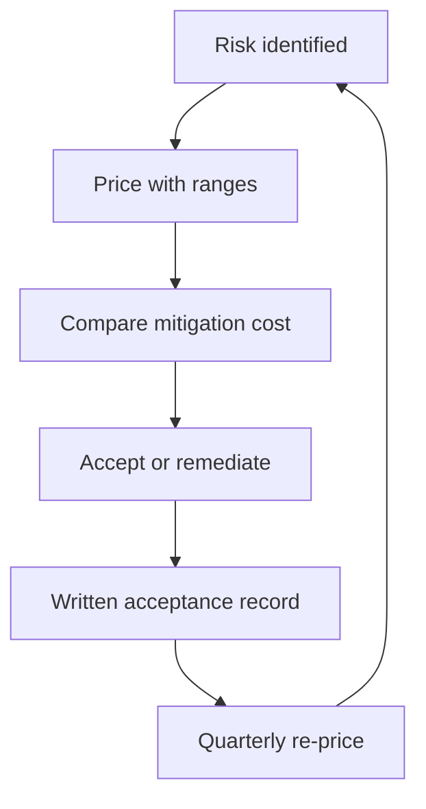

# Risk Pricing and Acceptance

> **Core skill:** Pricing risks as probability and impact ranges, comparing the cost of mitigation to the cost of risk, and recording every acceptance in writing with an owner and a review date.

## Why This Matters

Unrecorded acceptance is denial with extra steps. Every risk that is not remediated is being accepted — whether anyone said so or not. The question is whether the acceptance is explicit: priced, owned, dated, and reviewable. Orgs that skip the explicit step carry the same risks with none of the visibility, and the first surprise is always the most expensive.

Pricing is what makes acceptance discussable. "The auth migration is risky" produces a shrug; "a failed migration costs $200k to $600k at 20 to 40 percent likelihood, and the mitigation costs $80k" produces a decision. The staff engineer's discipline is converting risk language into arithmetic — approximate arithmetic, honestly ranged, but arithmetic.

## Pricing Risks

Price as ranges, not points. A point estimate pretends to a precision the data does not have.

| Element | How to Estimate | Honest Practice |
|---|---|---|
| **Probability** | Base rate, incident history, expert judgment | Range, not a point: 20-40 percent, with rationale |
| **Impact** | Cost of outage, remediation, reputation | Range with a central case and a bad case |
| **Timeframe** | When the risk could materialize | "Within two years" beats "someday" |
| **Blast radius** | Systems, customers, revenue affected | Named scope, not "everything" |

Example: the legacy auth service has a 30-50 percent chance of a critical failure within 18 months, each failure costing $150k to $400k in incident time and customer impact. The risk price is the shape of that distribution, not a single number.

## Cost of Mitigation vs Cost of Risk

Expected value, simply: expected cost of risk = probability x impact. Mitigate when the mitigation is cheaper than the expected cost it removes.

| Option | Calculation | Verdict |
|---|---|---|
| **Do nothing** | 40% x $300k = $120k expected loss | Baseline |
| **Migrate auth** | $80k one-time, removes 90% of the exposure | Expected value $108k saved: do it |
| **Harden in place** | $45k, removes 50% of the exposure | Expected value $60k saved: do it first |
| **Transfer via insurance** | $20k/year, covers $100k of the loss | Partial transfer: keep for the residual |

The arithmetic is coarse and that is fine — it is for ranking, not accounting. The discipline is doing the arithmetic at all, with ranges, and writing the comparison down.

## Acceptance Criteria

Not everyone can accept every risk. The acceptance authority must match the risk size:

| Risk Size | Who Can Accept | What They Need |
|---|---|---|
| Team-level, reversible | Tech lead or team | Price, owner, review date |
| Cross-team, slow-burning | Staff engineer | Price, narrative, quarterly review |
| Budget or roadmap impact | Engineering leadership | Price, alternatives, recommendation |
| Regulatory, legal, or existential | Executive or board level | Full case, options, written record |

The test for your own acceptance authority: could you defend this acceptance in writing to the level above you? If not, it is not yours to accept — it is yours to escalate with options.

## The Written Acceptance Record

Every accepted risk gets a record. Minimal viable fields:

| Field | Purpose |
|---|---|
| **Risk** | One sentence naming the exposure |
| **Price** | Likelihood range, impact range, expected value |
| **Mitigation in place** | What already reduces the exposure |
| **Residual risk** | What remains after mitigation |
| **Alternatives considered** | Why not remediate, transfer, or exit |
| **Accepting owner** | The person with authority for this size |
| **Review date** | When it gets re-priced |

```markdown
# Risk Acceptance Record

- Risk ID: RISK-2026-021
- Risk: [one sentence]
- Price: [likelihood range] x [impact range] = [expected value]
- Mitigation in place: [description]
- Residual risk: [description]
- Alternatives considered: [remediate cost / transfer cost / exit cost]
- Accepting owner: [name and authority level]
- Review date: [quarterly re-price]
- Signature / date: [owner and date]
```

## Acceptance Review Cadence

Acceptance is a decision with a shelf life:

| Cadence | What Happens |
|---|---|
| **Quarterly** | Every accepted risk gets re-priced; likelihood and impact updated |
| **On trigger** | Any material change re-opens the acceptance: new dependency, new regulation, new scale |
| **Annually** | The full acceptance portfolio is presented to the accepting level |

A risk accepted at 20 percent that has drifted to 70 percent without a review is not an accepted risk — it is a surprise in progress.

## When Acceptance Becomes Denial

Three failure modes convert legitimate acceptance into denial:

| Failure Mode | Signature | Correction |
|---|---|---|
| **Unreviewed** | The record exists; the date passed; nothing happened | Re-price on the cadence, no exceptions |
| **Unowned** | The risk is accepted by a committee, which is no one | One named owner with matching authority |
| **Unpriced** | "We accept this" with no arithmetic | Price it or it is not accepted — it is ignored |

The staff habit: whenever you hear "we'll accept that risk," the next sentence is "in writing, priced, owned, and dated." Acceptance without the record is where careers meet surprises.

## Communicating Accepted Risk Upward Honestly

Leadership hears what you choose to tell them. The honest version:

| Practice | Example |
|---|---|
| **State the residual risk plainly** | "We are accepting a 30 percent chance of a $200k incident this year" |
| **Show the arithmetic** | "Mitigation costs $120k; expected loss is $60k" |
| **Name the alternatives** | "We could remediate, transfer, or exit — here is each price" |
| **Report drift** | "This risk re-priced from 20 to 45 percent this quarter" |
| **Keep the record** | "Here is the signed acceptance from last quarter" |

Acceptance communicated honestly is a decision leadership can own. Acceptance discovered later is a failure they will own for you.



## Practical Applications

### Acceptance Checklist

- [ ] Price every risk as ranges with rationale, not points
- [ ] Compare mitigation cost against expected loss for each
- [ ] Match the acceptance authority to the risk size
- [ ] Write the acceptance record with all seven fields
- [ ] Schedule the re-price date at the moment of acceptance
- [ ] Report drift and re-priced risks at the quarterly review

## Common Pitfalls

| Pitfall | Why It Is a Problem | Better Approach |
|---|---|---|
| **Silent acceptance** | Unpriced, unwritten acceptance is denial with extra steps | Every acceptance in writing with a price |
| **Point estimates** | False precision hides the real range | Price as ranges with a central and bad case |
| **Wrong acceptance level** | Team-level acceptance of org-level risk | Match authority to risk size |
| **Unreviewed acceptance** | Decisions with shelf lives that expired | Quarterly re-price, trigger-based re-open |
| **Committee ownership** | Everyone accepts, so no one owns | One named owner per risk |
| **Fear-driven mitigation** | Over-mitigating risks cheaper to accept | Do the arithmetic; mitigate what the math says |

## Success Indicators

- Every accepted risk in the org has a written, priced, dated record
- Re-pricing happens on schedule and drift is reported
- Acceptance authority matches risk size in practice
- Leadership cites the arithmetic in risk discussions
- The acceptance portfolio is reviewed, not just collected

## Related Topics

- [[01_Seeing_Org_Scale_Risk]]: where risks enter the portfolio
- [[06_Escalating_Risk_With_Options]]: risks too big for your authority
- [[02_Architecture_Erosion]]: pricing erosion hotspots
- [[04_Security_and_Compliance_Posture]]: priced security investment
- [[03_Technical_Strategy/00_overview|Technical Strategy]]: bets priced against risk

## Summary

Risk pricing and acceptance is the discipline of making every risk decision explicit: price probability and impact as ranges, compare the cost of mitigation against expected loss, match acceptance authority to risk size, and record every acceptance in writing with an owner and a re-price date. Acceptance that is unreviewed, unowned, or unpriced is not acceptance — it is denial, scheduled to surprise you.
