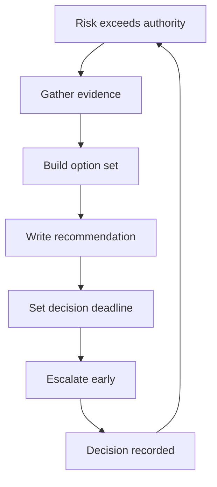

# Escalating Risk With Options

> **Core skill:** Escalating risks that exceed your authority the way leadership wants to receive them — situation, evidence, options, recommendation, and a decision deadline.

## Why This Matters

Escalation is how staff risk ownership meets its limit: the risk is real, priced, and beyond what you can accept or fund. Done well, escalation is a decision request — the leadership equivalent of a well-formed PR. Done badly, it is an alarm: the problem arrives with no path, and the decision-maker becomes a firefighter instead of a decision-maker.

The difference between the two is preparation. A risk escalated with options and a recommendation is a gift; the same risk escalated as "we have a problem" is a tax. Staff engineers are judged on which kind they bring, and the org's escalation culture is largely set by which kind gets rewarded.

## When to Escalate

| Trigger | Example | Why It Is Not Yours |
|---|---|---|
| **Risk exceeds your authority** | Cross-team data deletion policy | Acceptance authority belongs higher |
| **Needs budget** | Migration costing more than your scope | Budget is a leadership decision |
| **Needs structural change** | A re-org or ownership change is the fix | Structure is org-level authority |
| **Timing pressure** | The decision must land this week | Not escalating is now the risk |
| **Conflicting stakeholders** | Two VPs want opposite outcomes | Deadlock needs a higher arbiter |

The test: if the risk materializes and the decision was yours alone, would that have been right? If no, escalate — early, with options.

## Escalation Anatomy

Every escalation carries five parts:

| Part | What It Contains |
|---|---|
| **Situation** | What is true, in two to three sentences, no history lesson |
| **Evidence** | The pricing, data, and narratives that make it real |
| **Options** | Do nothing / mitigate / transfer / exit, each with cost and effect |
| **Recommendation** | Which option you would choose and why |
| **Decision needed by** | The date the risk overtakes the decision |

```markdown
# Escalation: [Risk Name]

## Situation
[What is true, in 2-3 sentences]

## Evidence
- Price: [likelihood range] x [impact range]
- Timeline: [when it materializes]
- Blast radius: [who and what it hits]

## Options
| Option | Cost | Effect | Risk Left |
|---|---|---|---|
| Do nothing | 0 | Baseline | Full |
| Mitigate | [estimate] | [reduction] | [residual] |
| Transfer | [estimate] | [coverage] | [residual] |
| Exit | [estimate] | [removal] | Minimal |

## Recommendation
[Option and why, in one paragraph]

## Decision Needed By
[Date and what happens if no decision]
```

## The Escalation Meeting

The meeting's goal is a yes or no on your recommendation, not a discussion:

| Do | Don't |
|---|---|
| Open with the recommendation | Open with the history |
| Show the options table | Read the options table aloud |
| State the decision deadline | Accept "let's discuss later" |
| Have the record ready | Leave the record for afterward |
| Close by confirming the decision | Close with "let me know what you think" |

If the decision-maker needs more information, name exactly what is missing and when you will bring it. A decision deferred with a named gap and a date is a decision in progress; a decision deferred with no next step is an escalation that failed.

## Documentation Trail

The escalation is a record, not just a meeting:

- The written escalation goes out before the meeting
- The decision — and the reasoning — is captured in the record
- The acceptance or remediation is entered in the risk register
- The re-price date is set at the moment of decision

A decision that leadership makes is only as good as the record that lets anyone find it six months later. The trail is what makes the escalation reviewable and the accountability real.

## Escalation Timing

Early with options beats late with alarms:

| Timing | What It Sounds Like | Outcome |
|---|---|---|
| **Early** | "We see this forming; here are options for Q3" | Decision with runway, options still real |
| **On time** | "This needs a decision this week" | Decision under mild pressure |
| **Late** | "This is happening; we need to react" | Firefighting; options already closed |

The discipline is escalating when the risk is still a range, not when it has become an event. Most escalations arrive late because escalation felt like admitting failure — it is the opposite: it is the risk system working.

## The Crying Wolf Problem

Over-escalation devalues future escalations:

| Signal of Over-Escalation | Correction |
|---|---|
| Everything is escalated at the same urgency | Reserve escalation for the authority boundary |
| Recommendations are always the same | Differentiate: sometimes the answer is do nothing |
| Deadlines always slip past without consequence | Escalate the deadline itself when it is real |
| Decision-makers start deferring before reading | Earn attention with evidence and options |

The credibility budget is finite. Spend it on risks that genuinely cross your authority, price them honestly, and honor the decision — including when the decision is "accept" against your recommendation.



## Practical Applications

### Escalation Checklist

- [ ] Confirm the risk genuinely exceeds your acceptance authority
- [ ] Write the five-part escalation before booking the meeting
- [ ] Price every option with cost, effect, and residual risk
- [ ] Send the written record before the meeting
- [ ] Push for a yes or no, with a named next step if deferred
- [ ] Record the decision in the register and set the re-price date

## Common Pitfalls

| Pitfall | Why It Is a Problem | Better Approach |
|---|---|---|
| **Alarm-only escalation** | Problems without paths turn leaders into firefighters | Always bring options and a recommendation |
| **Escalation theater** | Escalating what you could decide yourself burns credibility | Reserve escalation for the authority boundary |
| **No decision deadline** | Undated escalations float forever | Name the date and what happens after it |
| **History-led meetings** | Context before content loses the room | Recommendation first, evidence on request |
| **Unrecorded decisions** | Verbal decisions vanish in a quarter | Write the decision into the register |
| **Late escalation** | Waiting until the risk is an event closes the options | Escalate while the risk is still a range |

## Success Indicators

- Escalations arrive with five parts and a decision deadline
- Decision-makers act on your escalations within the deadline
- The register shows escalation decisions with owners and dates
- Your escalation rate is stable because you only escalate the real ones
- Decision-makers ask for your options before you offer them

## Related Topics

- [[01_Seeing_Org_Scale_Risk]]: the portfolio escalations come from
- [[05_Risk_Pricing_and_Acceptance]]: the pricing that makes options real
- [[03_Technical_Strategy/00_overview|Technical Strategy]]: decisions that set risk appetite
- [[04_Influence_and_Alignment/00_overview|Influence and Alignment]]: leading the decision-maker
- [[career-path/05_Tech_Lead/07_Incident_Leadership_and_Production_Excellence/04_Remediating_Systemic_Weaknesses|Remediating Systemic Weaknesses (Tech Lead)]]: the team-level escalation pattern

## Summary

Escalation is a decision request, not an alarm: confirm the risk crosses your authority, write the five-part case — situation, evidence, options, recommendation, decision deadline — and bring the decision-maker to a yes or no. Escalate early while options are still open, honor the decision in writing, and protect your credibility budget by escalating only what is genuinely beyond you. The org's risk system is only as good as its escalations.
