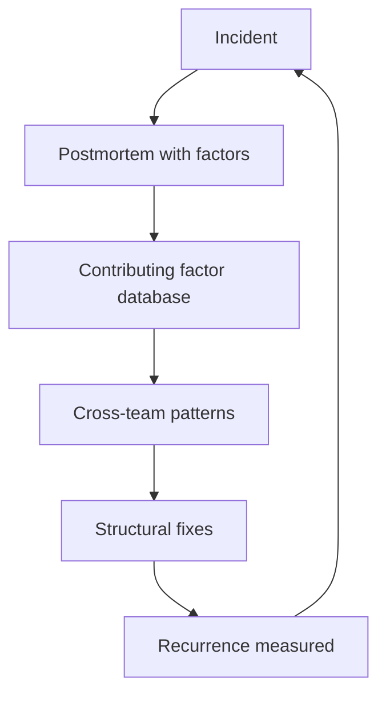

# Post Incident Organizational Learning

> **Core skill:** Aggregating incidents across teams into contributing-factor patterns, converting them into structural fixes, and measuring whether the org actually learns.

## Why This Matters

The team postmortem answers "what happened here." The org-level question is "what keeps happening everywhere." The same contributing factors recur across teams — missing ownership, skipped hardening, unrehearsed rollback — each time as a fresh incident with a fresh postmortem and a fresh set of action items. Teams learn; the org repeats.

Organizational learning is the step past the postmortem: aggregate contributing factors across incidents, find the patterns, and convert them into structural fixes. It is the bridge between incident response and systems thinking — the point where the incident becomes data about the org rather than a story about the night.

## Beyond the Team Postmortem

| Team-Level Observation | Org-Level Pattern |
|---|---|
| "We skipped the hardening work again" | Hardening is never funded anywhere |
| "The rollback was unrehearsed" | Rollback is unrehearsed in every team |
| "The owner was on leave" | Ownership is a person, not a role, org-wide |
| "The alert gave no context" | Alerts are built without runbooks everywhere |

The move is aggregation: the same factor in three teams is a structural finding; in one team it is a local failure. Org learning requires collecting the factors at all, which most orgs never do.

## The Contributing Factor Database

The aggregation tool: a simple database of contributing factors, extracted from every postmortem.

| Field | Purpose |
|---|---|
| **Incident ID** | Link back to the postmortem |
| **Contributing factor** | The condition that enabled the failure |
| **Factor category** | Ownership, process, tooling, knowledge, incentives |
| **Team and system** | Where it happened |
| **Date** | When it happened |
| **Fix status** | Local fix, structural fix, unfixed |

```markdown
# Contributing Factor Entry

- Incident ID: INC-2026-042
- Factor: [the condition that enabled the failure]
- Category: ownership / process / tooling / knowledge / incentives
- Team and system: [where]
- Date: [when]
- Fix status: local fix / structural fix / unfixed
- Appears in incidents: [count and list]
```

The database's power is the query: "which factors appear in the most incidents?" That ranking is the org's learning backlog.

## Learning Reviews

Periodic multi-incident analysis, on a cadence:

| Review | What It Does | Cadence |
|---|---|---|
| **Monthly pattern review** | New factors, rising factors, cross-team repeats | Monthly |
| **Quarterly learning review** | Top factors, fix effectiveness, structural conversions | Quarterly |
| **Annual systemic review** | The org's top five learning failures and what would fix them | Annually |

The learning review's output is not more action items — it is a short list of structural changes with owners and prices, fed into the risk register like any other risk.

## Converting Patterns into Structural Fixes

| Recurring Pattern | Structural Fix | Bridge to Systems Thinking |
|---|---|---|
| Rollback never rehearsed | Deployment drills as a release requirement | The loop produces the failure on schedule |
| Hardening never funded | Standing reliability budget per team | The incentive, not the people, is the cause |
| Ownership is one person | Named backup and rotation per critical system | Knowledge as a stock with one inflow |
| Alerts without context | Runbook required at alert creation | The information flow is the leverage point |
| Postmortems without follow-through | Action items tracked like bugs | The learning loop is not closed |

The conversion rule: a pattern appearing across three or more teams is a structure problem. Fix the structure once and the incidents stop recurring everywhere, not just in the team that happened to write the postmortem.

## Measuring Learning

The metric is recurrence, not documentation:

| Measure | What It Tells You | Target |
|---|---|---|
| **Contributing-factor recurrence rate** | Whether the same conditions keep producing incidents | Declining over quarters |
| **Time from incident to structural fix** | Whether learning converts to change | Shrinking |
| **Cross-team repeat count** | Whether aggregation is working | No factor above one team for long |
| **Fix effectiveness review** | Whether the fixes that landed actually worked | Fixes validated after a quarter |

The honest test of organizational learning: could a new engineer, reading only the factor database, avoid the org's top five failure conditions? If not, the org has postmortems but no learning.

## The Staff Role in Incident Follow-Through

| Activity | Staff Action |
|---|---|
| **Extraction** | Ensure postmortems name contributing factors, not just root cause |
| **Aggregation** | Maintain the factor database and its queries |
| **Pattern spotting** | Bring the top factors to the quarterly review |
| **Structural conversion** | Design the structural fix and get it owned and priced |
| **Shepherding** | Track fixes across teams until they land and hold |
| **Measurement** | Report recurrence trends to leadership |

The staff role is the seam between incidents and structure — the person who makes sure the org's incidents become its learning.



## Practical Applications

### Org Learning Checklist

- [ ] Every postmortem names contributing factors with categories
- [ ] Factors are aggregated in a queryable database
- [ ] The monthly review ranks factors by recurrence
- [ ] Top patterns convert to structural fixes with owners and prices
- [ ] Recurrence trends are reported to leadership quarterly
- [ ] Fixes are validated for effectiveness after a quarter

## Common Pitfalls

| Pitfall | Why It Is a Problem | Better Approach |
|---|---|---|
| **Incident amnesia** | Same factors, different tickets, no aggregation | Maintain the factor database |
| **Root-cause tunnel vision** | One root cause per incident hides the conditions | Name every contributing factor |
| **Local-only fixes** | Each team fixes its own instance; the org repeats | Convert cross-team patterns structurally |
| **Action-item graveyards** | Postmortem actions that never land | Track actions like bugs, validate effectiveness |
| **No measurement** | Learning claimed, recurrence never counted | Report the recurrence rate |
| **Blame leakage** | Aggregated patterns that name people | Aggregate conditions, never individuals |

## Success Indicators

- Contributing-factor recurrence declines quarter over quarter
- The factor database exists, is queried, and drives reviews
- Cross-team patterns convert to structural fixes within a quarter
- Postmortem action items land and are validated
- Leadership can name the org's top five learning failures and their fixes

## Related Topics

- [[01_Seeing_Org_Scale_Risk]]: patterns enter the risk register
- [[05_Risk_Pricing_and_Acceptance]]: pricing the structural fixes
- [[02_Architecture_Erosion]]: incident clustering as an erosion signal
- [[05_Systems_Thinking_and_Organizational_Design/00_overview|Systems Thinking and Organizational Design]]: the loop behind the pattern
- [[career-path/05_Tech_Lead/07_Incident_Leadership_and_Production_Excellence/03_Blameless_Postmortem_Leadership|Blameless Postmortem Leadership (Tech Lead)]]: the team-level foundation

## Summary

Post-incident organizational learning is the step past the team postmortem: aggregate contributing factors across incidents into a queryable database, run learning reviews on a cadence, convert cross-team patterns into structural fixes, and measure the recurrence rate as the honest metric of learning. The org that aggregates its incidents stops repeating its history — the org that does not keeps writing the same postmortem with different dates.
