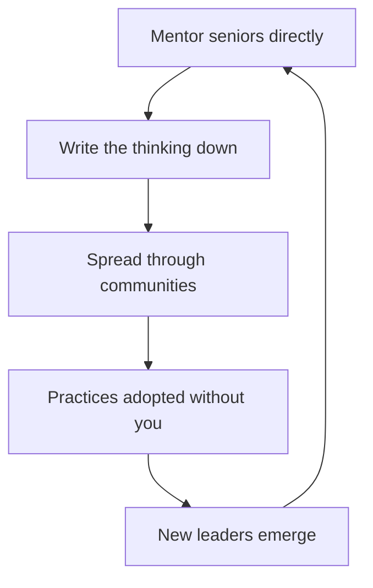

# Organizational Learning and Mentoring

> **Core capability:** The staff engineer makes the organization smarter — mentoring senior engineers toward staff-level judgment, spreading practices through communities, and building systems that retain knowledge beyond individuals.

## Why This Matters

A staff engineer who solves every problem personally becomes the org's most expensive bottleneck. The durable version of the role multiplies: seniors who think in systems, teams that adopt practices without pushing, knowledge that survives attrition. Influence that lives only in your head retires when you do.

Mentoring at this level also changes clientele: you mentor seniors and tech leads, not juniors. The work is judgment transfer — how to frame a proposal, how to read an incentive, how to know which battle matters — which spreads through writing, reviews, and deliberate communities of practice more than through 1:1 teaching alone.

## Topics in This Capability Area

| Topic | Core Skill | When It Matters |
|-------|------------|-----------------|
| [[01_Mentoring_Senior_Engineers]] | Growing seniors toward staff judgment | Seniors plateauing at team scope |
| [[02_Judgment_Transfer]] | Teaching thinking, not solutions | Reviews; proposal coaching; case walkthroughs |
| [[03_Communities_of_Practice]] | Building cross-team learning structures | Repeated divergence; skill silos |
| [[04_Writing_as_Scaling]] | Making thinking reusable in documents | Every proposal, postmortem, and strategy |
| [[05_Growing_the_Next_Staff]] | Building the staff pipeline deliberately | Org scaling; succession |
| [[06_Teaching_Architecture_Thinking]] | Spreading the architectural lens | Design reviews; architecture guilds |
| [[07_Knowledge_Continuity]] | Protecting knowledge against attrition | Key-person risks; legacy systems |

## The Multiplication Loop

Each turn grows the surface area that learns without your presence.

## What Changes from Senior to Staff

| Activity | Senior engineer | Staff engineer |
|----------|-----------------|----------------|
| Mentees | Juniors and mids | Seniors, tech leads, future staff |
| Content | Skills and practices | Judgment: framing, trade-offs, politics |
| Mechanism | 1:1 and pairing | Writing, reviews, communities, arc sponsorship |
| Knowledge | Documents own area | Builds org knowledge continuity systems |
| Success | Mentee grows | Org learns without you in the room |

## Practical Applications

### Multiplication Checklist

- [ ] Two to four deliberate mentoring relationships at senior/lead level
- [ ] Your thinking lands in findable documents, not just meetings
- [ ] At least one community of practice meets without you chairing
- [ ] A staff pipeline exists: named candidates, sponsored arcs, stretch scopes
- [ ] Key-person knowledge has documented succession
- [ ] Architecture reviews teach, not just gate

## Common Pitfalls

| Pitfall | Why It Is a Problem | Better Approach |
|---------|---------------------|-----------------|
| **Hero scaling** | Org learns dependence, not judgment | Sponsor arcs; let others own outcomes |
| **Oral tradition** | Knowledge lives in your explanations | Write it; documents outlive availability |
| **Community theater** | Guilds that meet but don't transfer | Output-focused communities: standards, reviews |
| **Clone mentoring** | Growing copies of yourself | Grow their strengths; staff has four archetypes |

## Success Indicators

- Seniors you mentor frame proposals at org level unprompted
- Your documents are cited in rooms you've never entered
- Communities produce artifacts: standards, review checklists, patterns
- More than one credible internal staff candidate per cycle
- Knowledge handoffs survive departures without heroics

## Related Capabilities

- [[01_The_Staff_Role_and_Scope/00_overview|The Staff Role and Scope]]: multiplication is the role's escape from bottleneck
- [[04_Influence_and_Alignment/00_overview|Influence and Alignment]]: teaching spreads influence you don't attend
- [[career-path/02_Senior_Software_Engineer/07_Mentoring_and_Team_Leadership/00_overview|Mentoring and Team Leadership (Senior)]]: the 1:1 craft this builds on
- [[career-path/05_Tech_Lead/05_Team_Development_and_Mentoring_Leadership/00_overview|Team Development and Mentoring Leadership (Tech Lead)]]: the team-level parallel
- [[career-path/04_Principal_and_Distinguished_Engineer/00_overview|Principal and Distinguished Engineer]]: where org-scale multiplication goes next

## Summary

Organizational learning and mentoring is how staff impact compounds: mentor seniors in judgment, write thinking into documents, build communities that produce artifacts, grow the next staff pipeline, and protect knowledge against attrition. The test of the whole area: the organization keeps learning when you are not in the room.
